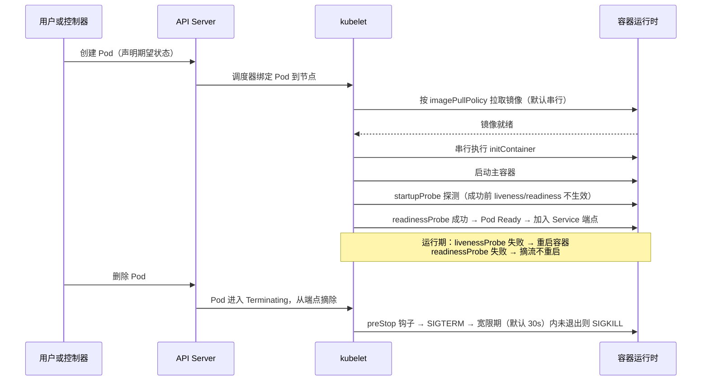
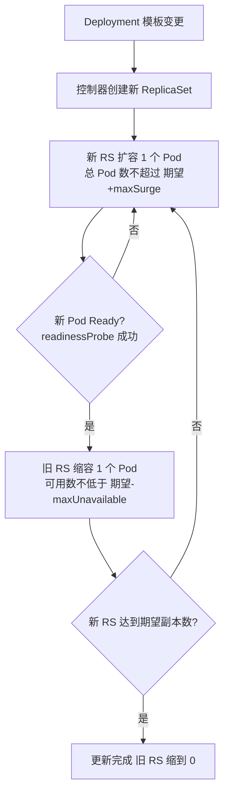
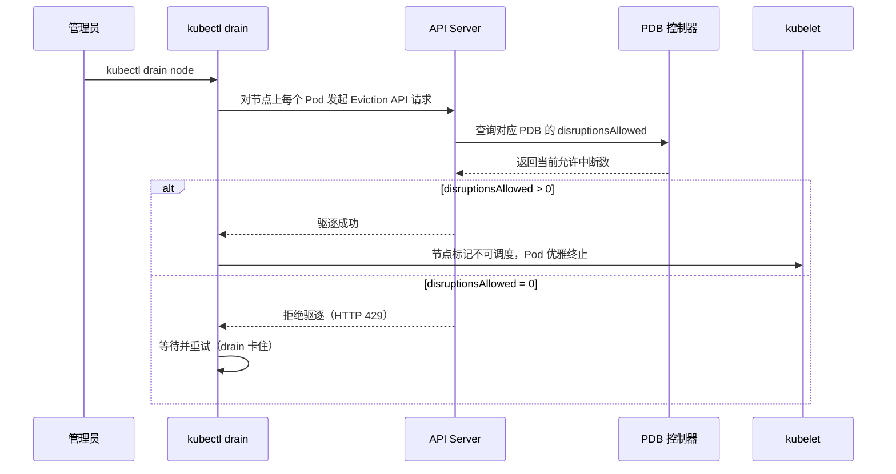

# 1.10 企业云部署实践 [实用]

> 来源：[Kubernetes 官方文档](https://kubernetes.io/docs/)：Pod 生命周期（探针/优雅终止）· 镜像（imagePullPolicy/imagePullSecrets）· Deployment 滚动更新 · 调度与驱逐（反亲和/拓扑分布）· PDB；前沿：spegel / kube-fledged / InPlace Pod Resize（待验证）
> 验证环境：待验证（kind v0.x + K8s v1.x，发布前须本地跑通）

## 为什么先学这个

本章的定位是**认知建立**，不是操作手册。企业生产部署的治理意识，比具体 YAML 更重要：遇到「镜像拉取超时」「启动被误杀」「发布断流」时，没有概念的人连问题都描述不清，更谈不上排查；和 AI 讨论部署设计时，问不到核心要点，得到的方案就不可信。先知道「有这回事」——每个主题解决什么问题、不治理会踩什么坑——再动手配，才是本章的学习顺序。每个主题末尾附「和 AI 沟通的提问要点」，把「问得到点子上」变成可练习的动作。

## 概念：为什么需要

**业务痛点**：[已必备] 大镜像首次调度到新节点拉取慢，启动超时、发布窗口拉长；[已必备] 服务启动慢被存活探针误杀，陷入「启动→被杀→重启」循环；[已必备] 发布与节点维护时服务直接断流。企业生产部署要过三道坎：**拉得动**（镜像预热）、**起得快**（启动治理）、**扛得住**（可用性配置）。

- **从哪来**：单副本裸跑、手动逐节点拉镜像、kill -9 式下线 → 多副本 + 探针 + 声明式预热 + 受控变更
- **是什么**：本章三个主题——镜像预热把「拉取时间」从发布路径挪到后台；启动治理用 startupProbe（启动探针）等机制给慢启动容器留出窗口；可用性配置用 PDB（自愿中断保护）、滚动更新策略、反亲和/拓扑分布、优雅终止把「能跑」变成「扛得住」
- **往哪去**：预热走向节点镜像预置/快照（托管集群 bootstrap 脚本）；启动治理走向启动就绪的标准化（探针 + 资源基线）；可用性配置走向平台化（平台强制 PDB/资源配额，业务只声明需求）

## 主题一：镜像预热（image pre-pull）

### 为什么需要

大镜像（AI 模型镜像 GB 级、基础镜像数百 MB）首次调度到新节点时，kubelet 要从镜像仓库拉取，拉取时间可能长达几分钟，直接拉长发布窗口、触发启动超时。节点池弹性扩缩容时新节点是「空盘」，冷启动拉镜像成为瓶颈。预热 = 在 Pod 真正调度之前，先把镜像拉到节点上。

### 认知要点（先建立意识）

- **不治理会踩的坑**：大镜像首次调度到新节点，拉取耗时超过启动窗口 → 发布超时、滚动更新卡住；节点池弹性扩容时新节点「空盘」，冷启动拉镜像成为瓶颈
- **要知道的关键事实**：imagePullPolicy 默认规则（tag 为 latest 默认 Always，显式 tag 默认 IfNotPresent）；预热是尽力而为，不保证新 Pod 一定命中已预热镜像；预热清单不跟版本同步 = 白预热；私有仓库没有 imagePullSecrets 时预热和调度都会失败
- **治理意识**：把「拉取时间」从发布路径挪到后台，是预热的核心思想；先确认镜像大小与节点池规模，再决定要不要预热、怎么预热

### 怎么做

**1. DaemonSet 预热（单镜像）**：DaemonSet 是确保每个（或部分）节点上运行一个 Pod 副本的工作负载对象。把目标镜像作为 initContainer（主容器启动前串行执行的初始化容器）的镜像，kubelet 在每个节点上自动拉取，预热 Pod 随节点加入自动调度、节点删除自动清理：

```yaml
apiVersion: apps/v1
kind: DaemonSet
metadata:
  name: image-puller
  namespace: kube-system
spec:
  selector:
    matchLabels:
      name: image-puller
  template:
    metadata:
      labels:
        name: image-puller
    spec:
      initContainers:
        - name: puller
          image: registry.example.com/ai/model:v1.0.0   # 预热目标镜像
          command: ["sh", "-c", "true"]
      containers:
        - name: pause
          image: registry.k8s.io/pause:3.9
```

> 验证环境：待验证。预热 Pod 完成即退出，DaemonSet 会把它重启——这是预期行为，预热动作发生在每次 Pod 创建时的镜像拉取阶段。

**2. 多镜像预热（脚本循环）**：预热清单放 ConfigMap，脚本循环拉取（containerd 运行时用 `crictl pull`）：

```bash
# 预热清单（ConfigMap 管理，发布流水线同步更新）
for img in $(cat /images.txt); do crictl pull "$img"; done
```

> 验证环境：待验证。脚本镜像需自带 crictl 或挂载宿主机运行时 socket，具体挂载方式随运行时/平台而异。

**3. imagePullPolicy 三值选择**（kubelet 拉取镜像的策略）：

- `Always`：每次创建容器都检查/拉取，保证最新，但慢——适合频繁发版、镜像 tag 易漂移的场景
- `IfNotPresent`：本地已有就不拉，启动快——配合预热的主力选项
- `Never`：只用节点本地镜像，不访问仓库——适合离线/测试环境
- 默认规则（官方文档事实）：tag 为 `latest` 或未指定时默认 `Always`，显式 tag 默认 `IfNotPresent`，`Never` 必须显式设置

**4. 私有仓库认证 imagePullSecrets**（Pod 访问私有镜像仓库的凭据）：

```bash
kubectl create secret docker-registry regcred \
  --docker-server=registry.example.com \
  --docker-username=<user> --docker-password=<pass>
```

```yaml
spec:
  imagePullSecrets:
    - name: regcred
```

注意：imagePullSecrets 写在 Pod 模板的 spec 下（Deployment 里是 `template.spec`）；Secret 按 namespace 隔离，每个命名空间都要建（或由平台默认挂载）。

### 官方机制引述：kubelet 镜像拉取流程

> 来源：[Kubernetes 官方文档（镜像）](https://kubernetes.io/docs/concepts/containers/images/) · 验证环境：待验证

官方文档对 imagePullPolicy 的语义定义（要点转述）：

- **Always**：kubelet 每次启动容器都查询镜像仓库，把镜像名解析为 digest（摘要，镜像内容的唯一指纹）；本地已有同 digest 的缓存则直接用缓存，否则拉取——保证「每次都用最新」，代价是每次启动都有一次仓库查询
- **IfNotPresent**：本地已有镜像就不拉，只有缺失时才拉——配合预热的主力选项
- **Never**：只用节点本地镜像，不访问仓库
- **默认规则**：tag 为 `latest` 或未指定时默认 `Always`，显式 tag 默认 `IfNotPresent`——这是官方文档明确写出的默认行为，也是「预热 + 显式 tag」组合能生效的前提

**串行 vs 并行拉取**：kubelet 默认**串行**拉取镜像（`--serialize-image-pulls` 默认 true，一次只拉一个），避免并发拉取打爆仓库限流和节点磁盘 IO；官方建议不要轻易改默认值，除非确认节点网络能承受并行拉取。多镜像预热脚本循环 `crictl pull` 时，串行语义意味着大镜像列表要预留足够时间。

**拉取失败重试**：拉取失败后 Pod 进入 ImagePullBackOff（镜像拉取退避）状态，kubelet 按指数退避持续重试——所以「镜像仓库临时不可用」不会立刻杀死 Pod，但会卡在 BackOff 状态，需要看 Events 区分「仓库问题」和「镜像不存在/认证失败」。

> 验证环境：待验证。以上为官方文档机制转述，字段与默认值以官方文档当日内容为准。

### 注意事项

- **与节点池扩缩容的配合**：DaemonSet 预热是「节点加入后」才拉，新 Pod 可能先于预热完成被调度——托管集群可在节点组 bootstrap 脚本里预拉关键镜像，或对关键节点池提前扩容；预热是尽力而为，不是硬保证
- **镜像版本漂移**：预热的是旧 tag，发布用新 tag（Always 策略）时预热白做；预热清单要与发布版本同步维护，否则「预热了但没拉到要用的版本」
- **仓库带宽与磁盘**：大镜像多节点同时拉会打爆仓库限流，可错峰/分批；预热镜像占用节点磁盘，注意 kubelet 镜像垃圾回收（imageGC 高/低水位，默认 85%/80%）可能回收预热镜像

### 和 AI 沟通的提问要点

向 AI 咨询镜像预热方案时，先说清：镜像大小（MB/GB 级）、节点池规模与扩容频率、拉取频率（每次发版都拉还是偶尔）、仓库是否私有/是否限流。核心问题：预热用 DaemonSet 还是节点 bootstrap 脚本？预热清单怎么跟发布版本同步？imagePullPolicy 该用 IfNotPresent 还是 Always？

## 主题二：Pod 快速启动治理

### 为什么需要

启动慢的常见原因：镜像拉取慢（见主题一）、初始化任务重（initContainer 下载模型/迁移数据）、依赖服务未就绪（DB/配置中心）、应用框架启动慢（JVM 等）。后果：发布窗口拉长、滚动更新卡住（新 Pod 不就绪旧 Pod 不摘流）、**被 liveness 误杀**——容器进程活着但还没就绪，存活探针失败触发重启，陷入「启动→被杀→重启」循环。

### 认知要点（先建立意识）

- **不治理会踩的坑**：慢启动容器被 liveness 误杀，陷入「启动→被杀→重启」循环；滚动更新时新 Pod 迟迟不就绪，旧 Pod 不摘流，发布卡死；就绪探针探测外部依赖，DB 一抖动全 Pod 摘流 → 雪崩
- **要知道的关键事实**：startupProbe 成功前 liveness/readiness 不生效；initContainer 串行执行且各自拉镜像，会叠加启动时间；CPU 超 limits 节流不杀，内存超 limits 直接 OOMKilled
- **治理意识**：启动慢要先定位根因（拉取/初始化/依赖/框架），再对症下药，不是一味调大探针参数

### 怎么做

**1. startupProbe**（启动探针，容器启动阶段专用的健康检查）：startupProbe 成功之前，liveness/readiness 不生效，给慢启动容器一个明确的启动窗口：

```yaml
spec:
  containers:
    - name: app
      image: registry.example.com/app:v1.0.0
      startupProbe:
        httpGet:
          path: /healthz
          port: 8080
        failureThreshold: 30
        periodSeconds: 10        # 启动窗口 = 30 × 10 = 300s
      livenessProbe:
        httpGet:
          path: /healthz
          port: 8080
        periodSeconds: 10
      readinessProbe:
        httpGet:
          path: /readyz
          port: 8080
        periodSeconds: 5
```

> 验证环境：待验证。livenessProbe 是存活探针（失败则重启容器），readinessProbe 是就绪探针（成功才接流量）。

**2. imagePullPolicy: IfNotPresent**：配合预热，跳过重复拉取（见主题一）。

**3. initContainer 最小化**：只放必须的初始化（等依赖、准备数据）；重的初始化移到应用启动流程或预热；多个 initContainer 串行执行且各自拉镜像，会叠加启动时间。

**4. 资源 requests 预留**：requests 是调度与驱逐的依据——设太低，节点超卖，运行时被 CPU 节流（throttling，限速）或内存 OOMKilled（被杀）；设太高，调度不出去（Pending）。

**5. 就绪探针与流量接入时机**：readinessProbe 成功才把 Pod 加入 Service 端点（接流量）；就绪探针要反映「真正能服务」，不是「进程活着」。

### 官方机制引述：探针语义

> 来源：[Kubernetes 官方文档（存活/就绪/启动探针）](https://kubernetes.io/docs/concepts/configuration/liveness-readiness-startup-probes/) · 验证环境：待验证

官方文档对探针关键字段的语义定义（要点转述）：

- **startupProbe 与 liveness/readiness 的交互**：容器没有 startupProbe 时，liveness/readiness 在容器启动后立即开始探测；配置了 startupProbe 时，liveness/readiness **在 startupProbe 成功之前不运行**——这就是「启动窗口」的官方机制来源。startupProbe 成功一次后即停止，后续由 liveness/readiness 接管
- **startupProbe 失败**：kubelet 杀掉容器，按重启策略处理（与 liveness 失败同级的后果）——所以 startupProbe 的窗口必须覆盖最坏情况，否则等于把「误杀」从 liveness 转移到了 startup
- **failureThreshold**（失败阈值）：连续失败这么多次后「放弃」；liveness 放弃 = 重启容器，readiness 放弃 = Pod 标记为 Unready（摘流），startup 放弃 = 杀容器。默认 3，最小 1
- **periodSeconds**（探测周期）：每隔多少秒探测一次，默认 10，最小 1
- **启动窗口计算**：官方示例即用 `failureThreshold × periodSeconds` 表达启动窗口（如 30 × 10 = 300 秒）——这是社区与官方一致的算法

> 验证环境：待验证。字段默认值与交互语义以官方文档当日内容为准。

### 机制架构：Pod 生命周期时序

把三个主题串起来看，Pod 从创建到删除的完整时序（探针在其中的作用）：



时序要点：

- **Pending → Running**：镜像拉取（主题一）与 initContainer 串行执行（主题二）都发生在 Running 之前，是启动慢的两大来源
- **Running 的「就绪」门槛**：Pod 状态 Running ≠ 可接流量，readinessProbe 成功才进 Service 端点——滚动更新、PDB 计数都以「Ready」为准
- **Terminating 的体面**：摘端点 → preStop → SIGTERM → SIGKILL 兜底，是主题三优雅终止的完整链路

### 注意事项

- startupProbe 的窗口要覆盖最坏情况（冷启动 + 依赖等待），别和 liveness 用同一组短参数
- 就绪探针别探测外部依赖（DB 挂了全 Pod 摘流 → 雪崩）；就绪只查自身，外部依赖由调用方/平台兜底
- initContainer 串行 + 每个 initContainer 的镜像都要拉，数量越多启动越慢——能合并就合并
- requests 与 limits 分开设：CPU 超 limits 节流不杀，内存超 limits 直接 OOMKilled；limits 别拍脑袋，先压测拿基线

### 和 AI 沟通的提问要点

向 AI 咨询启动治理时，先说清：启动耗时（秒级/分钟级）、启动慢的环节（拉镜像/初始化/等依赖）、依赖哪些外部服务、探针路径与预期返回。核心问题：该用 startupProbe 还是调大 liveness 参数？initContainer 能不能合并或后移？requests 基线怎么定（有压测数据还是估算）？

## 主题三：服务可用性配置规范

### 为什么需要

生产可用性 = 冗余 + 受控变更 + 故障域隔离 + 优雅退出。单副本、无 PDB、无优雅终止的服务，在节点维护（drain）、发布、节点宕机时直接断流。从哪来→是什么→往哪去：单副本 → 多副本 + 反亲和 → 跨可用区拓扑分布；kill -9 → preStop 排空 + SIGTERM 优雅退出。

### 认知要点（先建立意识）

- **不治理会踩的坑**：节点维护（drain）时服务中断——没有 PDB，drain 直接把 Pod 全停；滚动更新期间流量中断——maxUnavailable 默认 25%，副本少时可能全停；单副本 + 无反亲和，节点宕机 = 服务全挂；没有优雅终止，存量请求被 SIGKILL 掐断
- **要知道的关键事实**：PDB 只保护自愿中断，不保护节点宕机；maxUnavailable: 0 + maxSurge: 1 是零中断滚动更新（需资源余量）；preStop + SIGTERM 处理时间必须小于 terminationGracePeriodSeconds（默认 30s）
- **治理意识**：可用性配置是「故障域思维」——副本要冗余，冗余要打散（节点/可用区），变更要受控（PDB/滚动更新），退出要体面（优雅终止）

### 怎么做

**1. 副本数冗余 + PDB**（PodDisruptionBudget，自愿中断保护——限制节点维护等自愿中断时最多能同时停几个 Pod）：

```yaml
apiVersion: policy/v1
kind: PodDisruptionBudget
metadata:
  name: demo-pdb
spec:
  minAvailable: 2          # 或 maxUnavailable: 1
  selector:
    matchLabels:
      app: demo
```

> 验证环境：待验证。PDB 只保护自愿中断（节点 drain、滚动更新、主动删除），不保护非自愿中断（节点宕机、OOM）。

**2. 滚动更新策略**（maxSurge：最多超出期望副本数多少个；maxUnavailable：最多允许多少个不可用）：

```yaml
spec:
  strategy:
    type: RollingUpdate
    rollingUpdate:
      maxSurge: 1
      maxUnavailable: 0     # 先起新的再杀旧的，零中断（需资源余量）
```

> 验证环境：待验证。默认值 maxSurge/maxUnavailable 均为 25%。

**3. 反亲和 + 拓扑分布**（把副本打散到不同节点/可用区，避免单点故障域一锅端）：

```yaml
spec:
  affinity:
    podAntiAffinity:
      preferredDuringSchedulingIgnoredDuringExecution:
        - weight: 100
          podAffinityTerm:
            labelSelector:
              matchLabels:
                app: demo
            topologyKey: kubernetes.io/hostname   # 尽量不跟同标签 Pod 同节点
  topologySpreadConstraints:
    - maxSkew: 1
      topologyKey: topology.kubernetes.io/zone    # 跨可用区均匀分布
      whenUnsatisfiable: DoNotSchedule
      labelSelector:
        matchLabels:
          app: demo
```

> 验证环境：待验证。反亲和是「尽量不跟同标签 Pod 同拓扑域」，拓扑分布约束（topologySpreadConstraints）是把 Pod 均匀打散到拓扑域（节点/可用区），maxSkew 控制最大不均衡。

**4. 优雅终止**（terminationGracePeriodSeconds：优雅终止宽限期，默认 30s；preStop：容器终止前执行的钩子）：

```yaml
spec:
  terminationGracePeriodSeconds: 30
  containers:
    - name: app
      lifecycle:
        preStop:
          exec:
            command: ["sh", "-c", "sleep 5"]   # 等 Service 端点摘除传播，或调用应用排空接口
```

删除流程：Pod 进入 Terminating → 从 Service 端点摘除 → 执行 preStop → 收到 SIGTERM → 应用处理完存量请求退出 → 超时被 SIGKILL。

**5. 资源 requests/limits**：

```yaml
resources:
  requests:
    cpu: 500m
    memory: 512Mi
  limits:
    cpu: "1"
    memory: 1Gi
```

requests 用于调度与 QoS 分级（requests=limits 为 Guaranteed 最高级，驱逐时最后动）；limits 用于运行时限制。

### 官方机制引述：PDB / 滚动更新 / 优雅终止

> 来源：[Kubernetes 官方文档（PDB）](https://kubernetes.io/docs/tasks/run-application/configure-pdb/) · [Deployment](https://kubernetes.io/docs/concepts/workloads/controllers/deployment/) · [Pod 生命周期](https://kubernetes.io/docs/concepts/workloads/pods/pod-lifecycle/) · 验证环境：待验证

**PDB 官方机制**（要点转述）：

- **定义**：PDB 限制「自愿中断（voluntary disruptions）」时同时不可用的 Pod 数量；自愿中断 = 应用 owner 或集群管理员主动发起的（节点 drain、滚动更新、主动删除），非自愿中断（involuntary）= 硬件故障、内核 panic、节点删除、网络分区等不可控因素——**PDB 对非自愿中断无效**
- **minAvailable / maxUnavailable 二选一**：官方文档要求两个字段只能指定一个；minAvailable 是「驱逐后必须保持可用的最少 Pod 数」，maxUnavailable 是「驱逐后最多不可用的 Pod 数」
- **disruptionsAllowed**：PDB 控制器实时计算「当前还允许几个 Pod 被自愿中断」（`kubectl describe pdb` 可见），minAvailable 模式下 ≈ 当前可用数 − minAvailable；驱逐请求会实时检查这个值
- **Eviction API**：节点 drain 不是直接删 Pod，而是对每个 Pod 调用 Eviction API（驱逐子资源）；API Server 检查对应 PDB，disruptionsAllowed > 0 才放行，否则拒绝（HTTP 429），drain 会等待重试——这就是「drain 卡住」的官方机制

**滚动更新官方语义**（要点转述）：

- **maxSurge**：更新期间最多允许超出期望副本数多少个 Pod（默认 25%）；**maxUnavailable**：更新期间最多允许多少个 Pod 不可用（默认 25%）
- **控制器保证**：Deployment 控制器保证「可用 Pod 数 ≥ 期望数 − maxUnavailable」且「总 Pod 数 ≤ 期望数 + maxSurge」——maxUnavailable: 0 + maxSurge: 1 即「先起新的、新的 Ready 后才杀旧的」的零中断配置
- **就绪门控**：新 ReplicaSet 的 Pod 只有 readinessProbe 成功（Ready）后，控制器才继续扩新缩旧——readiness 探针是滚动更新的「门」

**优雅终止官方时序**（要点转述）：

- 删除 Pod → 进入 Terminating → 从 Service 端点摘除 → 执行 preStop 钩子 → 向主进程发 SIGTERM → 宽限期（terminationGracePeriodSeconds，默认 30s）内未退出则 SIGKILL 强杀
- **宽限期共享**：preStop 钩子与 SIGTERM 处理**共用同一个宽限期**——preStop sleep 5s + 应用排空 20s 已经吃掉 25s，剩余不足 5s 就可能被强杀；这是「配了优雅终止却超时被强杀」的官方机制解释

> 验证环境：待验证。以上为官方文档机制转述，字段默认值与交互语义以官方文档当日内容为准。

### 机制架构：滚动更新控制器流程



要点：滚动更新是「扩新 → 等 Ready → 缩旧」的循环，readinessProbe 是每一步的门；PDB 与滚动更新同时存在时，缩旧也受 PDB 约束（缩旧属于自愿中断）。

### 机制架构：PDB 与节点驱逐交互（Eviction API）



要点：节点宕机等**非自愿中断不经过 Eviction API**，PDB 拦不住——所以 PDB 是「运维纪律的护栏」，不是「高可用的保证」，副本冗余 + 反亲和才是。

### 注意事项

- PDB 与滚动更新互相约束：滚动更新也属于自愿中断，受 PDB 限制；maxUnavailable: 0 的滚动更新在资源不足时可能卡住（新 Pod Pending，旧 Pod 不杀）
- 反亲和 preferred 是尽力而为，required 会降低调度成功率（小集群可能调度不出）；拓扑分布与反亲和叠加时注意约束冲突
- 单节点/单可用区集群没有 zone 标签，`topology.kubernetes.io/zone` 约束不生效（待验证）
- preStop sleep 是「等端点摘除」的社区通行做法，但 sleep + SIGTERM 处理时间必须小于 terminationGracePeriodSeconds，否则被 SIGKILL 强杀，优雅退出白配
- 优雅终止的正确姿势是应用自己处理 SIGTERM 排空，preStop 只是兜底

### 和 AI 沟通的提问要点

向 AI 咨询可用性配置时，先说清：副本数、可用性要求（能否接受短暂中断/中断多久）、是否跨可用区部署、节点维护频率、应用能否处理 SIGTERM 排空。核心问题：PDB 用 minAvailable 还是 maxUnavailable、值设多少？滚动更新 maxSurge/maxUnavailable 怎么配？反亲和用 preferred 还是 required？preStop 该 sleep 还是调排空接口？

## 主题四：业界前沿与演进方向 [进阶]

> 前沿，待验证：本节为 2026 年视角的业界动态，版本与项目状态以官方发布博客 / KEP / 项目仓库当日内容为准。

### 1. 镜像分发新方案：spegel 与 kube-fledged

DaemonSet 预热（主题一）解决「节点空盘冷启动」，但仓库带宽瓶颈还在：N 个新节点同时拉同一个 GB 级镜像，仓库先扛不住。业界两个方向（前沿，待验证）：

- **spegel**（CNCF 沙箱项目，https://github.com/spegel-org/spegel）：节点间**点对点（P2P）分发**镜像——每个节点把自己已有的镜像作为「源」，新节点优先从邻居节点拉取，仓库只承担首次拉取。思路类似 BitTorrent：节点越多、镜像越热，分发越快，仓库压力越小。对 GB 级 AI 模型镜像、节点池频繁扩容的场景收益最大
- **kube-fledged**（https://github.com/senthil-kumaran/kube-fledged）：基于 CRD 的**声明式镜像预热** operator——定义 ImageCache 资源（镜像列表 + 节点选择器），控制器负责在目标节点上预拉镜像。比 DaemonSet 预热更声明式：可指定节点子集、可查看预热状态、可定时刷新

选型视角：DaemonSet 预热是「无状态尽力而为」，kube-fledged 是「声明式预热管理」，spegel 是「拉取路径优化」——三者解决不同环节，可组合使用；小集群用 DaemonSet 足够，大镜像 + 大节点池再上 spegel。

### 2. InPlace Pod Resize（原地调整资源）

传统改 resources 必须重建 Pod（触发滚动更新），慢且打断存量连接。InPlace Pod Resize（KEP-1287）允许**不重启容器**直接调整 CPU/内存 requests/limits（前沿，待验证）：

- 版本轨迹：1.27 引入（alpha）→ 检索手册 §1 记录 1.35 GA（待验证）；使用前先确认集群版本与特性开关
- 机制要点：resizePolicy 声明哪些资源允许 RestartNotRequired（不重启生效）；内存受 cgroup 限制，**只能增大、不能缩小**（缩小需要重启，RestartRequired）
- 对本章的意义：资源基线（requests）可以运行时调整，「改资源 = 重建 Pod」的发布成本下降；但调度语义要重新理解——resize 后调度器按新 requests 重新评估节点容量（待验证）

### 3. 拓扑分布约束演进

topologySpreadConstraints（拓扑分布约束）从「按标签均匀打散」走向「按业务维度分组打散」（前沿，待验证）：

- 版本轨迹：EvenPodsSpread alpha 1.16 → beta 1.18 → GA（1.24 前后，待验证）
- 新字段：**minDomains**（1.24+，拓扑域数量不足时的处理策略）、**nodeAffinityPolicy / nodeTaintsPolicy**（1.26+，约束如何对待节点亲和与污点）、**matchLabelKeys**（1.27+，按 Pod 标签分组计算不均衡度）
- 对本章的意义：matchLabelKeys 可以把「同一次发布的新版本 Pod」视为一组来打散——滚动更新期间新老版本各自均匀分布，而不是混在一起算 skew；多可用区 + 大副本数场景值得跟进

### 4. 其他新版本特性速览

- **Native Sidecar**（1.28 beta / 1.29 稳定，待验证）：sidecar 容器不再阻塞主容器启动，生命周期与 Pod 一致——影响主题二「initContainer 最小化」的策略选择（日志采集等 sidecar 不再拖慢启动）
- **DRA（Dynamic Resource Allocation，1.35 GA，检索手册 §1 记录）**：资源管理从「节点级固定资源」走向「按需声明」，GPU 等异构资源调度演进方向（Part 3 详述）
- **Metrics API（1.37 GA，检索手册 §1 记录）**：指标 API 标准化，与本章关系不大，但说明 K8s 在持续把「事实标准」收编为「官方标准」

### 和 AI 沟通的提问要点

问 AI 前沿方案时，先说清：集群版本（决定特性可用性）、镜像规模与节点数、仓库带宽瓶颈是否真实存在。核心问题：spegel 与 DaemonSet 预热怎么选/怎么组合？集群版本支持 InPlace Pod Resize 吗？拓扑分布约束的 matchLabelKeys 怎么用？

## 实用技巧

- 预热清单用 ConfigMap 管理，发布流水线发版后触发一次预热更新，避免版本漂移
- 启动慢排查三板斧：`kubectl describe pod` 看 Events（Pulling/Pulled 时间戳、调度事件）、`kubectl logs` 看应用启动日志、`kubectl get events --sort-by=.lastTimestamp` 看全量事件
- 探针字段记不住就 `kubectl explain pod.spec.containers.startupProbe`
- 滚动更新卡住：`kubectl rollout status deployment/demo` + describe 新 Pod（Pending/ImagePullBackOff/CrashLoopBackOff 各有对应解法）
- 验证优雅终止：`kubectl delete pod` 后看应用日志是否收到 SIGTERM 并完成排空
- 节点维护前 `kubectl drain` 会受 PDB 约束，先 `kubectl describe pdb` 看 disruptionsAllowed（当前允许中断数）

## CKAD 考点对照

- 探针三件套（liveness/readiness/startup）是 CKAD 高频考点：会写、会解释 startup 与 liveness 的关系
- 滚动更新策略（maxSurge/maxUnavailable）与回滚（`kubectl rollout undo`）
- 资源 requests/limits 与 QoS 类
- initContainer 多容器 Pod 模式
- PDB、反亲和、拓扑分布属 CKA 考纲，CKAD 不直接考——但生产必备，按 CKA 标准学

## 考察问题

- 预热 DaemonSet 为什么能「自动跟随节点池扩容」？预热清单有 20 个镜像时怎么组织？（线索：DaemonSet 调度机制；脚本 + ConfigMap）
- startupProbe 与 livenessProbe 都用 failureThreshold: 3、periodSeconds: 10，慢启动容器会怎样？（线索：startup 未成功前 liveness 不生效）
- maxUnavailable: 0 + maxSurge: 1 的滚动更新在节点资源不足时会怎样？PDB 与滚动更新同时存在时谁约束谁？（线索：新 Pod Pending；PDB 管自愿中断总数）
- preStop sleep 5 秒为什么能降低流量损失？sleep 超过 terminationGracePeriodSeconds 会怎样？（线索：端点摘除传播延迟；SIGKILL）
- spegel 与 DaemonSet 预热解决的是同一个问题吗？什么场景下 P2P 分发收益最大？（线索：节点冷启动 vs 仓库带宽；大镜像 + 大节点池）
- InPlace Pod Resize 与滚动更新改 resources 的区别？内存为什么只能升不能降？（线索：不重启 vs 重建；cgroup 内存限制，待验证）

## 经验之谈

- 探针是发布的第一道门：很多「启动崩溃」其实是 liveness 误杀，startupProbe 是慢启动容器的救命配置
- 预热是把拉取时间从发布路径挪到后台：对 GB 级 AI 大镜像收益最大，但清单不跟版本同步就是白预热
- 优雅终止是「最后 30 秒的体面」：preStop sleep 是通行 hack，正确做法是应用自己处理 SIGTERM；配了优雅终止却超时被强杀，等于没配
- 反亲和与拓扑分布是故障域思维：先看集群拓扑再配，单节点集群配了也白配

### 权威观点引述（真实来源）

> 以下观点均来自检索手册 §10 收录人物，出处与原文待核对（验证环境：待验证）；拿不准的只写观点不署名。

- **Charity Majors**（Honeycomb CTO，可观测性领域）：「调试是软件工程中最难的部分」——生产排障的难度远超写代码；可观测性 = 不发布新代码就能回答关于系统的任意问题。对应本章：探针/日志/事件三板斧只是排障起点，真正的生产排障需要结构化日志与高基数事件数据。来源：[honeycomb.io 博客](https://www.honeycomb.io/blog)（原文待核对）
- **Brendan Burns**（K8s 联合创始人）：「Kubernetes 是构建平台的平台」——K8s 把调度、探针、滚动更新等通用能力平台化，业务团队聚焦应用本身。对应本章：探针/PDB/滚动更新是平台给业务的能力，业务要做的只是声明需求。来源：其著作/演讲（原文待核对）
- **Kelsey Hightower**（K8s 社区领袖）：「Kubernetes is boring」——K8s 本身已成熟到「无聊」，真正有趣的问题在它之上（应用架构）与之下（基础设施）。对应本章：把 K8s 当基础设施用，把精力投向应用与平台能力对齐。来源：KubeCon 主题演讲（2019 前后，原文待核对）
- **Julia Evans**（调试/网络图解）：排障要像科学实验——先形成假设、再验证、一次只改一个变量。对应本章「启动慢排查三板斧」：先看 Events 形成假设，再逐项验证，不要同时改多个配置。来源：[jvns.ca](https://jvns.ca/zines/)（原文待核对）
- **张磊**（《深入剖析 Kubernetes》）：理解 K8s 一切工作负载的关键是「控制器对账」思维——声明期望状态，控制器不断把实际状态收敛回期望状态；滚动更新、PDB 都是对账循环的具体化。来源：[极客时间专栏](https://time.geekbang.org/column/intro/116)（原文待核对）
- **性能分析（不署名）**：先测量再优化；USE 方法（利用率 Utilization / 饱和度 Saturation / 错误 Errors）是定位资源瓶颈的通用框架——对应本章「requests 基线先压测再拍脑袋」

## 架构师视角

- **解决什么问题**：把「能跑」变成「扛得住」——启动快、发布稳、中断可控
- **何时用**：生产服务默认全配（探针 + 资源 + 滚动更新 + PDB + 优雅终止）；反亲和/拓扑分布按副本数与集群拓扑决定
- **何时不用**：可快速重建的批任务、单节点开发集群（PDB/反亲和无意义）
- **权衡**：可用性配置的复杂度 vs 收益；反亲和降低调度密度（资源利用率下降）；PDB 限制运维灵活性（drain 变慢）
- **固定三问**：
  - 平台提供了什么能力边界？节点池是否支持镜像预置/启动脚本？集群是否多可用区（zone 标签）？平台是否强制 PDB/资源配额/默认宽限期？
  - 业务接入点在哪？探针路径、排空接口、资源基线由业务提供；PDB/反亲和/拓扑分布由服务 owner 在清单里声明
  - 需要和基础设施团队对齐什么？节点池扩容与预热配合、镜像仓库带宽与限流、集群拓扑（可用区）、平台驱逐策略与默认 terminationGracePeriodSeconds

## 核心收获表

| 能力维度 | 具体收获 |
|---|---|
| 镜像预热 | 能写预热 DaemonSet，理解 imagePullPolicy 三值与 imagePullSecrets 认证 |
| 启动治理 | 能配 startupProbe 三件套，能定位启动慢根因（拉取/初始化/依赖/误杀） |
| 可用性规范 | 能配 PDB、滚动更新策略、反亲和、拓扑分布、优雅终止、资源限制 |
| 前沿认知 | 知道 spegel/kube-fledged/InPlace Pod Resize/拓扑分布演进，能判断集群版本是否支持 |
| 排障 | 能排查 Pending/ImagePullBackOff/CrashLoopBackOff/滚动更新卡住/发布断流 |

## 推荐开源项目

| 项目 | 链接 | 研读重点 |
|---|---|---|
| Kubernetes 官方文档（Pod 生命周期） | https://kubernetes.io/docs/concepts/workloads/pods/pod-lifecycle/ | 探针/优雅终止/重启策略，字段以官方为准 |
| Kubernetes 官方文档（镜像） | https://kubernetes.io/docs/concepts/containers/images/ | imagePullPolicy 默认规则/imagePullSecrets |
| Kubernetes 官方文档（调度与驱逐） | https://kubernetes.io/docs/concepts/scheduling-eviction/ | 反亲和/拓扑分布/驱逐 |
| Kubernetes 官方文档（PDB） | https://kubernetes.io/docs/tasks/run-application/configure-pdb/ | PDB 配置与自愿/非自愿中断 |
| kind | https://kind.sigs.k8s.io/ | 本地验证环境，`kind load docker-image` 模拟预热 |
| k9s | https://k9scli.io/ | 终端排障，快速看 Pod 状态与事件 |
| spegel | https://github.com/spegel-org/spegel | 节点间 P2P 镜像分发，大镜像多节点场景（前沿，待验证） |
| kube-fledged | https://github.com/senthil-kumaran/kube-fledged | CRD 声明式镜像预热，可指定节点子集（前沿，待验证） |

## 常见问题排查

| 高频报错 | 排查路径 |
|---|---|
| Pod 一直 Pending | `kubectl describe pod` 看 Events：镜像拉取失败（认证/不存在/仓库不可达）还是资源不足（Insufficient cpu/memory） |
| ImagePullBackOff / ErrImagePull | 检查 imagePullSecrets、镜像 tag 是否存在、私有仓库地址与网络 |
| 启动后反复重启（CrashLoopBackOff） | `kubectl logs --previous` 看上次日志；怀疑 liveness 误杀就加 startupProbe 或调大 failureThreshold |
| 滚动更新卡住 | `kubectl rollout status` + describe 新 Pod；检查 maxSurge/maxUnavailable 与 PDB 约束 |
| 发布时流量中断 | 检查优雅终止配置（preStop/terminationGracePeriodSeconds）、readiness 是否在摘流前就绪 |
| 节点维护 drain 卡住 | PDB 阻止驱逐：`kubectl describe pdb` 看 disruptionsAllowed，确认 minAvailable 是否合理 |