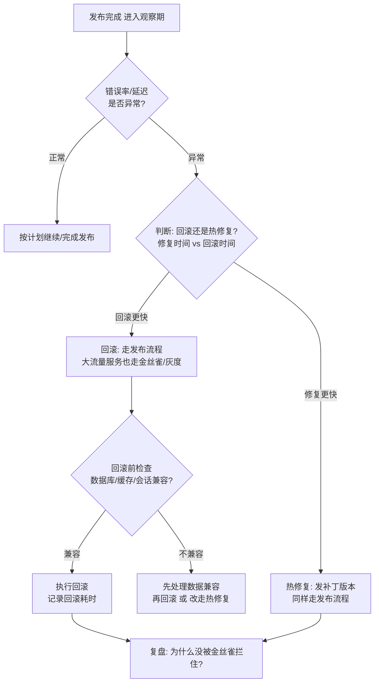
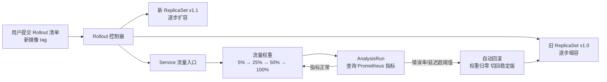
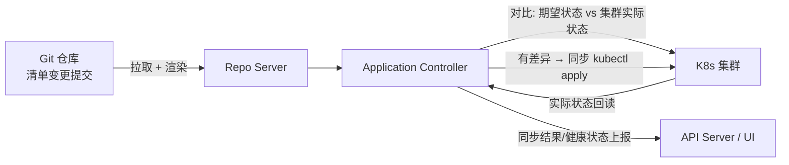

# 1.11 发布策略与回滚实践认知 [实用]

> 来源：[Kubernetes 官方文档](https://kubernetes.io/docs/concepts/workloads/controllers/deployment/)（Deployment 滚动更新与回滚）· [Argo Rollouts](https://argoproj.github.io/rollouts/)（渐进式交付）· [ArgoCD / Flux](https://argoproj.github.io/cd/ · https://fluxcd.io/)（GitOps）
> 验证环境：待验证（kind v0.x + K8s v1.x，发布前须本地跑通）

## 为什么先学这个

本章的定位是**认知建立**，不是操作手册。1.10 解决了「能部署」（拉得动、起得快、扛得住），本章解决「敢发布」——把新版本安全地送到用户面前，出问题能体面地退回来。企业里「发布」从来不只是 `kubectl apply`：一次坏发布 = 线上事故，而事故的代价（营收损失、口碑崩塌、半夜被叫起来）远超发布本身。先建立发布治理意识——发布策略怎么选、回滚怎么设计、和 GitOps 什么关系——再动手配，才是本章的学习顺序。每个主题末尾附「和 AI 沟通的提问要点」，把「问得到点子上」变成可练习的动作。

## 概念：为什么需要

**业务痛点**：[已必备] 一次坏发布 = 线上事故——新版本有 bug、配置写错、数据库不兼容，全量发布时影响面 100%，用户全部受影响；[已必备] 大促/秒杀前不敢发版，发布窗口只能排在凌晨，出问题回滚还要半小时；[已必备] 消费者侧服务不可用 = 直接营收损失与口碑崩塌。发布策略解决「怎么把新版本安全地送到用户面前」：把变更的影响面从 100% 缩小到可控范围，出问题能快速退回去。

- **从哪来**：停机发布（先停旧再上新，发布期间服务不可用）→ 滚动更新（K8s 默认，逐步替换）→ 蓝绿/金丝雀/灰度（把「全量切换」拆成「可控放量」）
- **是什么**：发布策略 = 新版本上线的方式与节奏（滚动/蓝绿/金丝雀/灰度）；回滚 = 出问题时的逃生通道（退回到上一个已知良好版本）；两者合起来构成一次发布的完整闭环
- **往哪去**：GitOps 下发布 = Git 提交，回滚 = revert 提交；渐进式交付（发布过程中自动分析指标、指标异常自动回滚）把「人盯发布」变成「系统盯发布」——细节在 Part 4.8

## 认知要点（先建立意识）

- **发布策略的本质是「风险控制」**：把变更的影响面从 100% 缩小到可控范围。滚动更新把影响面拆成「一批 Pod」、金丝雀把影响面拆成「一小撮流量」、灰度把影响面拆成「一小群用户」——策略的差异就是「影响面怎么拆、拆多细」
- **不治理会踩的坑**：全量发布失败（新版本有问题，影响面 100%，用户全挂）；回滚困难（没有发布记录、数据库不兼容、缓存格式不兼容，想退退不回去）；发布窗口长（大流量下不敢发，只能半夜发，发一次要几小时）
- **要知道的关键事实**：K8s Deployment 默认就是滚动更新（maxSurge/maxUnavailable 默认 25%）；Deployment 默认保留 10 个 revision（发布历史版本，`revisionHistoryLimit` 可调）；K8s 原生不支持按比例/按用户分流——金丝雀和灰度都需要额外组件（Ingress 权重、服务网格、Argo Rollouts）
- **治理意识**：发布前先回答三个问题——影响面多大？出问题怎么退？多久能退？答不上来任何一个，就不该发

## 主题一：四种发布策略对比

### 对比表

| 策略 | 原理一句话 | 适用场景 | 回滚方式 | 成本 |
|---|---|---|---|---|
| 滚动更新 | 新老 Pod 逐步替换，边起边杀 | 无状态服务默认选择 | `kubectl rollout undo` | 低（K8s 内置，零额外组件） |
| 蓝绿 | 新旧两套环境同时运行，验证后一次性切换 | 需要完整预验证（大改版、配合数据库迁移） | 切回旧环境（秒级） | 高（双倍资源） |
| 金丝雀 | 小流量试新版本，观察无误逐步放量 | 核心服务、稳定性要求高的服务 | 停止放量，流量留在旧版本 | 中（需流量治理组件） |
| 灰度/AB | 按用户维度（ID/地域/客户端版本）放量 | 大流量、多租户、按用户群验证 | 路由规则回退 | 高（需网关/服务网格 + 用户分群） |

### 1. 滚动更新（RollingUpdate）

**原理**：Deployment 默认策略——新版本 Pod 逐个创建、就绪后摘流，旧版本 Pod 逐个删除，`maxSurge`（最多超出期望副本数多少个）和 `maxUnavailable`（最多允许多少个不可用）控制替换节奏。新老版本会短暂同时在线，流量按副本数比例自然分配。

**怎么做**（标准 K8s 实践）：

```yaml
spec:
  strategy:
    type: RollingUpdate
    rollingUpdate:
      maxSurge: 1
      maxUnavailable: 0     # 先起新的再杀旧的，零中断（需资源余量）
```

```bash
kubectl set image deployment/demo demo=registry.example.com/demo:v1.1.0   # 触发滚动更新
kubectl rollout status deployment/demo                                    # 等发布完成
kubectl rollout history deployment/demo                                   # 看发布历史（revision 列表）
kubectl rollout undo deployment/demo                                      # 回滚到上一个 revision
kubectl rollout undo deployment/demo --to-revision=2                      # 回滚到指定 revision
```

> 验证环境：待验证。以上命令与 YAML 发布前须在本地 kind 集群跑通。

**适用场景**：无状态服务（不保存本地状态、可随时重建）的默认选择；发布频率高、每次变更小的服务。

**回滚方式**：`kubectl rollout undo`——Deployment 保留 revision 历史（默认 10 个），回滚 = 把 Pod 模板切回旧 revision 再走一次滚动更新。

**成本**：低。K8s 内置，无额外组件；代价是「不可控」——无法按比例控制流量（新老版本同时在线，流量按副本数比例自然分配），也无法按用户维度控制。

### 2. 蓝绿（Blue/Green）

**原理**：新旧两套环境（两套 Deployment，如 blue/green）同时运行，新环境完整验证通过后，把流量一次性从旧环境切到新环境。切换动作通常是改 Service 的 selector（选择器，决定流量发给哪些 Pod）指向新环境。

**怎么做**（标准做法示意）：

```yaml
# 两套 Deployment（version: blue / version: green）各自运行，Service 只指向当前生效的一套
spec:
  selector:
    app: demo
    version: green    # 切蓝绿 = 把这一行从 blue 改成 green（或维护两个 Service 切换）
```

> 验证环境：待验证。蓝绿切换的流量瞬间完成，但「瞬间全量」意味着新环境有问题时影响面仍是 100%。

**适用场景**：需要完整预验证的场景——UI 大改版、配合数据库迁移、对「新旧版本共存」有顾虑的服务。

**回滚方式**：切回旧环境（selector 指回旧版本），秒级完成——这是蓝绿最大的优点。

**成本**：高。两套环境同时运行 = 双倍资源；数据库兼容是前提（新旧两套环境可能同时读写同一数据库）。

### 3. 金丝雀（Canary）

**原理**：先放一小部分流量（如 5%~10%）到新版本，观察错误率/延迟正常后逐步放量，直到全量。金丝雀按**流量比例**放量（随机样本），不是按用户。

**怎么做**：K8s 原生 Deployment 不支持按比例分流——需要 Ingress 权重、服务网格（如 Istio，管理服务间流量的基础设施层）或 Argo Rollouts 配合。Argo Rollouts 是 K8s 的金丝雀/蓝绿发布控制器（自定义资源 Rollout 替代 Deployment），支持发布过程中自动分析指标、指标异常自动回滚——细节在 Part 4.8。放量节奏用 steps（步骤）声明，每步设流量权重与观察时长：

```yaml
# Argo Rollouts 金丝雀放量节奏（Rollout 的 spec.strategy.canary.steps）
steps:
  - setWeight: 5          # 先放 5% 流量
  - pause: { duration: 10m }   # 观察 10 分钟
  - setWeight: 25
  - pause: { duration: 10m }
  - setWeight: 50
  - pause: { duration: 10m }
  - setWeight: 100        # 全量
```

> 验证环境：待验证。setWeight/pause 是 Argo Rollouts 标准字段；每步观察期可配 AnalysisRun 自动查指标，异常自动回滚。

**适用场景**：核心服务、稳定性要求高的服务；发布频率低但每次变更风险大的服务。

**回滚方式**：停止放量——流量留在旧版本，新版本 Pod 缩掉即可，不需要「回滚」动作。

**成本**：中。需要流量治理组件（Ingress 权重/服务网格/Argo Rollouts）；放量节奏、观察指标、阈值都要设计。

### 4. 灰度/AB

**原理**：按**用户维度**放量——用户 ID 哈希、地域、客户端版本、白名单等，让一小群指定用户先用到新版本，验证通过再逐步扩大用户范围。灰度按用户（定向样本），金丝雀按流量（随机样本）——这是两者的核心区别。

**怎么做**：需要网关/服务网格按请求特征（Header/Cookie/用户 ID）路由到不同版本，配合用户分群体系。规则与业务耦合深，维护成本高。Gateway API（K8s 北向流量标准 API）的 HTTPRoute 是标准化的实现路径——用 matches（匹配规则）按请求特征选路，用 backendRefs 的 weight（权重）按比例分发：

```yaml
# Gateway API HTTPRoute：按 Header 匹配灰度用户 + 按权重分流
spec:
  rules:
    - matches:                    # 灰度用户：请求带 X-Canary: v2 头
        - headers:
            - name: X-Canary
              value: v2
      backendRefs:
        - name: demo-v2           # 灰度用户 → 新版本
          port: 80
    - backendRefs:                # 其余用户 → 旧版本（默认路由）
        - name: demo-v1
          port: 80
          weight: 90
        - name: demo-v2           # 也可按权重放一小部分流量给新版本
          port: 80
          weight: 10
```

> 验证环境：待验证。matches/backendRefs/weight 是 Gateway API 标准字段；灰度规则与业务耦合深，维护成本高，先想清楚「按什么维度分群」再配。

**适用场景**：大流量、多租户（不同租户可以不同版本）；需要按用户群体验证（如新功能只对部分用户开放做 AB 实验）。

**回滚方式**：路由规则回退——把灰度规则改回去，用户流量回到旧版本。

**成本**：高。网关/服务网格路由能力 + 用户分群体系 + 规则维护；收益是影响面可以精确到「一小群用户」。

### 怎么选（决策思路）

- 无状态服务、发布频繁 → 滚动更新（默认，零成本）
- 需要完整预验证、能接受双倍资源 → 蓝绿
- 核心服务、要控制风险 → 金丝雀（先小流量试新）
- 大流量/多租户、要按用户群控制 → 灰度/AB
- 策略不是互斥的：可以「滚动更新打底 + 核心服务金丝雀 + 大流量灰度」组合使用

### 和 AI 沟通的提问要点

向 AI 咨询发布策略时，先说清：服务可用性要求（SLO，服务等级目标——可接受多长中断、多高错误率）、副本数与流量规模、是否有状态（数据库/会话/缓存）、发布频率、回滚容忍时间（出问题多久内必须退回去）。核心问题：该用哪种策略？金丝雀放量节奏和观察指标怎么定？蓝绿切换时数据库怎么处理？

## 主题二：回滚设计

### 为什么需要

回滚是发布策略的逃生通道。没有回滚设计的发布 = 裸奔：新版本一上线就出问题，想退退不回去，只能线上修 bug（热修复），而热修复本身又是一次发布，风险叠加。回滚设计的目标：**任何一次发布，都有一条验证过的、可计时的退路**。

### 认知要点（先建立意识）

- **回滚不是「重新部署旧版本」那么简单**：旧版本代码能跑，不代表旧版本能接住新版本留下的烂摊子——数据库结构变了、缓存格式变了、用户会话状态变了，都可能让「回滚」变成「二次事故」
- **不治理会踩的坑**：数据库 schema 不兼容（新版本改了表结构，回滚后旧版本读写报错）；缓存格式不兼容（新版本写入的缓存旧版本读不了，报错或数据错乱）；粘性会话（sticky session，会话保持——用户请求一直打到同一 Pod）下会话状态丢失，用户被登出/重试；没有发布记录，不知道「上一个好版本」是哪个
- **要知道的关键事实**：Deployment 的 revision 历史（`kubectl rollout history`）和 Helm 的 revision（发布版本号，`helm rollback`，见 [1.9](09-app-packaging.md)）都是「发布记录」——回滚的前提是发布有记录、可追溯
- **治理意识**：回滚要「可设计、可演练、可计时」——回滚方案在发布前写好，定期演练验证，回滚时间有明确预期（分钟级还是小时级）

### 怎么做（回滚检查清单）

**1. 数据库兼容**：schema（表结构）变更要同时兼容新旧两个版本——**向前兼容**（新版本写的结构旧版本能读）和**向后兼容**（旧版本写的结构新版本能读）。schema 变更分步走：先加列（新旧版本都能读写）→ 迁移数据 → 应用发布 → 确认稳定后删旧列。一次发布同时改 schema 和代码，回滚时旧代码面对新 schema 直接报错。

**2. 缓存**：新版本写入的缓存格式，旧版本能不能读？缓存 key 带版本号、或发布时清缓存，是常见做法（具体方案随缓存组件而异，待验证）。

**3. 会话**：有粘性会话的服务，回滚后用户会话状态是否还在？会话存哪（内存/Redis/数据库）决定回滚后用户是否被登出。

**4. 发布记录**：发布前记录当前版本号（镜像 tag、Helm revision、Deployment revision），回滚目标明确；发布记录与监控告警联动，出问题能立刻定位「这次发布改了什么」。

**5. 回滚演练**：定期演练回滚（测试环境全流程跑一遍），验证回滚脚本、回滚时间、回滚后的数据一致性。没演练过的回滚 = 没回滚。

### 回滚决策流程

发布出问题时的决策路径（发布前先想清楚，事故时按流程走，不靠临场拍脑袋）：



> 验证环境：待验证。流程要点：回滚也是发布（走同样的受控路径）；回滚前先过兼容检查清单；事故后必复盘——「为什么发布策略没拦住这次事故」是发布治理持续改进的入口。

### 注意事项

- **回滚窗口**：发布后设观察期（如 15~30 分钟），观察期内错误率/延迟异常立即回滚；过了观察期再出问题，先定位再决定（可能是数据问题，回滚也救不了）
- **回滚也是发布**：回滚本身要按发布流程走——大流量服务回滚也要走金丝雀/灰度，不能「紧急回滚」就全量裸切
- **回滚与热修复的选择**：小问题热修复（发补丁版本），大问题回滚；判断标准是「修复时间 vs 回滚时间」，哪个快用哪个

### 和 AI 沟通的提问要点

向 AI 咨询回滚方案时，先说清：是否有数据库及 schema 变更频率、缓存组件与格式、会话存储方式、发布记录方式（Helm/Deployment/自研）、回滚容忍时间。核心问题：这次变更数据库兼容吗？回滚后缓存/会话会怎样？回滚演练该覆盖哪些场景？

## 主题三：发布与 GitOps 的关系

### 为什么需要

GitOps（以 Git 仓库为唯一事实来源的声明式交付方式）下，发布 = 提交一次 Git 变更，ArgoCD/Flux 自动把集群同步到 Git 里声明的状态。发布策略和 GitOps 是两件事，但天然配合：GitOps 解决「发布可审计」（每次发布都有 Git 记录，可追溯、可 revert），发布策略解决「发布可控」（变更怎么送到用户面前）。

### 认知要点（先建立意识）

- **ArgoCD/Flux 是 GitOps 双雄**（CNCF 毕业项目）：监听 Git 仓库，自动同步到集群；回滚 = revert Git 提交（或切回旧分支），集群自动同步回去
- **渐进式交付**（发布过程中自动分析指标、指标异常自动回滚）：Argo Rollouts 支持金丝雀/蓝绿 + analysis（发布期间自动分析指标，异常自动回滚）；Flux 生态配合 Flagger 做类似能力
- **治理意识**：GitOps 下「回滚」有两个层次——应用层回滚（rollout undo，退 Pod 版本）和 Git 层回滚（revert 提交，退声明状态）；生产事故时先退应用层（快），再修 Git 状态（稳）
- 本章认知即可，ArgoCD/Flux 的配置细节在 Part 4.8

**发布策略与 GitOps 的分工对照**：

| 维度 | 发布策略（本章） | GitOps（Part 4.8） |
|---|---|---|
| 解决什么 | 变更怎么送到用户面前（**可控**） | 状态怎么收敛到声明（**可审计**） |
| 核心机制 | 滚动/蓝绿/金丝雀/灰度 + 回滚设计 | Git 为唯一事实来源 + 控制器自动同步 |
| 回滚方式 | `rollout undo` / 切流量 / 路由规则回退 | revert Git 提交（或切回旧分支） |
| 自动化下一步 | 渐进式交付：发布中自动分析指标、异常自动回滚 | 平台化：发布审批、策略内置、审计留痕 |
| 典型组合 | Argo Rollouts（发布可控） | ArgoCD/Flux（状态收敛） |

### 和 AI 沟通的提问要点

向 AI 咨询 GitOps 发布方案时，先说清：当前发布方式（kubectl apply / Helm / 脚本）、是否已有 Git 仓库管理清单、发布频率、回滚容忍时间。核心问题：ArgoCD 还是 Flux？渐进式交付（Argo Rollouts/Flagger）要不要上？应用层回滚和 Git 层回滚怎么配合？

## 官方文档关键机制引述

以下三处官方文档是本章机制的权威出处，字段与行为以官方为准（本手册不重复堆链接，完整索引见知识检索手册 §1/§2）：

**1. K8s 官方 Deployment 文档——滚动更新与 revision 机制**

> 要点：Deployment 以滚动更新方式更新 Pod——`maxSurge` 控制最多超出期望副本数多少个，`maxUnavailable` 控制最多允许多少个不可用（默认均为 25%）；每次更新产生一个新 revision（发布历史版本），`revisionHistoryLimit` 控制保留数量（默认 10）；`kubectl rollout pause/resume` 可暂停/恢复发布，`kubectl rollout undo` 回滚到上一个或指定 revision。
> 来源：[Kubernetes 官方文档 · Deployment](https://kubernetes.io/docs/concepts/workloads/controllers/deployment/) · 验证环境：待验证

**2. K8s 官方「回滚 Deployment」任务页——回滚的完整语义**

> 要点：回滚 = 把 Deployment 的 Pod 模板切回旧 revision 并重新走一次滚动更新；`kubectl rollout undo deployment/<name> --to-revision=<n>` 回滚到指定版本；回滚后 revision 继续递增（回滚本身也是一次发布）；`kubectl rollout history` 查看 revision 列表与变更原因（`--record` 可记录变更命令，已弃用，待验证）。
> 来源：[Kubernetes 官方文档 · Rolling Back a Deployment](https://kubernetes.io/docs/tasks/run-application/rollback-deployment/) · 验证环境：待验证

**3. Argo Rollouts 官方文档——金丝雀发布与 Analysis 自动回滚**

> 要点：Argo Rollouts 用自定义资源 Rollout 替代 Deployment，支持金丝雀/蓝绿发布；金丝雀发布按 step（步骤）逐步调整流量权重，每步可触发 AnalysisRun（发布期间运行的指标分析任务）查询 Prometheus 等指标源，指标异常时自动回滚（流量切回稳定版）；蓝绿发布支持 previewService/activeService 双 Service 切换。
> 来源：[Argo Rollouts 官方文档](https://argoproj.github.io/rollouts/) · 验证环境：待验证

## 明星项目架构：Argo Rollouts 与 ArgoCD

### Argo Rollouts：金丝雀发布的数据流

Argo Rollouts 是 K8s 的金丝雀/蓝绿发布控制器（CNCF Argo 项目族成员）。核心组件：**Rollout 自定义资源**（替代 Deployment 的发布声明）、**新旧两个 ReplicaSet**（新老版本 Pod 集合）、**稳定版/金丝雀版 Service**（流量入口）、**AnalysisTemplate/AnalysisRun**（指标分析模板与运行实例）。金丝雀发布的数据流：



> 验证环境：待验证。图中「流量权重」由 Argo Rollouts 通过 Ingress/服务网格（Istio 等）的权重配置实现；AnalysisRun 的指标查询与阈值在 AnalysisTemplate 中声明。

### ArgoCD：GitOps 同步的数据流

ArgoCD 是 GitOps 双雄之一（CNCF 毕业项目）。核心组件：**Application 自定义资源**（声明「哪个 Git 仓库的哪个路径 → 同步到哪个集群/命名空间」）、**Repo Server**（拉取 Git 仓库并渲染清单，支持 Helm/Kustomize）、**Application Controller**（对比期望状态与实际状态、执行同步）、**Redis**（缓存仓库与清单）、**API Server/UI**（人机接口）。同步数据流：



> 验证环境：待验证。同步策略（自动/手动）、健康评估（Health Status）、回滚方式（revert Git 提交或切分支）在 Application 的 spec 中声明；ArgoCD 与 Argo Rollouts 可配合：Rollout 负责「发布可控」，ArgoCD 负责「状态收敛」。

## 业界前沿：发布治理的演进方向

> 本节为演进方向认知，标注「前沿，待验证」——具体版本与能力以官方文档为准。

- **Gateway API 流量切分标准化**：Gateway API（K8s 北向流量标准 API）的 HTTPRoute 支持 backendRefs 权重（weight）字段，按权重把流量分给多个后端——金丝雀放量有了标准化的原生路径，不再依赖 Ingress 注解或服务网格（前沿，待验证：weight 字段语义与实现以 Gateway API 官方文档为准）
- **渐进式交付与 GitOps 深度融合**：Argo Rollouts 与 ArgoCD 集成（Rollout 作为 Application 管理的资源）、Flux 生态配合 Flagger（金丝雀发布 + 指标分析）——「发布 = Git 提交 + 自动分析 + 自动回滚」成为平台级能力，人只负责审批（前沿，待验证）
- **大镜像发布的 P2P 分发**：spegel（镜像 P2P 分发项目，节点间互相分享镜像层）——GB 级 AI 模型镜像发布时，新节点不再各自从仓库拉全量，而是从相邻节点拉取，发布窗口显著缩短（前沿，待验证：spegel 的 CNCF 状态与生产成熟度以项目官方为准）
- **AI 推理服务的金丝雀发布**：KServe（推理平台层标准）的 InferenceService 支持 canary 配置——模型版本切换走金丝雀，流量按权重分配，回滚 = 权重归零（前沿，待验证：canary 字段与行为以 KServe 官方文档为准）
- **发布期间资源调整**：InPlace Pod Resize（KEP-1287，原地调整 Pod 资源请求/限制，无需重建 Pod）——发布/扩容时资源调整不再触发 Pod 重建，减少发布扰动（前沿，待验证：特性版本与默认状态以 K8s 发布博客为准）

## 选型/技术路线建议

- **小团队/低流量起步**：滚动更新打底（K8s 默认，零成本），配好 `kubectl rollout undo` 回滚路径——先做到「发得出去、退得回来」
- **核心服务升级**：金丝雀——Argo Rollouts 或服务网格按流量比例放量，配发布观察指标
- **大流量/多租户再上灰度**：网关/服务网格按用户维度路由，配用户分群体系——这是最后一步，别一上来就上
- **发布策略与可观测性联动**（呼应 1.8 可观测性，章节待写作）：发布期间盯错误率、延迟、P99（99% 请求的耗时上限），金丝雀放量每一步都看指标再决定下一步；没有可观测性的金丝雀是盲放
- **渐进路线**：先滚动 → 再金丝雀 → 再灰度，每一步都以「可观测性到位」为前提；发布治理的复杂度跟着服务重要度走，不是所有服务都上全套

## 实用技巧

- 发布三件套：`kubectl rollout status`（等发布）、`kubectl rollout history`（看历史）、`kubectl rollout undo`（回滚）——发布前先 `kubectl rollout history` 确认「上一个好版本」是哪个
- 发布前 diff 防盲发：`kubectl diff`（Kustomize 清单）或 `helm diff upgrade`（Helm，见 [1.9](09-app-packaging.md)）
- 发布期间盯什么：错误率（5xx 比例）、延迟（P99）、Pod 重启次数（CrashLoopBackOff）、就绪状态——异常先看是不是发布引起的（对照发布记录）
- 回滚演练脚本化：把「回滚到上一版本」写成脚本（含数据库兼容检查），每季度演练一次，记录实际回滚耗时
- 大流量服务回滚也要走灰度：紧急回滚前先确认「回滚本身不会引发二次事故」（数据库/缓存兼容）
- 发布窗口选低峰期，观察期覆盖业务高峰：如晚间发版，观察期覆盖次日早高峰——「发布完就下班」等于把观察期交给运气
- 发布记录与告警联动：发布单（变更了什么、谁批的、回滚预案）与监控告警绑定，告警触发时第一眼就能看到「是不是这次发布引起的」
- 金丝雀放量节奏参考：5% → 25% → 50% → 100%，每步观察 10~30 分钟；放量越快，观察指标越要灵敏（阈值收紧）

## CKAD 考点对照

- 滚动更新与回滚是 CKAD 高频考点：会写 `strategy` 字段（maxSurge/maxUnavailable）、会用 `kubectl rollout undo` 回滚
- Deployment revision 历史（`kubectl rollout history`）与回滚到指定版本
- 蓝绿/金丝雀/灰度属生产实践，CKAD 不直接考——但「发布可控」的意识是面试高频题，按 CKA/生产标准学

## 考察问题

- 滚动更新为什么不能按比例控制流量？新老版本同时在线时流量怎么分配？（线索：Service 负载均衡按端点轮询，与副本数比例相关）
- 蓝绿切换时数据库怎么办？新旧两套环境同时读写同一数据库会怎样？（线索：schema 兼容；迁移窗口）
- 金丝雀放量 10% 时新版本 Pod 数怎么算？流量比例等于 Pod 数比例吗？（线索：负载均衡权重 vs 副本数；Ingress/网格的权重配置）
- GitOps 下回滚是 revert 提交还是 `kubectl rollout undo`？两者什么关系？（线索：Git 层 vs 应用层；ArgoCD 自动同步的时机）
- 回滚后缓存里还有新版本写入的数据，旧版本读会怎样？（线索：缓存格式兼容；key 版本化）
- 回滚演练该覆盖哪些场景？怎么验证「回滚后数据一致」？（线索：数据库兼容检查、缓存清理、会话保持、回滚耗时计时）

## 经验之谈

**权威观点（署名引述，观点转述未逐字核对原文，链接可查）**：

- **Martin Fowler**（蓝绿部署术语的提出者之一）：蓝绿部署的核心思想是「两套环境只切换流量」——新版本在绿环境完整验证后，把流量从蓝环境切到绿环境；回滚 = 把流量切回蓝环境，秒级完成。蓝绿部署的价值在于「切换」与「回滚」都只是流量动作，不涉及重新部署。出处：[BlueGreenDeployment（Martin Fowler 与 Danilo Sato，2010）](https://martinfowler.com/bliki/BlueGreenDeployment.html)
- **Bilgin Ibryam**（《Kubernetes Patterns》作者）：发布策略在 K8s 里是「部署模式」家族——滚动更新、金丝雀、蓝绿是模式化的发布方式，底层哲学是声明式发布 + 控制器收敛：你声明期望状态（哪个版本、多少副本），控制器负责把集群收敛到该状态；发布与回滚都只是「修改期望状态」。出处：[Kubernetes Patterns（Bilgin Ibryam 与 Roland Huß，O'Reilly）](https://k8spatterns.io/)
- **Brendan Burns**（K8s 联合创始人）：K8s 的核心设计是声明式 API——用户描述期望状态，系统负责收敛；这决定了发布 = 修改期望状态（apply 新清单），回滚 = 把期望状态改回去（apply 旧清单），而不是「登录服务器手动操作」。出处：[Kubernetes: Up and Running（Brendan Burns、Joe Beda、Kelsey Hightower，O'Reilly）](https://www.oreilly.com/library/view/kubernetes-up-and/9781098110192/)

**观点转述（不署名，具体引用待补）**：

- 发布策略的本质是风险控制，不是炫技：影响面拆得越细，代价越高（组件、资源、规则），先想清楚「这个服务值不值得」
- 回滚设计比发布策略更重要：策略决定「怎么送」，回滚决定「怎么退」——退不回去的发布，策略再好也是裸奔
- 没有可观测性的金丝雀是盲放：放量 10% 却不知道错误率，等于没放量
- 数据库兼容是回滚的第一道坎：schema 和代码一起改，回滚时旧代码面对新 schema 直接报错——schema 变更永远分步走
- 回滚也是发布：紧急回滚全量裸切，等于把「发布事故」换成「回滚事故」

## 架构师视角

- **解决什么问题**：把「能部署」变成「敢发布」——变更影响面可控、出问题能快速退回、发布过程可审计
- **何时用**：生产服务默认配滚动更新 + 回滚路径；核心服务上金丝雀；大流量/多租户上灰度；发布频率高或变更风险大的服务优先治理
- **何时不用**：可快速重建的批任务/一次性任务（发布策略无意义）；开发/测试环境（滚动更新默认即可）；发布频率极低且无状态的小服务（滚动更新足够）
- **权衡**：策略复杂度 vs 风险收益——金丝雀/灰度要额外组件和规则维护，小服务不值；蓝绿双倍资源；发布治理的复杂度跟着服务重要度走
- **固定三问**：
  - 平台提供了什么能力边界？平台是否提供金丝雀/灰度能力（Ingress 权重、服务网格、发布平台）？是否强制发布审批/发布窗口？GitOps 平台（ArgoCD/Flux）是否由平台托管？
  - 业务接入点在哪？服务清单里声明滚动更新策略与探针；金丝雀/灰度规则（放量比例、用户分群）由业务提出需求，路由配置由平台或业务按约定维护
  - 需要和基础设施团队对齐什么？发布窗口与审批流程、金丝雀/灰度平台能力、发布期间的监控告警口径（错误率/延迟阈值）、回滚的权限与流程（谁能按回滚按钮）

## 核心收获表

| 能力维度 | 具体收获 |
|---|---|
| 发布策略认知 | 能说清滚动/蓝绿/金丝雀/灰度四种策略的原理、适用场景、回滚方式、成本，能按服务重要度选型 |
| 回滚设计 | 能写出回滚检查清单（数据库/缓存/会话/发布记录/演练），理解「回滚不是重新部署旧版本」 |
| GitOps 关系 | 能说清 GitOps 与发布策略的分工（可审计 vs 可控），知道渐进式交付自动回滚的存在 |
| 官方机制与架构 | 能引述 K8s 官方滚动更新/回滚机制（maxSurge/maxUnavailable/revision），能画出 Argo Rollouts 金丝雀与 ArgoCD 同步的数据流 |
| 前沿认知 | 知道 Gateway API 流量切分、spegel P2P 分发、KServe canary 等演进方向（前沿，待验证） |
| AI 沟通 | 能向 AI 提供发布方案五要素（SLO/规模/状态/频率/回滚容忍时间），问到核心要点 |
| 动手 | 能用 `kubectl rollout` 三件套完成滚动更新与回滚（待验证） |

## 推荐开源项目

| 项目 | 链接 | 研读重点 |
|---|---|---|
| Kubernetes 官方文档（Deployment） | https://kubernetes.io/docs/concepts/workloads/controllers/deployment/ | 滚动更新策略/回滚/revision 历史，字段以官方为准 |
| Argo Rollouts | https://argoproj.github.io/rollouts/ | 金丝雀/蓝绿发布控制器，analysis 自动回滚 |
| ArgoCD | https://argoproj.github.io/cd/ | GitOps 双雄之一，发布可审计 |
| Flux | https://fluxcd.io/ | GitOps 双雄之一，配合 Flagger 渐进式交付 |
| Flagger | https://flagger.app/ | Flux 生态渐进式交付，金丝雀发布 + 指标分析自动回滚 |
| Istio | https://istio.io/ | 服务网格，按流量/请求特征路由（金丝雀/灰度基础设施） |
| spegel | https://spegel.dev/ | 镜像 P2P 分发，大镜像发布加速（前沿，待验证） |

## 常见问题排查

| 高频报错 | 排查路径 |
|---|---|
| 发布后错误率飙升 | 先对照发布记录确认是不是本次发布引起；`kubectl rollout undo` 回滚；回滚前检查数据库/缓存兼容 |
| 回滚后服务报错 | 大概率是数据兼容问题：检查 schema 是否被新版本改动、缓存格式是否不兼容、会话状态是否丢失 |
| 滚动更新卡住 | `kubectl rollout status` + describe 新 Pod（Pending/ImagePullBackOff/CrashLoopBackOff）；检查 maxSurge/maxUnavailable 与 PDB 约束（见 [1.10](10-enterprise-deploy-practices.md)） |
| `kubectl rollout undo` 报错 | 检查 revision 是否存在（`kubectl rollout history`）；revision 被清理（revisionHistoryLimit 太小）则需重新部署旧版本镜像 |
| 金丝雀放量后流量没按比例走 | 检查 Ingress/网格的权重配置与 Service 端点数量关系；权重 ≠ 副本数比例（待验证） |
| 发布后延迟升高但错误率正常 | 对照发布记录确认变更内容；检查慢查询/缓存命中率/资源水位（CPU/内存）；金丝雀场景先看是否放量过快、观察期是否足够 |
| GitOps 下回滚后集群没同步 | 检查 Git 仓库状态是否已 revert、ArgoCD/Flux 同步策略（自动/手动）、同步是否被卡住（见 Part 4.8） |