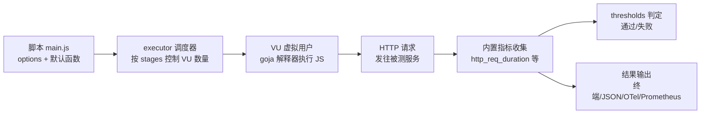
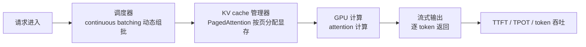

# 1.12 服务压测实践认知 [实用]

> 来源：[k6 官方文档](https://grafana.com/docs/k6/) · [hey](https://github.com/rakyll/hey) · [wrk](https://github.com/wg/wrk) · [Locust 官方文档](https://docs.locust.io/) · [JMeter 官方文档](https://jmeter.apache.org/) · [vLLM 官方文档](https://docs.vllm.ai/) · [Google SRE Book](https://sre.google/sre-book/)
> 验证环境：待验证（kind v0.x + K8s v1.x，发布前须本地跑通）

## 为什么先学这个

本章的定位是**认知建立**，不是操作手册。压测（load testing，用工具模拟真实流量、在可控条件下测量系统性能上限与瓶颈的实践）是容量规划的依据：上线前不知道性能上限，流量洪峰来了才知道扛不住——而那时已经没有从容调整的窗口。压测结果直接决定副本数、资源规格（requests/limits）怎么定，呼应 1.10 里「limits 别拍脑袋，先压测拿基线」。先建立「目标 → 场景 → 指标 → 工具 → 结果分析」的方法论认知，再让 AI 帮你逐步落实，是本章的学习顺序。

## 概念：为什么需要

**业务痛点**：[已必备] 大促/秒杀流量洪峰扛不住，扩容靠拍脑袋；[已必备] 上线后才发现性能问题，事故复盘时拿不出压测数据，只能「加副本试试」；[已必备] 资源规格（CPU/内存/副本数）凭经验估算，要么浪费钱要么不够用。

- **从哪来**：拍脑袋定副本数与资源规格 → 压测数据驱动容量规划；上线后救火 → 上线前摸底
- **是什么**：压测 = 用工具模拟真实流量，在可控条件下测量系统的性能上限、延迟分布与瓶颈位置，为容量规划（副本数/资源规格）提供数据依据
- **往哪去**：压测走向常态化（发布流水线集成冒烟压测）、平台化（压测环境与数据隔离）；AI 推理服务压测走向吞吐/延迟/token 成本联动评估（呼应 3.4）

## 认知要点（先建立意识）

### 压测三要素：目标、场景、指标

- **目标**：测什么、达到什么标准算通过。没有目标的压测是自嗨——压完只有一堆数字，不知道好不好
- **场景**：模拟什么流量。日常流量、峰值流量、异常流量是三种不同的场景，压测脚本要分别设计
- **指标**：用什么衡量结果。指标选错，压测结论就错

三要素各举一例，感受「可执行」的标准：

| 要素 | 模糊的说法 | 可执行的说法 |
|---|---|---|
| 目标 | 「压一下看看扛不扛得住」 | 「目标 QPS 500、P99 延迟 < 300ms、错误率 < 1%，达到即通过」 |
| 场景 | 「模拟用户访问」 | 「模拟 500 并发、读:写 = 9:1、每请求带 1KB 请求体，持续 10 分钟」 |
| 指标 | 「看响应快不快」 | 「记录 QPS、P50/P99 延迟、错误率、CPU/内存利用率，压完出报告」 |

### 核心指标

| 指标 | 一句话解释 | 为什么重要 |
|---|---|---|
| QPS（Queries Per Second，每秒请求数） | 系统每秒能处理的请求量，即吞吐 | 容量规划的核心数字：目标 QPS 决定副本数 |
| 延迟 P50/P99 | 百分位延迟：P99 = 99% 的请求延迟低于该值 | P99 反映长尾体验，比平均值真实得多 |
| 错误率 | 失败请求占总请求的比例 | 压测中错误率上升 = 系统已到极限或出问题 |
| 资源利用率 | CPU/内存/网络/磁盘/GPU 的使用率 | 定位瓶颈在哪一层，决定扩容方向 |

百分位延迟补充说明：P50（中位数）代表「典型体验」，P95/P99 代表「长尾体验」，P99.9 代表「极端情况」。同一组数据里，P50 可能只有 50ms 而 P99 是 800ms——中间隔着「偶发慢请求」的分布。压测报告至少给 P50 + P99 两个数字，有条件再给延迟分布直方图（histogram，按区间统计请求数量的图），比单一数字信息量大得多。

### 压测类型

| 类型 | 做什么 | 用途 |
|---|---|---|
| 冒烟压测（smoke） | 极小并发跑通链路 | 验证压测脚本与链路本身没问题 |
| 负载压测（load） | 预期负载下持续运行 | 验证系统在预期流量下表现稳定 |
| 压力压测（stress） | 逐步加压直到系统崩溃 | 找系统的性能上限与瓶颈 |
| 峰值压测（spike） | 瞬间打高并发 | 模拟大促/秒杀洪峰，验证弹性 |

### 不治理会踩的坑

- **压测环境与生产差异**：压测环境的配置（副本数/资源规格）、数据量（生产数据量级 vs 测试数据量级）与生产不同，压测结果不能直接外推生产——差异要列清单、算误差
- **压测数据污染**：压测写入的脏数据混进业务数据，影响后续测试与业务统计——压测要用独立数据源/独立 namespace
- **只看平均值不看 P99**：平均值掩盖长尾延迟——100 个请求 99 个 10ms、1 个 5s，平均值只有 60ms，看着很好，实际体验已崩
- **压测完不清理**：压测负载、压测数据、压测产生的资源残留，污染环境、浪费资源——压测要有收尾动作

## 压测方法论

### 第一步：目标设定（从 SLO 反推）

先定 SLO（Service Level Objective，服务等级目标——对可用性/延迟等指标承诺的目标值），再反推压测目标。例如：「目标 QPS 500，P99 延迟 < 300ms，错误率 < 1%」——这就是压测的通过标准。没有 SLO 先定 SLO，压测只是验证手段。

目标 QPS 怎么来？从业务预期反推：大促预估峰值流量（如 500 QPS）→ 定目标 QPS（覆盖峰值 + 冗余，如 500）→ 压测验证「500 QPS 内 P99 < 300ms」是否成立。副本数估算示例：单副本压测能力 100 QPS（拐点数据），目标 500 QPS → 至少 5 副本，再按可用性要求加冗余（如 5 × 1.5 ≈ 8 副本，具体冗余系数按业务定）——这就是「压测结果直接决定副本数」的完整链路。

### 第二步：场景设计

- **典型流量**：日常平均 QPS 与请求分布（读多写少？接口比例？）——请求分布要按生产实际配比，不是所有接口等权重
- **峰值流量**：大促/秒杀时的峰值 QPS（通常按典型流量的 3~10 倍估算，具体倍数按业务定）
- **异常流量**：突增（瞬间翻倍）、慢客户端（响应慢的调用方拖住连接）、下游抖动
- **数据准备**：压测数据量级要对齐生产（数据量差一个数量级，索引/缓存行为完全不同，压测结果不可信）；压测数据用独立数据源隔离，避免污染

### 第三步：阶梯加压

逐步增加并发（如 10 → 50 → 100 → 200 → 500），每档持续一段时间，观察两个拐点：**延迟开始劣化的点**（延迟-并发曲线变陡）和**错误率开始上升的点**。拐点之前的并发区间就是系统的健康工作区，容量规划以拐点为界。

k6 的 stages 就是阶梯加压的官方写法（脚本示例，验证环境：待验证）：

```javascript
import http from 'k6/http';
import { check, sleep } from 'k6';

export const options = {
  stages: [
    { duration: '30s', target: 10 },    // 起步：10 并发
    { duration: '30s', target: 50 },    // 每档 30 秒，逐步加压
    { duration: '30s', target: 100 },
    { duration: '30s', target: 200 },
    { duration: '30s', target: 500 },   // 峰值档
    { duration: '30s', target: 0 },     // 收尾：并发归零
  ],
  thresholds: {
    http_req_failed: ['rate<0.01'],     // 错误率 < 1%
    http_req_duration: ['p(99)<500'],   // P99 延迟 < 500ms
  },
};

export default function () {
  const res = http.get('http://app.example.com/api/hello');
  check(res, { 'status 200': (r) => r.status === 200 });
  sleep(1);   // 模拟用户思考时间，控制请求频率
}
```

> 验证环境：待验证。跑完看 summary 输出：每档的 QPS/延迟/错误率变化，拐点就在延迟或错误率突变的那一档附近。

### 第四步：结果分析（瓶颈定位）

压测数据出来后，按资源利用率定位瓶颈层：

| 瓶颈特征 | 瓶颈层 | 扩容方向 |
|---|---|---|
| CPU 打满、延迟随并发线性上升 | 计算瓶颈 | 加副本/升 CPU 规格 |
| 内存持续上涨、OOMKilled | 内存瓶颈 | 升内存规格/查内存泄漏 |
| 网络带宽打满、连接数超限 | 网络瓶颈 | 加副本分散/查大响应体 |
| 磁盘 IO 高、慢查询 | 存储瓶颈 | 查 DB/缓存/日志写入 |
| GPU 利用率高、显存不足 | GPU 瓶颈（AI 推理） | 加 GPU 副本/降 batch/量化 |

## 官方文档关键机制引述

压测方法论不是凭空发明，以下三个官方机制是「压测目标怎么定、结果怎么落地」的依据（要点 + 链接，字段以官方为准）：

**1. K8s 资源 requests/limits 机制**（压测数据 → 资源规格的依据）：

- 官方要点：CPU 是可压缩资源（超限节流不杀），内存是不可压缩资源（超限 OOMKilled）；requests 用于调度与 QoS 分级，limits 用于运行时限制——压测拿到的资源基线，就是写 requests/limits 的数据来源
- 链接：https://kubernetes.io/docs/concepts/configuration/manage-resources-containers/
- 验证环境：待验证（kind v0.x + K8s v1.x，发布前须本地跑通）

**2. K8s HPA 控制环**（压测验证扩缩容的依据）：

- 官方要点：HPA 控制器周期性（默认 15s）读取指标（如 CPU 利用率），按公式计算期望副本数并调整工作负载副本数；压测是验证 HPA 配置（指标阈值/最小最大副本数）是否合理的标准手段——压测中并发上升，副本数应按预期扩、回落时应按预期缩
- 链接：https://kubernetes.io/docs/tasks/run-application/horizontal-pod-autoscale/
- 验证环境：待验证（kind v0.x + K8s v1.x，发布前须本地跑通）

**3. k6 thresholds 阈值断言机制**（压测通过标准的落地）：

- 官方要点：thresholds 在压测脚本里声明「指标必须满足的条件」（如 `p(99)<500`、错误率 `<1%`），压测结束自动判定通过/失败——这是「目标 → 可执行断言」的官方机制，把 SLO 反推的压测目标变成脚本里机器可判定的标准
- 链接：https://grafana.com/docs/k6/latest/using-k6/thresholds/
- 验证环境：待验证（k6 版本以官方文档为准）

## 工具认知表

| 工具 | 一句话定位 | 适用场景 | 学习成本 |
|---|---|---|---|
| k6 | 脚本化压测事实标准（Grafana 出品，JavaScript 脚本，支持场景编排与阈值断言） | 场景编排、CI 集成、复杂压测 | 中（要写 JS 脚本） |
| hey / wrk | 命令行快速单点压测（一条命令打一个接口） | 快速验证单接口、临时摸底 | 低（一条命令） |
| Locust | Python 分布式压测（用 Python 写用户行为，支持分布式施压） | 需要 Python 生态、分布式施压 | 中（要写 Python） |
| JMeter | 传统企业生态压测工具（GUI + 脚本，生态成熟） | 企业已有 JMeter 资产、团队习惯 GUI | 中高（GUI + 脚本） |

选型原则：**先轻后重**——单接口摸底用 hey/wrk 一条命令；要场景编排、阈值断言、CI 集成用 k6；团队是 Python 栈且要分布式用 Locust；企业已有 JMeter 体系就沿用。

### 工具速查命令（验证环境：待验证）

**hey**（单接口快速压测，一条命令）：

```bash
hey -n 10000 -c 100 http://app.example.com/api/hello
# -n 总请求数，-c 并发数；输出含 QPS、延迟分布（P50/P90/P99）、错误统计
```

**wrk**（高性能 HTTP 压测，C 实现）：

```bash
wrk -t 4 -c 100 -d 30s http://app.example.com/api/hello
# -t 线程数，-c 连接数，-d 时长；输出含 QPS 与延迟分布
```

**k6**（脚本化压测，跑上面的 stages 脚本）：

```bash
k6 run load-test.js
# 输出 summary：QPS、延迟百分位、错误率，thresholds 自动判定通过/失败
```

**Locust**（Python 分布式压测，最小脚本）：

```python
from locust import HttpUser, task, between

class ApiUser(HttpUser):
    wait_time = between(1, 3)          # 用户思考时间 1~3 秒
    @task
    def hello(self):
        self.client.get("/api/hello")  # 每个虚拟用户循环执行
```

```bash
locust -f locustfile.py --host http://app.example.com
# 启动后打开 Web 界面（默认 8089 端口）配置并发与时长
```

**JMeter**：GUI 建测试计划（线程组 + HTTP 请求 + 聚合报告），命令行 `jmeter -n -t plan.jmx` 跑无头压测（企业已有资产时沿用，新项目不建议从 JMeter 起步）。

## 明星项目架构：k6 与 vLLM 的内部机制

理解压测工具与被测对象（AI 推理引擎）的内部机制，压测数据才有解读依据。选两个与本章最相关的核心机制：k6 的执行架构（压测怎么跑起来）与 vLLM 的 PagedAttention（AI 推理压测为什么必须看显存）。

### k6：脚本化压测的执行架构

k6 是 Go 实现、JavaScript 脚本的压测工具，核心组件与数据流（官方文档公开架构）：



- **executor（执行器）**：按 stages 配置调度虚拟用户（VU，Virtual User，模拟的一个用户会话）的增减，阶梯加压就是 executor 按时间线逐步调 VU 数量
- **VU 执行**：每个 VU 用 goja（Go 实现的 JavaScript 解释器）独立循环执行脚本的默认函数，VU 之间互不影响
- **指标与判定**：指标内置收集（http_req_duration、http_req_failed 等），thresholds 在脚本里声明判定条件，结果可输出到终端/JSON，也可通过 OTel/Prometheus 与可观测平台打通

### vLLM：PagedAttention 与推理服务架构

vLLM 是当前主流的高性能 LLM 推理引擎（开源项目，官方文档 + 论文），压测 AI 推理服务前理解它的核心机制，才知道压测数据意味着什么：



- **PagedAttention（分页注意力）**：vLLM 论文提出的核心机制——KV cache（键值缓存，推理时缓存已计算过的注意力键值对，避免重复计算）传统上按请求连续分配显存，碎片化浪费可达 60~80%；PagedAttention 把 KV cache 按固定大小的页（block）管理，像操作系统分页一样按需分配，显存浪费趋近于零，吞吐相对传统方案提升 2~4 倍（论文数据）
- **continuous batching（连续批处理）**：调度器动态组批，请求完成即出队、新请求即入队，而不是等整批完成——这是「并发越高吞吐越高但延迟劣化」的机制根源
- **压测含义**：显存（KV cache 页池）决定能同时服务多少请求；并发超过显存容量时请求排队，TTFT 劣化——压测时观察显存占用与 TTFT 的关系，就是观察 PagedAttention 页池的水位

## AI 推理服务压测特殊性

普通服务的压测认知（QPS/延迟/错误率）对 AI 推理服务依然成立，但有以下特殊性：

### 0. 指标对照：普通服务 vs AI 推理

| 维度 | 普通服务 | AI 推理服务 |
|---|---|---|
| 吞吐 | QPS（每秒请求数） | QPS + token 吞吐（每秒生成 token 数） |
| 延迟 | 响应延迟 P50/P99 | TTFT（首 token 延迟）+ TPOT（每 token 延迟） |
| 资源瓶颈 | CPU/内存/网络/磁盘 | GPU 利用率 + 显存（KV cache 页池） |
| 成本联动 | 资源成本 ≈ 固定 | 成本随 token 吞吐浮动（呼应 3.4） |

### 1. 吞吐 vs 延迟的权衡

GPU 推理服务并发越高，吞吐（每秒处理的请求数）越高，但每个请求的延迟会劣化——因为请求要排队等 GPU 计算，且引擎会做批处理（batching，把多个请求合并成一批计算，提高 GPU 利用率但增加单个请求等待时间）。压测 AI 推理服务时，**不能只看吞吐**，要同时看延迟曲线，找到「吞吐够高且延迟可接受」的并发区间。

### 2. 显存与批处理

显存（GPU 显存容量）决定批处理的上限：batch 越大吞吐越高，但显存占用越大。压测时显存不足会直接 OOM 或报错，这是 AI 推理压测特有的瓶颈层。

### 3. TTFT / TPOT 指标

LLM 流式输出（逐 token 生成）的延迟不能用普通接口的「响应延迟」衡量，要用两个专用指标：

- **TTFT**（Time To First Token，首 token 延迟）：从请求发出到收到第一个输出 token 的时间——用户感知的「开始响应」速度
- **TPOT**（Time Per Output Token，每 token 延迟）：生成每个输出 token 的平均耗时——决定整体生成速度

压测 AI 推理服务时，这两个指标 + token 吞吐（每秒生成 token 数）比单纯 QPS 更有意义。

### 4. 引擎自带 benchmark

vLLM 等推理引擎自带 benchmark 脚本（如 vLLM 的 benchmark_serving.py，官方文档有使用说明），可以快速测出引擎在给定并发/输入输出长度下的吞吐与延迟——**认知即可**：知道引擎自带压测能力，具体用法查官方文档（待验证，随版本变化）。

### 5. token 成本与性能联动（呼应 3.4）

AI 推理的压测结果直接关联成本：吞吐越高、延迟越低，单位 token 的算力成本越低；压测时统计 token 吞吐，把性能数字换算成成本数字，是 AI 推理容量规划与普通服务最大的不同。

### 6. 流式 vs 非流式压测

LLM 接口通常支持两种模式，压测要分别覆盖：

- **非流式（non-streaming）**：等完整响应生成完才返回——延迟 = TTFT + 全部 token 的 TPOT 之和，压测看「完整响应延迟」
- **流式（streaming）**：逐 token 返回（SSE，Server-Sent Events，服务端向客户端逐条推送数据的协议）——用户感知的是 TTFT（第一个字多快出来）+ 生成速度（TPOT），压测看「TTFT + token 生成速率」

同一个服务，流式压测的并发模型与指标口径和非流式完全不同；压测场景矩阵里要显式区分两种模式（见「用 AI 落实」示例 3）。

## 用 AI 落实（本章特色小节）

知道方法论后，压测的落地动作可以交给 AI 逐步执行——AI 是执行者，你是验收者：

1. **让 AI 生成压测脚本**：给出目标（接口、QPS、延迟要求），让 AI 写 k6 脚本（含阶梯加压 stages 与阈值断言 thresholds）
2. **让 AI 设计压测场景矩阵**：给出业务流量特征，让 AI 输出「场景 × 并发 × 时长」矩阵
3. **让 AI 分析压测结果**：把压测工具的输出（k6 summary 等）贴给 AI，让它解读指标、定位瓶颈
4. **让 AI 给容量建议**：基于压测结果，让 AI 给出副本数/资源规格建议，并说明依据

### AI 产出的验收清单

AI 生成的脚本与建议，跑之前先过一遍清单（AI 会编造，验收是你的责任）：

- [ ] 脚本里的目标地址/端口/路径与真实被测服务一致（防止压测打到生产）
- [ ] stages 并发档位与场景矩阵一致，时长合理（每档至少 30 秒，太短数据不稳）
- [ ] thresholds 断言与 SLO 目标一致（不是 AI 随手写的数字）
- [ ] 脚本能看懂：每段在做什么、为什么这么写，看不懂就让 AI 解释
- [ ] 容量建议有压测数据依据（副本数 = 目标 QPS ÷ 单副本能力 + 冗余），不是拍脑袋
- [ ] 命令与 YAML 在本地验证过（AGENTS.md 纪律：AI 不是验证环境）

### 可直接用的 AI 提问示例

**示例 1（生成脚本）**：
> 我有一个 Spring Boot 服务，接口 GET /api/orders，目标 QPS 500、P99 延迟 < 300ms、错误率 < 1%。请帮我写一个 k6 压测脚本：包含阶梯加压（10/50/100/200/500 并发，每档 30 秒）和对应的 thresholds 断言。

**示例 2（分析结果）**：
> 这是 k6 压测输出（贴 summary 文本）。请帮我分析：1）系统的性能上限和拐点在哪；2）瓶颈可能在 CPU/内存/网络/DB 哪一层；3）如果目标 QPS 是 500，副本数和资源规格（requests/limits）应该怎么定，依据是什么。

**示例 3（AI 推理压测）**：
> 我要压测一个 vLLM 推理服务（模型、显存、并发上限已知）。请帮我设计压测场景矩阵：并发档位、输入/输出 token 长度、流式/非流式组合，以及应该记录哪些指标（TTFT/TPOT/token 吞吐/显存占用）。

> 纪律提醒：AI 生成的脚本要自己看懂再跑；AI 给的容量建议要回到压测数据验证；命令与 YAML 必须本地验证（见 AGENTS.md 三条纪律）。

## 选型/技术路线建议

- **轻量起步**：hey/wrk 单脚本快速摸底——一条命令拿到单接口的 QPS 与延迟分布，适合第一次压测
- **复杂场景**：k6（场景编排 + 阈值断言 + CI 集成）或 Locust（Python 分布式）——多接口、多场景、要长期维护的压测
- **AI 推理服务**：引擎自带 benchmark（vLLM 等）测引擎能力 + 网关层压测（对推理网关/入口做整体压测，呼应 3.5）——两层结合，先知道引擎上限，再知道入口整体表现

## 业界前沿：压测的演进方向（前沿，待验证）

压测实践正在从「上线前一次性动作」走向「常态化、平台化、AI 化」，以下演进方向供跟踪（均标注「前沿，待验证」，落地前回官方文档核实）：

- **持续压测（continuous testing）**：压测嵌入发布流水线，每次发布跑冒烟压测，性能回归在合并前被发现——k6 等工具原生支持 CI 集成（前沿，待验证）
- **压测与可观测性融合**：压测指标（k6 等）通过 OTel/Prometheus 输出到可观测平台，与生产指标同口径对比——「压测环境 vs 生产差异」从拍脑袋变成数据化对比（前沿，待验证）
- **AI 推理压测标准化**：MLPerf Inference 增加 LLM 场景基准、Anyscale 开源 LLMPerf（LLM 压测工具）、vLLM 自带 benchmark——AI 推理压测从「自己写脚本」走向「行业基准」（前沿，待验证）
- **网关层压测与推理路由**：Gateway API Inference Extension（网关 API 的推理扩展，用于模型路由/灰度）成熟后，压测对象从「单引擎」走向「网关 + 引擎」全链路（呼应 3.5，前沿，待验证）
- **压测 → 调规格闭环**：InPlace Pod Resize（KEP-1287，原地调整 Pod 资源规格、无需重建 Pod）落地后，「压测发现规格不足 → 原地调规格 → 再压测」的迭代成本大幅下降（前沿，待验证）
- **GPU 资源排队与压测计划**：Kueue（两级队列，AI 工作负载资源排队）等调度机制下，压测申请 GPU 资源要走队列——压测计划要预留资源排队时间（前沿，待验证）
- **压测环境准备加速**：spegel（K8s 镜像 P2P 分发）等加速镜像分发，压测环境（含 AI 大镜像）准备更快（前沿，待验证）
- **AI 应用形态演进**：A2A（Agent2Agent，Agent 间通信协议）等新协议出现后，压测对象从「单接口」走向「多 Agent 协作链路」（前沿，待验证）

## 实用技巧

- 压测前先列「压测环境 vs 生产差异」清单（副本数/资源规格/数据量/网络拓扑），结果外推时算误差
- 压测数据用独立数据源/独立 namespace 隔离，避免污染业务数据
- 压测基线要留档：环境、版本、脚本、参数、结果——没有留档的压测不可复现，等于没压
- 压测完清理：删压测负载、清压测数据、释放压测资源
- 先跑冒烟压测验证脚本与链路，再跑正式压测，避免压测脚本本身有 bug 浪费一轮
- 压测机（施压端）资源要够：施压端自己先到瓶颈，压测结果就失真

### 压测报告模板（四段式）

压测完出一份可复现的报告，四段结构：

1. **环境**：被测服务版本、副本数、资源规格、压测环境 vs 生产差异清单、压测工具与版本、脚本文件路径
2. **场景**：场景矩阵（并发档位/时长/请求分布/数据量）、SLO 目标（目标 QPS/延迟/错误率）
3. **结果**：每档的 QPS、P50/P99 延迟、错误率、资源利用率；拐点位置；thresholds 通过/失败
4. **结论**：性能上限与健康工作区、瓶颈层、容量建议（副本数/资源规格）及依据、遗留风险

报告是给三个月后的自己看的——没有环境与脚本信息的结果数字，等于没压。

## CKAD 考点对照

- 压测本身不在 CKAD 考纲，但压测数据是两类考点的依据：
  - **资源 requests/limits**：压测拿到的资源基线，是写 requests/limits 的数据来源（1.10 已讲）
  - **HPA（HorizontalPodAutoscaler，水平自动扩缩）**：压测验证 HPA 配置是否合理——并发上来副本数是否按预期扩、缩容是否及时
- 压测时观察探针行为（压测中 Pod 被误杀/摘流），是探针配置是否合理的实战检验

## 考察问题

- 为什么 P99 比平均值重要？只看平均值会漏掉什么？（线索：长尾延迟、用户体验、超时重试放大）
- 压测环境与生产差异有哪些？怎么让压测结果更可信？（线索：配置/数据量/网络拓扑；差异清单 + 误差估算）
- 阶梯加压时怎么判断拐点？拐点前后的容量规划策略有什么不同？（线索：延迟-并发曲线、错误率突变；健康工作区 vs 极限区）
- GPU 推理压测为什么并发越高延迟越差？吞吐和延迟怎么权衡？（线索：排队、批处理、显存上限）
- 压测数据怎么换算成容量建议（副本数/资源规格）？（线索：单副本能力 = 目标 QPS ÷ 拐点 QPS；资源利用率反推规格）

## 经验之谈

- 压测的价值不在「测出上限」，而在「上线前知道上限在哪」——事故复盘时，有压测数据和无压测数据是两种完全不同的处境
- 没有 SLO 的压测是自嗨：先定「多少 QPS 内 P99 低于多少毫秒」，再谈压测
- 平均值是给汇报用的，P99 是给排障用的——看指标先看百分位
- 压测数据要能复现：环境、版本、参数、脚本全部留档，否则三个月后没人知道这组数字怎么来的
- AI 推理压测别只盯吞吐：吞吐高但 TTFT 劣化，用户体感一样崩
（观点转述，不署名；具体引用待补）

### 权威观点引述

- **PagedAttention 论文（Kwon et al.，vLLM 团队）**：KV cache 传统连续分配导致显存碎片化浪费可达 60~80%，PagedAttention 按页管理后浪费趋近于零，吞吐相对传统系统提升 2~4 倍——这是「AI 推理压测为什么必须看显存」的论文级依据。出处：arXiv:2309.06180（https://arxiv.org/abs/2309.06180，检索手册 §11 收录）
- **Charity Majors（可观测性领域，charity.wtf）**：「staging 环境是谎言」——测试环境永远无法完全复刻生产，压测环境与生产的差异不是「尽量消除」而是「显式承认并量化」。出处：charity.wtf（具体文章待补）
- 其余观点（不署名）：LLM 应用评估要同时看延迟与成本，只看准确率会漏掉用户体验与账单（呼应 3.4）；压测数据要能复现，否则三个月后没人知道这组数字怎么来的

## 架构师视角

- **解决什么问题**：上线前知道性能上限，容量规划（副本数/资源规格）有数据依据，不再拍脑袋
- **何时用**：新服务上线前、大促/活动前、架构变更后（框架升级/依赖变更）、资源规格调整时
- **何时不用**：一次性脚本/批任务（压测收益低）；开发环境快速验证（轻量工具 hey/wrk 即可，不必上完整压测体系）
- **权衡**：压测成本（环境/时间/数据准备）vs 事故成本（洪峰扛不住）；压测环境与生产差异带来的误差 vs 完全不压测的盲目
- **固定三问**：
  - 平台提供了什么能力边界？压测环境是否可申请/隔离？平台是否有压测工具或压测集群？GPU 资源如何申请与计费？
  - 业务接入点在哪？业务提供压测目标（接口/场景/数据）、SLO 目标、资源基线；压测脚本与结果分析由业务主导
  - 需要和基础设施团队对齐什么？压测环境与生产的差异清单、压测数据隔离方案、GPU 资源申请、压测是否可能影响生产（压测目标地址必须确认隔离）

## 核心收获表

| 能力维度 | 具体收获 |
|---|---|
| 压测认知 | 能说清压测三要素（目标/场景/指标）、核心指标（QPS/P50/P99/错误率/资源利用率）、四种压测类型 |
| 方法论 | 能从 SLO 反推压测目标，设计典型/峰值/异常场景，阶梯加压找拐点，按资源利用率定位瓶颈 |
| 工具选型 | 能按场景选 k6/hey/wrk/Locust/JMeter，能跑通一个 k6 阶梯加压脚本 |
| AI 推理压测 | 理解吞吐 vs 延迟权衡、显存与批处理、TTFT/TPOT 指标、引擎自带 benchmark、token 成本联动 |
| 用 AI 落实 | 能让 AI 生成压测脚本、设计场景矩阵、分析结果、给容量建议，并自己验收 |

## 推荐开源项目

| 项目 | 链接 | 研读重点 |
|---|---|---|
| k6 | https://grafana.com/docs/k6/ | 脚本化压测事实标准：stages 阶梯加压、thresholds 阈值断言、CI 集成 |
| hey | https://github.com/rakyll/hey | 单接口快速压测，一条命令拿 QPS 与延迟分布 |
| wrk | https://github.com/wg/wrk | 高性能 HTTP 压测（C 实现），轻量摸底 |
| Locust | https://docs.locust.io/ | Python 分布式压测，用户行为脚本化 |
| JMeter | https://jmeter.apache.org/ | 传统企业生态，GUI + 脚本，生态成熟 |
| vLLM | https://docs.vllm.ai/ | 推理引擎自带 benchmark 脚本（benchmark_serving.py），AI 推理压测入口 |
| Google SRE Book | https://sre.google/sre-book/ | SLO 定义与容量规划方法论（第 2-4 章），压测目标的来源 |

## 常见问题排查

| 高频问题 | 排查路径 |
|---|---|
| 压测结果波动大、不可复现 | 检查施压端资源（压测机自己先到瓶颈）、网络抖动、压测环境是否被其他任务干扰；确认基线留档（环境/版本/参数） |
| 延迟高但 CPU 不高 | 瓶颈不在计算：查网络（带宽/连接数）、锁竞争、外部依赖（DB/下游服务） |
| 错误率上升 | 看错误类型：超时（延迟劣化）/连接拒绝（连接数上限/副本不够）/5xx（应用错误）；对照拐点判断是否已到极限 |
| 压测打到生产 | 检查压测目标地址与 namespace 隔离；压测前确认目标环境，压测中监控生产告警 |
| GPU 压测显存不足 | 降低并发或 batch size；检查显存占用与模型大小；确认引擎配置（如 vLLM 的 max-num-seqs） |
| 压测后环境被污染 | 压测数据残留：用独立数据源/namespace，压测完执行清理脚本（删负载/清数据） |
| 压测结果与生产表现差异大 | 对照「压测环境 vs 生产差异」清单逐项排查：副本数/资源规格/数据量/网络拓扑/缓存命中率；差异无法消除时按差异方向修正外推结论 |
| 压测中 HPA 不扩缩 | 检查 HPA 指标源（metrics-server 是否部署）、指标阈值是否合理（并发高但 CPU 利用率未超阈值）、最小/最大副本数配置；压测时长是否足够触发 HPA 周期（默认 15s 一次） |