# Part 1 云原生基础

> 一句话说明：解决「把应用容器化并部署到 K8s」的全部基础问题——镜像构建、核心对象、配置安全、打包分发，对齐 CKAD 考点，学完能独立完成阶段项目 lab1（部署 Web 应用）。
> 💡 用 AI 学本章：考察问题抛给 AI 当讨论伙伴；动手报错让 AI 解释 + 给排查路径；让 AI 生成练习变体检验是否真懂。完整 AI 学习指南见根 README。

## 快速导航

| 文档 | 说明 |
|---|---|
| 📖 [1.9 应用打包与分发：Helm 与 Kustomize](09-app-packaging.md) | 详解：Chart/values vs base/overlay 选型与使用，GitOps 前置 |
| 📖 [1.10 企业云部署实践](10-enterprise-deploy-practices.md) | 详解：镜像预热 / Pod 快速启动治理 / 服务可用性配置规范 |
| 📖 [1.11 发布策略与回滚实践认知](11-release-strategies.md) | 详解：滚动/蓝绿/金丝雀/灰度四策略对比、回滚设计、与 GitOps 的关系 |
| 📖 [1.12 服务压测实践认知](12-load-testing.md) | 详解：压测方法论 / 工具认知 / AI 推理压测 / 用 AI 落实压测 |
| 📖 [1.3 增强：Pod Security Admission](03a-pod-security.md) | 详解：PSA 三档安全级别与 Pod 被拒排障（1.3 配置与安全增强小节） |
| 📋 1.1~1.8 章节 | 待写作：容器与镜像 / 核心概念 / 配置与安全 / 多容器 Pod / Pod 设计 / 服务与网络 / 状态持久化 / 可观测性 |

## 核心特性（✅ 学完能做什么）

- 构建镜像，部署 Pod/Deployment/Service，完成滚动更新与回滚
- 用 ConfigMap/Secret/SecurityContext 管理配置与安全基线，读懂 PSA 拒绝原因
- 用 Helm/Kustomize 实现「一份资产，多环境差异」的打包分发
- 配置探针与资源限制，用 describe/logs/exec 三板斧排障
- 达到 CKAD 应试水平（模拟题 60%+）

## 前置知识

| 知识点 | 来源章节 | 在本章的应用 |
|---|---|---|
| Docker 基础 | Part 0.3 环境准备 | 镜像构建与推送 |
| kind + kubectl | Part 0.3 环境准备 | 本地集群操作与排障 |
| Linux 基础 | — | 容器进程/权限理解（PSA 的 runAsNonRoot 等） |

## 学习路线图

```mermaid
flowchart LR
    A[1.1 容器与镜像] --> B[1.2 核心概念] --> C[1.3 配置与安全] --> D[1.4 多容器 Pod] --> E[1.5 Pod 设计] --> F[1.6 服务与网络] --> G[1.7 状态持久化] --> H[1.8 可观测性] --> I[1.9 打包分发] --> J[lab1 部署 Web 应用]
    classDef core fill:#e3f2fd,stroke:#90caf9
    classDef step fill:#fff3e0,stroke:#ffcc80
    classDef done fill:#c8e6c9,stroke:#a5d6a7
    class A,B,C,D,E,F,G,H core
    class I step
    class J done
```

## 业务场景映射

| 业务痛点/场景 | 本章技术方案 |
|---|---|
| [已必备] 发布慢、环境不一致（「在我机器上是好的」） | 1.9 Helm/Kustomize 多环境差异化 |
| [已必备] 大促/秒杀流量洪峰扛不住 | 1.5 滚动更新/资源限制 + 1.8 探针 |
| [已必备] 故障恢复慢（MTTR 长） | 1.8 可观测性 + 1.5 回滚 |
| [已必备] 安全基线不统一、Pod 被平台拒 | 1.3 增强 PSA |