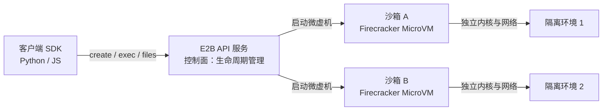
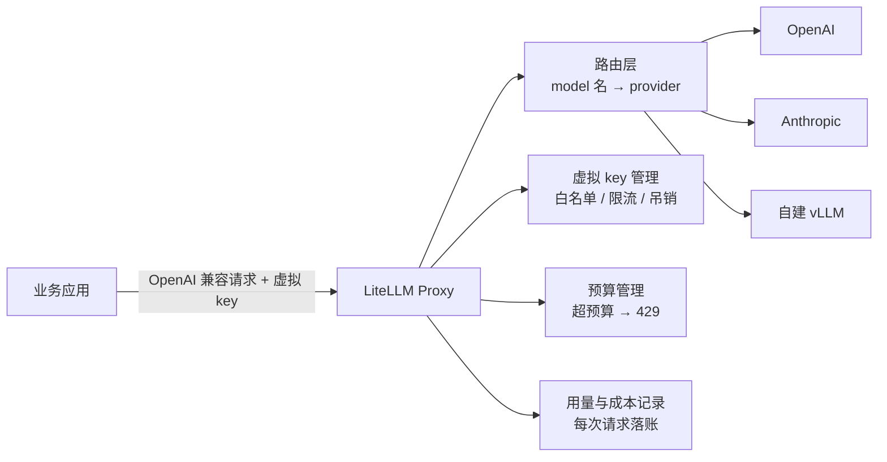
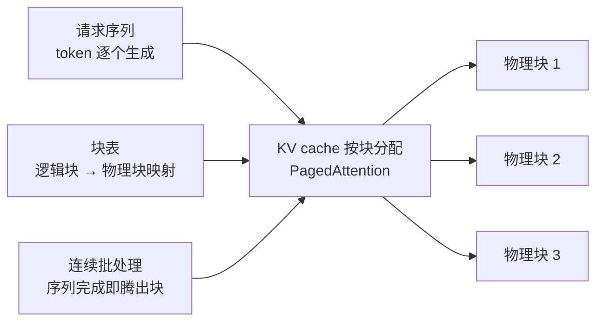
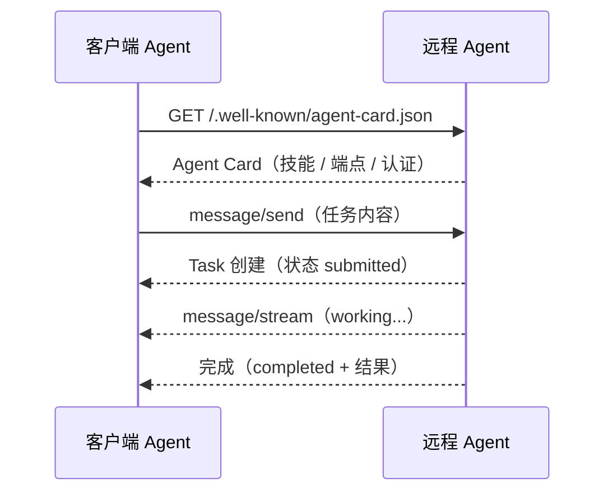
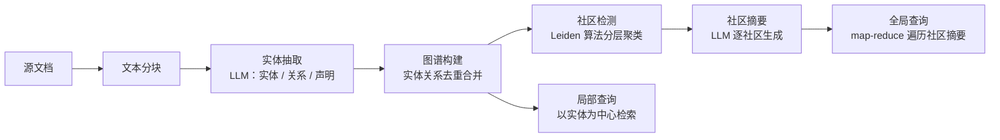
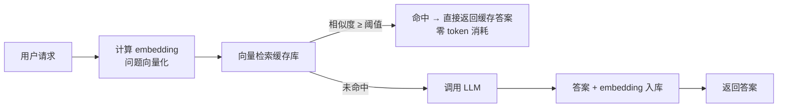
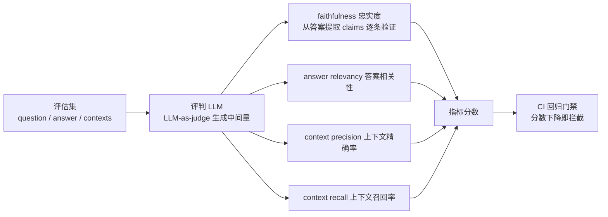
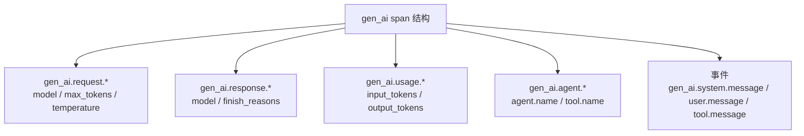

# 2.8 企业智能体平台方向认知 [进阶]

> 来源：各方向开源项目官方站点（见各小节项目表）· 验证环境：待验证（本章为认知章节，无命令）

## 概念：为什么需要

**业务痛点**：Agent 从 demo 到生产，会撞上一堵「业务代码解决不了」的墙：Agent 要执行不可信代码、要接多家模型、要代表用户操作、token 成本失控、能力悄悄退化、出问题查不了账（[已必备]：企业规模化上 Agent 时，这些墙必然出现）。这些问题的答案不在某个框架里，而在「平台」里——于是企业开始建设 Agent 平台。

- **从哪来**：单 Agent 应用（调 API + 写业务逻辑）→ 多 Agent 规模化 → 平台化（安全/网关/身份/算力/质量/成本统一治理）
- **是什么**：企业 Agent 平台 = 九个方向的组合，每个方向解决一类「规模化后才暴露」的问题
- **往哪去**：方向正在收敛——网关、可观测、评估快速标准化（LiteLLM / OTel GenAI / RAGAS），沙箱、身份、运行时仍是平台团队的核心地盘

**定位红线**：这些方向多数是平台团队的地盘（学习者不建设平台）。学习者的价值在于：**知道有这些方向、能识别企业需求、能与平台团队对齐**，并从中选择适合自己的入门/择业方向。本章给一张「能力地图」，不教建设。

## 2.8.1 沙箱（Agent 代码/工具执行隔离）

**方向是什么**：Agent 要执行代码、调工具，但代码与工具输出不可信——沙箱（sandbox，隔离执行环境）把执行放进受限环境（微虚机 / 容器 / WASM，WASM 即 WebAssembly，可移植字节码格式），限制资源与网络，出事不连坐。这是 2.7 防御分层里「隔离执行」的平台侧实现。

| 项目 | 来源 | 一句话定位 |
|---|---|---|
| E2B | https://e2b.dev/ | Agent 云沙箱：为 AI Agent 提供即开即用的隔离执行环境 |
| Daytona | https://github.com/daytonaio/daytona | 开发环境即代码：沙箱化开发环境管理 |
| Firecracker | https://github.com/firecracker-microvm/firecracker | AWS 微虚机（MicroVM）：毫秒级启动、单虚机开销最小 |
| gVisor | https://github.com/google/gvisor | Google 容器沙箱运行时：用户态内核拦截系统调用 |
| Extism | https://github.com/extism/extism | WASM 插件框架：不可信代码编译成 WASM 隔离执行 |

**含金量与难度：高**。安全敏感——沙箱逃逸等于平台沦陷；需要内核/虚拟化知识，是安全团队与平台团队的地盘。

**企业着力点**：不可信代码执行（数据分析、代码生成产物）、资源/网络隔离、安全边界。

**入门择业建议**：业务开发者了解能力边界即可——知道「Agent 执行要进沙箱」、能向平台提需求（隔离级别、网络策略）。想理解隔离模型，可先玩 Extism（WASM 门槛低）。

#### 明星项目架构：E2B（API 服务 + 微虚机运行时）

E2B 是「Agent 云沙箱」的代表实现，架构分两层：**控制面（API 服务）** 与 **数据面（微虚机运行时）**。控制面只管沙箱生命周期（创建/销毁/快照/模板），真正执行代码的是数据面——每个沙箱是一个 Firecracker 微虚机（MicroVM，轻量虚拟机，毫秒级启动），拥有独立内核与网络，互不干扰。客户端通过 SDK 调 API 服务，在沙箱里执行代码、读写文件、启动进程。



**数据流**：业务 Agent 调 SDK → API 服务创建沙箱（秒级）→ 沙箱内执行不可信代码 → 结果回传 → 用完销毁。模板（Template）机制把预装好依赖的沙箱镜像固化，让「起一个带 Python 环境的沙箱」变成一次 API 调用。理解要点：**隔离粒度在微虚机层**（比容器更硬），这是「Agent 执行不可信代码」场景的安全底线。

**官方文档关键机制**：Firecracker 官方文档明确其设计目标——毫秒级启动、单虚机内存开销最小化（约 5 MiB 量级），专为 serverless 与容器场景设计，是 E2B 等沙箱产品的底层运行时。

> 来源：[Firecracker 官方文档](https://firecracker-microvm.github.io/) · 验证环境：待验证

## 2.8.2 LLM/Agent 网关

**方向是什么**：所有模型请求过一道统一网关（gateway，统一入口代理）：多 provider 路由、key 治理、限流、成本观测。业务代码只认一个 OpenAI 兼容端点，换模型不改代码。

| 项目 | 来源 | 一句话定位 |
|---|---|---|
| LiteLLM | https://github.com/BerriAI/litellm | 统一代理事实标准：100+ provider 一个接口，key 治理 + 预算 |
| Envoy AI Gateway | https://github.com/envoyproxy/ai-gateway | CNCF 沙箱：Envoy 系 AI 网关，provider 路由/fallback |
| Portkey | https://github.com/Portkey-AI/gateway | AI 网关：路由/重试/缓存/观测一体 |
| Helicone | https://github.com/Helicone/helicone | LLM 网关 + 观测：代理层记录 token 与成本 |

**含金量与难度：中**。生态成熟（LiteLLM 已是事实标准），概念不深；做扎实要懂限流/路由/可观测，但业务开发者完全能上手。

**企业着力点**：多 provider 接入与切换、key 治理（防泄露/防滥用）、限流配额、成本观测。

**入门择业建议**：**最推荐入门方向之一**。自建一个 LiteLLM 代理接 2~3 个模型，理解路由/预算/观测，即可在企业落地；呼应手册 3.5（推理网关）。

#### 明星项目架构：LiteLLM（路由层 / 虚拟 key / 预算）

LiteLLM 是 Python 实现的统一代理，业务侧只看到一个 OpenAI 兼容端点（`/v1/chat/completions`），代理内部完成三件事：**路由**（按 model 名映射到对应 provider，支持 fallback 与重试）、**虚拟 key 治理**（master key 派生虚拟 key，真实 provider key 只存在代理侧，业务拿不到）、**预算管控**（按 key/团队设 token 或金额上限，超限直接 429）。



**数据流**：业务请求带虚拟 key → 路由层按 model 名选 provider → 代理用真实 key 转发 → 响应回传的同时记录 token 用量与成本。理解要点：**key 与预算都在代理层治理**——换模型只改代理配置，业务代码零改动；虚拟 key 可随时吊销，泄露了也不影响真实账号。

**官方文档关键机制**：LiteLLM 文档「Virtual Keys」章节说明虚拟 key 机制——代理持有真实 provider key，为每个业务方签发虚拟 key，可绑定模型白名单、限流与预算，随时吊销。

> 来源：[LiteLLM 文档](https://docs.litellm.ai/) · 验证环境：待验证

## 2.8.3 统一授权认证管理（Agent 身份与权限）

**方向是什么**：Agent 不是「一个用户」，是「一组身份」——它要代表用户调系统、跨系统协作。需要身份认证（你是谁）、授权（你能干什么）、最小权限与审计追踪。

| 项目 | 来源 | 一句话定位 |
|---|---|---|
| Keycloak | https://github.com/keycloak/keycloak | Red Hat 维护的开源 IAM：OIDC/SAML 单点登录事实标准 |
| Ory（Kratos/Hydra） | https://github.com/ory/kratos | 开源身份栈：Kratos 注册登录、Hydra OAuth2/OIDC |
| OpenFGA | https://github.com/openfga/openfga | Zanzibar 系细粒度授权：关系模型做权限判断 |
| SPIFFE/SPIRE | https://github.com/spiffe/spire | 服务身份标准：为每个工作负载发短期身份证书 |

**含金量与难度：高**。安全敏感 + 协议多（OIDC/OAuth2/关系模型），概念门槛高，平台/安全团队地盘。

**企业着力点**：Agent 身份建模（Agent 代表谁、能做什么）、最小权限、审计追踪、跨系统授权。

**入门择业建议**：业务开发者了解概念即可——能说清「Agent 身份 ≠ 用户身份」、知道 OIDC（OpenID Connect，基于 OAuth2 的身份认证协议）与细粒度授权是两回事。想深入从 OIDC 概念入手读 Keycloak 文档。

#### 明星项目架构：OpenFGA（Zanzibar 关系模型）

OpenFGA 是 Google Zanzibar（Google 内部全球授权系统，支撑 Drive/YouTube 等产品的权限判断）的开源实现。核心不是「角色表」，而是**关系元组（tuple）**：`(对象, 关系, 用户)`，例如 `document:1#viewer@user:alice` 表示「文档 1 的查看者是 alice」。权限判断 = 一次 **Check 请求**：`Check(document:1, viewer, user:alice)`，系统沿关系图展开判断（alice 直接是 viewer？alice 所在的组是 viewer？），返回 allowed/denied。

```mermaid
flowchart LR
    APP[应用] -->|Check document:1 viewer user:alice| API[OpenFGA API]
    API --> TUPLE[查询关系元组<br/>document:1#viewer@...]
    TUPLE -->|直接命中| ALLOW[allowed]
    TUPLE -->|未命中| EXPAND[展开 userset<br/>group:eng#member]
    EXPAND -->|alice ∈ group:eng| ALLOW2[allowed]
    EXPAND -->|不在任何组| DENY[denied]
    ALLOW --> CACHE[结果缓存<br/>加速重复判断]
    ALLOW2 --> CACHE
```

**数据流**：应用发起 Check → 查 tuple 存储 → 命中直接返回；未命中则沿 userset（如「组」这种间接关系）递归展开 → 得出结果并缓存。理解要点：**权限是「关系」不是「角色」**——「谁能看文档 1」由 tuple 决定，新增一种关系（如「评论者」）只改类型定义，不动业务代码。Agent 场景下，tuple 的 user 可以是「Agent 身份」或「用户 + Agent 的复合身份」，审计天然可追溯。

**官方文档关键机制**：OpenFGA 文档「Authorization Model」章节定义 tuple 与类型模型（type definition）——对象类型声明有哪些关系、关系可指向用户或 userset，Check 请求基于该模型求值。

> 来源：[OpenFGA 文档](https://openfga.dev/docs) · 验证环境：待验证

## 2.8.4 智能体运行时（共享/高并发）

**方向是什么**：模型推理是 Agent 平台的「算力底座」：有限 GPU 服务更多用户——批处理、共享推理、弹性伸缩、语义缓存（相似问题直接命中缓存，免去重复调用）。这是 Part 3 的平台侧全景。

| 项目 | 来源 | 一句话定位 |
|---|---|---|
| vLLM | https://github.com/vllm-project/vllm | 推理引擎事实标准：PagedAttention 高吞吐 |
| Ray Serve | https://github.com/ray-project/ray | 分布式模型服务：Python 原生、弹性扩缩 |
| BentoML | https://github.com/bentoml/BentoML | AI 应用产品化：模型打包/部署/服务 |
| KServe | https://kserve.github.io/website/ | 推理平台层标准：serverless/金丝雀 |
| K8s Inference Extension | https://gateway-api-inference-extension.sigs.k8s.io/ | 新秀：网关感知推理负载，InferencePool 路由 |

**含金量与难度：高**。基础设施：GPU 调度、显存管理、分布式推理——平台团队核心地盘。

**企业着力点**：批处理、语义缓存、共享推理、弹性伸缩。

**入门择业建议**：云原生工程师切入 AI 的第一梯队（复用 K8s 知识）：vLLM → KServe → Inference Extension（手册 Part 3 主线）；业务开发者了解能力边界即可。

#### 明星项目架构：vLLM（PagedAttention 机制）

vLLM 高吞吐的秘密在显存管理。自回归生成（一个 token 一个 token 地生成）时，已生成 token 的 Key/Value 张量要缓存供后续计算——这就是 **KV cache（键值缓存）**，它随序列长度增长，是推理显存的最大头。传统推理框架按「最大可能长度」预分配连续显存，造成大量浪费；vLLM 的 **PagedAttention** 借鉴操作系统虚拟内存分页：KV cache 按固定大小块（block）分配，逻辑上连续、物理上离散，用**块表（block table）** 记录映射，按需分配、用完即还。



**配套机制——连续批处理（continuous batching）**：传统批处理等整批序列都生成完才换下一批；连续批处理是「谁完成谁走」，完成的序列立刻释放显存块，新序列马上插入，GPU 一刻不闲。理解要点：**分页 + 连续批处理 = 显存利用率与吞吐双提升**，这是「有限 GPU 服务更多用户」的底层答案。

**官方文档关键机制**：vLLM 官方文档与论文（Kwon et al.）说明 PagedAttention 设计——论文指出传统系统因 KV cache 管理低效浪费约 60-80% 显存，分页管理使显存利用率接近最优。

> 来源：[vLLM 文档](https://docs.vllm.ai/) · [PagedAttention 论文](https://arxiv.org/abs/2309.06180) · 验证环境：待验证

## 2.8.5 A2A 多智能体协作

**方向是什么**：Agent 之间怎么协作？两个层面：协议标准（A2A 跨企业 Agent 互操作、MCP 工具互操作）+ 编排框架（单应用内多 Agent 任务编排）。

| 项目 | 来源 | 一句话定位 |
|---|---|---|
| Google A2A | https://a2a-protocol.org/ | Agent 互操作协议（Linux Foundation 托管）：Agent 间发现/协商/协作 |
| MCP | https://modelcontextprotocol.io/ | 工具互操作事实标准：Agent 连接工具/数据的统一协议 |
| CrewAI | https://github.com/crewAIInc/crewAI | 角色扮演多智能体框架：入门友好 |
| AutoGen | https://github.com/microsoft/autogen | 多智能体框架（新项目走 Microsoft Agent Framework 继任者） |
| LangGraph | https://github.com/langchain-ai/langgraph | 图状态机编排：2026 首选编排框架 |

**含金量与难度：中高**。标准演进中（A2A/MCP 还在变），跟标准要持续投入；编排框架本身不难。

**企业着力点**：协议标准选型、任务编排、状态管理、可靠性（多 Agent 失败处理）。

**入门择业建议**：**推荐**。MCP 是当下最值得投入的协议——工具互操作是 Agent 落地的关键；从「给 Agent 写一个 MCP server」入手，再学 LangGraph 编排；A2A 观察即可。

#### 明星项目架构：A2A 协议消息流（Agent Card 发现 + 任务协商）

A2A（Agent2Agent）解决「跨企业 Agent 怎么互相发现、怎么协作」。两个核心机制：**Agent Card** 与 **任务（Task）协商**。每个 Agent 在 `/.well-known/agent-card.json` 暴露自己的「名片」——名字、技能（skills）、端点 URL、认证方式；客户端 Agent 先取名片，知道对方能干什么、怎么调，再发起任务。



**任务状态机**：submitted（已提交）→ working（执行中）→ completed / failed / canceled，特殊状态 input-required（需要客户端补充输入，如问用户确认）。长任务用流式（SSE，服务器推送事件）持续推送状态，客户端不用轮询。理解要点：**A2A 是「名片 + 任务」模型**——发现靠 Agent Card，协作靠任务状态机，与 MCP 的「工具调用」模型互补（A2A 管 Agent↔Agent，MCP 管 Agent↔工具）。

**官方文档关键机制**：A2A 规范文档定义 Agent Card 结构与任务生命周期（Task lifecycle）——包括消息类型（message/send、message/stream、message/reply）与状态转换规则。

> 来源：[A2A 协议规范](https://a2a-protocol.org/) · 验证环境：待验证

## 2.8.6 知识工程（wiki 记忆）

**方向是什么**：Agent 的知识从哪来？RAG 数据底座（解析/切块/检索）+ 记忆分层（短期对话记忆/长期用户记忆/组织知识）。

| 项目 | 来源 | 一句话定位 |
|---|---|---|
| pgvector | https://github.com/pgvector/pgvector | PostgreSQL 向量扩展：中台优先，复用现有库 |
| Qdrant | https://qdrant.tech/documentation/ | 专用向量库：Rust 实现，性能好 |
| Milvus | https://milvus.io/docs | 分布式向量库：大规模场景 |
| GraphRAG | https://github.com/microsoft/graphrag | 知识图谱 RAG：实体关系建图，全局问答 |
| Mem0 | https://github.com/mem0ai/mem0 | Agent 记忆层：跨会话长期记忆 |
| Letta | https://github.com/letta-ai/letta | 记忆型 Agent 框架（MemGPT 继任）：上下文管理 |

**含金量与难度：中**。贴近业务，业务开发者友好；难点在「质量」不在「跑通」。

**企业着力点**：文档解析、切块策略、检索质量、记忆分层（呼应手册 2.3）。

**入门择业建议**：**推荐**。业务开发者最自然的切入点：先跑通 2.3 的 RAG，再深入解析/切块/检索质量；GraphRAG 与记忆层作为进阶。

#### 明星项目架构：GraphRAG 索引流程（实体抽取 → 图谱构建 → 社区检测）

普通 RAG 把文档切块后向量化，回答「局部问题」可以，回答「整个语料才能看出的全局问题」（如「这套系统的核心设计原则是什么」）就抓瞎。GraphRAG（微软）的答案：先把语料建成**知识图谱**，再对图谱做**社区检测**（community detection，把图谱按连接紧密程度分层聚类），查询时按社区摘要回答全局问题。



**索引流程**：分块 → LLM 从每块抽取实体、关系、声明（claims）→ 去重合并成图 → Leiden 算法（一种社区发现算法，Louvain 的改进版）分层聚类 → 对每个社区用 LLM 生成摘要。查询分两路：局部查询走实体检索（快），全局查询走社区摘要的 map-reduce（慢但能答全局问题）。理解要点：**GraphRAG 用「建图 + 聚类」换来了全局理解能力**，代价是索引成本高（LLM 抽取要跑全量语料），适合知识库规模大、全局问答需求强的场景。

**官方文档关键机制**：GraphRAG 论文（From Local to Global）说明索引管线与查询策略——社区检测与摘要使全局查询无需遍历全部文本。

> 来源：[GraphRAG 论文](https://arxiv.org/abs/2404.16130) · [GraphRAG 项目](https://github.com/microsoft/graphrag) · 验证环境：待验证

## 2.8.7 Token 成本优化

**方向是什么**：LLM 成本 = token 消耗 × 单价。优化手段：缓存（语义缓存）、模型路由（便宜模型先试、分级模型）、压缩（prompt 精简）、预算管控。

| 项目 | 来源 | 一句话定位 |
|---|---|---|
| LiteLLM 预算 | https://github.com/BerriAI/litellm | 预算/限流：按 key/团队设 token 预算 |
| Langfuse | https://github.com/langfuse/langfuse | 观测：token 用量与成本归因 |
| promptfoo | https://github.com/promptfoo/promptfoo | 回归测试：改 prompt 前先跑评估，防「省成本省出质量事故」 |
| GPTCache | https://github.com/zilliztech/GPTCache | 语义缓存：相似问题命中缓存免调用 |

**含金量与难度：中**。概念简单，但「省成本不省质量」需要评估配合（呼应 2.5）。

**企业着力点**：缓存、模型路由（便宜模型先试）、压缩、预算管控。

**入门择业建议**：**推荐**。与网关方向天然搭配：LiteLLM 预算 + Langfuse 观测 + promptfoo 回归，一套组合拳即可在企业落地。

#### 明星项目架构：语义缓存命中流程（GPTCache）

普通缓存按「完全相同的字符串」命中，LLM 场景用户问法千变万化（「怎么部署」vs「如何部署」），字符串缓存几乎不命中。**语义缓存**（semantic cache）把问题向量化，按「语义相似度」命中——相似问题直接返回缓存答案，省掉一次完整 LLM 调用。



**数据流**：请求 → 算 embedding → 在缓存库（向量库）里找相似度超过阈值的历史问题 → 命中直接返回；未命中才调 LLM，答案连同 embedding 一起入库。理解要点：**阈值是核心旋钮**——阈值高（如 0.95）命中少但安全，阈值低命中多但可能答非所问；缓存还要配淘汰策略（容量上限、LRU 等）。语义缓存适合「高频相似问题」场景（客服、FAQ、代码助手），不适合「每次都要新内容」的场景。

**官方文档关键机制**：GPTCache 项目文档说明语义缓存原理——基于 embedding 相似度检索命中缓存，并支持多种缓存淘汰策略。

> 来源：[GPTCache](https://github.com/zilliztech/GPTCache) · 验证环境：待验证

## 2.8.8 智能体评估与版本控制

**方向是什么**：Agent 是概率系统，改一个 prompt/工具/模型都可能让能力退化。评估 = 用评估集 + 指标量化质量；版本控制 = 评估结果进 CI 回归门禁，用金标集（人工标注的高质量标准答案集）对比版本。

| 项目 | 来源 | 一句话定位 |
|---|---|---|
| RAGAS | https://docs.ragas.io/ | RAG 评估指标事实标准（呼应手册 2.5） |
| promptfoo | https://github.com/promptfoo/promptfoo | CI 级回归：prompt/模型对比测试 |
| LangSmith / Langfuse 评估 | https://docs.langchain.com/ | 商业/开源评估平台：在线评估与追踪 |
| Braintrust | https://github.com/braintrustdata/braintrust-sdk ⏳ | 评估平台：数据集/评分/回归 |
| AgentBench | https://github.com/THUDM/AgentBench | 清华：Agent 能力基准 |

**含金量与难度：中**。价值高——评估是 AI 产品最先该建的东西；隐性难点在「评估集质量」。

**企业着力点**：评估集建设、回归门禁、金标集、版本对比（呼应手册 2.5）。

**入门择业建议**：**最推荐**。业务开发者从 RAGAS + promptfoo 入手，把评估接进 CI——这是「会选会对齐」的典型能力。

#### 明星项目架构：RAGAS 评估流水线（生成 → 指标计算）

RAGAS 是 RAG 评估指标的事实标准，核心思路：**用 LLM 当评判者（LLM-as-judge）**。评估集每条数据含 question（问题）、answer（系统生成的答案）、contexts（检索到的上下文）、ground_truth（金标答案，可选）。流水线分两步：先用评判 LLM 生成中间量，再按公式算指标。



**指标计算**：faithfulness（忠实度：答案内容是否忠于检索上下文，防「编造」）→ 先从答案提取 claims（论断），再逐条验证是否被 contexts 支持；answer relevancy（答案是否切题）；context precision（检索结果里相关文档占比，衡量检索质量）；context recall（金标答案所需信息是否都被检索到）。理解要点：**评估不是「打一个分」，而是拆成可定位的维度**——分数降了能看出是检索问题还是生成问题。

**官方文档关键机制**：RAGAS 文档定义四指标的计算方式与所需数据字段（question/answer/contexts/ground_truth），并说明各指标基于 LLM 评判生成中间量。

> 来源：[RAGAS 文档](https://docs.ragas.io/) · 验证环境：待验证

## 2.8.9 Agent 可观测性

**方向是什么**：Agent 调用链长（LLM→工具→RAG→多轮），出问题要能定位：调用链追踪、token 计量、质量指标。埋点（在代码里记录可观测数据）口径要统一，否则各团队各埋各的。

| 项目 | 来源 | 一句话定位 |
|---|---|---|
| Langfuse | https://github.com/langfuse/langfuse | AgentOps 开源首选：追踪/评估/成本一体 |
| OpenInference | https://github.com/Arize-ai/openinference ⏳ | 开源追踪标准：LLM 调用链语义约定 |
| OTel GenAI 语义约定 | https://github.com/open-telemetry/semantic-conventions-genai | 统一埋点口径：gen_ai.usage.* 等字段（呼应 SPEC §7） |

**含金量与难度：中**。概念不深，但「埋点口径统一」是组织级难题。

**企业着力点**：调用链、token 计量、质量指标（与评估方向配合）。

**入门择业建议**：与评估/成本方向搭配学习：Langfuse 跑起来，理解 OTel GenAI 字段；业务开发者能直接做埋点。

#### 明星项目架构：OTel GenAI 语义约定字段结构

「埋点口径统一」落到技术上就是一套**语义约定（semantic conventions）**：所有团队按同一套字段名埋点，数据才能跨团队汇总分析。OTel GenAI 语义约定（OpenTelemetry 的 GenAI 扩展规范）定义了模型调用、Agent 执行、工具调用的 span（追踪中的一次操作单元）命名与属性字段。



**字段结构**：span 命名区分 `gen_ai.client.request`（模型调用）、`gen_ai.client.response`（响应）、`gen_ai.agent`（Agent 执行）、`gen_ai.operation`（工具调用）；属性按前缀分组——`gen_ai.request.*`（请求参数）、`gen_ai.response.*`（响应信息）、`gen_ai.usage.*`（token 用量，成本归因的统一口径）、`gen_ai.agent.*`（Agent 与工具名）；消息内容走事件（event）。理解要点：**`gen_ai.usage.*` 是 token 计量的标准字段**——网关、评估、成本系统都认这套字段，Langfuse 等平台直接消费。

**官方文档关键机制**：OTel GenAI 语义约定仓库（semantic-conventions-genai）定义 `gen_ai.usage.input_tokens` / `gen_ai.usage.output_tokens` 等字段与 span 命名规则；注意规范状态多为 Development（演进中），引用时需标注 status。

> 来源：[OTel GenAI 语义约定](https://github.com/open-telemetry/semantic-conventions-genai) · 验证环境：待验证

## 入门择业建议：四个适合学习者的方向

九个方向里，平台团队核心地盘（沙箱、授权认证、运行时）了解能力边界即可；业务开发者优先切入这四个：

| 方向 | 难度 | 理由 | 学习路径 |
|---|---|---|---|
| LLM/Agent 网关 + Token 成本优化 | 中 | 生态成熟、上手快、企业当下刚需 | 手册 3.5（推理网关）→ LiteLLM 文档 → 自建代理接 2~3 个模型 → 预算/限流 → Langfuse 成本归因 |
| 智能体评估与版本控制 | 中 | 价值最高（评估是 AI 产品最先该建的）；「会选会对齐」的典型能力 | 手册 2.5（RAGAS 四指标）→ promptfoo CI 回归 → 给 lab2 加评估门禁 |
| 知识工程 | 中 | 业务开发者最自然的切入点，贴近业务价值 | 手册 2.3（RAG 底座）→ 解析/切块质量 → GraphRAG/记忆层进阶 |
| A2A/MCP 协议方向 | 中高 | 标准红利期，工具互操作是 Agent 落地关键 | MCP 文档 → 给 lab2 的 Agent 写一个 MCP server → LangGraph 编排 → A2A 观察 |

共同点：这四个方向都是「业务开发者能直接上手、能向平台提需求、企业当下刚需」，且与手册已有章节（2.3 / 2.5 / 3.5）直接衔接——学完就能用。

## 业界前沿（2026 观察）[进阶]

> 本节为前沿动态，标注「前沿，待验证」；事实以官方发布为准，引用时核对日期与版本。

**怎么跟踪**：前沿信息变化快，跟踪成本要低——协议层（A2A / MCP / Inference Extension）只看官方发布（规范仓库 + 发布博客），生态层用 KubeWeekly 与 CNCF 博客按周扫（检索手册 §8），框架层等稳定再学。判断「值不值得跟」的标准：是否影响你的接入点（API / CRD / 协议）——影响就记，不影响就略过。

### A2A 协议演进

- **时间线**：2025-04 Google 发布 A2A 草案 → 2025-06 移交 Linux Foundation 托管 → 版本持续迭代（v0.2 / v0.3 等），2026 年仍在演进（前沿，待验证）
- **与 MCP 的分工逐渐清晰**：MCP 管 Agent↔工具（工具互操作），A2A 管 Agent↔Agent（跨企业协作）；两者互补而非竞争，A2A 消息中可携带 MCP 调用
- **演进方向**：认证标准化（Agent 之间互信）、任务协商细化、企业级部署形态（网关/注册中心）
- **观察信号**：主流框架（LangGraph、OpenAI Agents SDK 等）对 A2A 的接入程度，是判断「协议是否落地」的窗口
- **企业视角**：跨企业 Agent 协作（供应链、外包、生态合作）是 A2A 的主战场；单企业内部多 Agent 协作用编排框架（LangGraph 等）即可，不必等协议成熟

### K8s Inference Extension（推理扩展）

- **是什么**：Gateway API 的 AI 扩展——用 `InferencePool` / `InferenceModel` 等 CRD（K8s 自定义资源）声明推理后端，网关感知推理负载（GPU 显存、并发数）按模型路由（前沿，待验证）
- **与 vLLM/KServe 的关系**：vLLM 是推理引擎（单机吞吐），KServe 是推理平台（部署/伸缩），Inference Extension 是「网关层」——三者构成「引擎 → 平台 → 网关」的推理栈
- **参考实现**：EPP（Envoy 系）与 kgateway（CNCF 项目）已提供实现，是平台侧「推理网关」的标准化方向
- **呼应**：手册 Part 3 主线（vLLM → KServe → Inference Extension），检索手册 §4 有完整入口

### Agent 评估基准（AgentBench / SWE-bench）

- **AgentBench**（清华 THUDM）：8 大环境（操作系统、数据库、网页等）综合评测 Agent 能力，2023 年发布后成为 Agent 基准代表（前沿，待验证）
- **SWE-bench**：用真实 GitHub issue 修复任务评测软件工程 Agent，是「写代码 Agent」的事实标准基准；衍生出 SWE-bench Verified（人工筛选子集）
- **趋势**：评估从「单轮问答」转向「多轮任务完成」——基准越来越像真实工作（修 issue、操作电脑、调 API），与 2.8.8 的「评估集建设」呼应
- **注意**：基准分数 ≠ 生产质量，选基准要贴近自己的任务类型（检索手册 §5 有 RAGAS/promptfoo 等生产侧评估入口）
- **与 2.8.8 的关系**：基准（benchmark）用于「横向比模型/比方案」，评估集（eval set）用于「纵向守自家质量」——两者互补，企业里后者更常用

### Agent 身份标准（SPIFFE 用于 Agent）

- **SPIFFE**：服务身份标准——为每个工作负载签发短期身份证书（SVID），SPIRE 是其参考实现；K8s 场景下每个 Pod 自动获得身份（前沿，待验证）
- **用于 Agent**：Agent 本质是「代表用户执行的工作负载」，可复用 SPIFFE 体系获得**服务身份**；代表用户操作时再叠加**用户身份**（OIDC）——双身份模型让审计能回答「哪个 Agent 替哪个用户做了什么」
- **与 2.8.3 的关系**：SPIFFE 解决「Agent 是谁」（认证），OpenFGA 解决「Agent 能干什么」（授权），两者配合构成 Agent 身份与权限的完整链路

### MCP 生态演进（MCP Apps）

- **规范持续迭代**：MCP 规范 2026-07 版已含 MCP Apps——MCP 从「工具协议」扩展出应用层能力，Agent 与工具生态的连接方式仍在演进（前沿，待验证）
- **生态信号**：主流框架与平台（LangGraph、Dify、OpenAI Agents SDK 等）全面接入 MCP，MCP server 数量快速增长——「给 Agent 写一个 MCP server」已成为业务侧最通用的接入姿势
- **与 A2A 的分工**：MCP 管 Agent↔工具、A2A 管 Agent↔Agent，两者是「工具互操作 + Agent 互操作」的两层标准，不是二选一

### Deep Agents（深度推理 Agent）

- **趋势**：2026 年 Agent 架构从「浅层工具循环」走向「深度推理」——Agent 在行动前做长链推理（类似 o1 类模型的思考过程），减少试错、提高任务成功率（前沿，待验证）
- **学习顺序**：检索手册 §5 的 Agent 架构模式路径——ReAct（基石）→ Plan-and-Execute → 多智能体 → Deep Agents
- **对平台的影响**：深度推理 Agent 的 token 消耗与延迟显著上升，成本优化（2.8.7）与可观测（2.8.9）的压力更大——平台侧要提前准备
- **对评估的影响**：深度推理 Agent 的「思考过程」也要纳入评估与审计（2.8.8 / 2.8.9），不能只看最终答案

### Agent 网关与注册中心（企业部署形态）

- **形态**：A2A 生态的企业落地需要治理层——Agent 网关（统一入口、认证、限流）+ Agent 注册中心（Agent Card 的集中目录，类似 API 市场之于微服务）（前沿，待验证）
- **与 2.8.2 的区别**：LLM 网关管「模型请求」，Agent 网关管「Agent 间调用」——不同层，未来可能并存
- **观察信号**：A2A 规范对网关/注册中心的定义程度，决定企业落地成本
- **学习建议**：业务开发者现阶段了解形态即可，等协议成熟再学接入；把精力放在 MCP 与评估（2.8.5 / 2.8.8）

## 实用技巧

- **用「能力地图」做认知框架**：把九个方向画成一张表，标注「平台地盘 vs 业务切入」，面试/对齐时按图索骥
- **识别企业需求**：听到「Agent 执行代码」→ 沙箱；「多模型切换/换模型要改代码」→ 网关；「token 超预算」→ 成本；「Agent 变笨了/说不清」→ 评估；「出问题查不了账」→ 可观测
- **与平台团队对齐的提问模板**：这个能力平台提供吗？接入点是什么（API / CRD / 控制台）？配额与 SLA 是多少？
- **择业信号**：招聘 JD 里出现 LiteLLM / RAGAS / Langfuse / MCP 的岗位，都是业务侧能切入的方向
- **用「明星项目架构」做面试素材**：九个方向各记一个架构图（E2B 控制面/数据面、LiteLLM 路由/key/预算、OpenFGA tuple/check、vLLM 分页、A2A 名片+任务、GraphRAG 建图+聚类、语义缓存阈值、RAGAS 拆维度、OTel 字段前缀）——能画出数据流，就能讲清一个方向
- **前沿跟踪节奏**：每季度看一次 A2A 规范更新与 Inference Extension 发布博客即可（检索手册 §8 的 KubeWeekly 是低成本入口），不用天天追

## 考察问题

1. 为什么「Agent 身份 ≠ 用户身份」？企业里 Agent 代表谁执行操作，审计怎么记？（线索：OIDC 用户身份 vs SPIFFE 服务身份；Zanzibar 关系模型）
2. LiteLLM 已是事实标准，为什么大厂还要自研 AI 网关？（线索：成本、数据合规、与内部平台/计费系统集成）
3. 「评估最先该建」但多数团队最后才建，为什么？（线索：评估集建设成本高、见效慢、需要标注人力）
4. 语义缓存为什么用「相似度阈值」而不是「完全匹配」？阈值调高调低各有什么代价？（线索：命中率 vs 答非所问风险，2.8.7）
5. A2A 的 Agent Card 和 MCP 的 server 声明有什么异同？一个 Agent 同时提供两者意味着什么？（线索：名片 vs 工具清单，2.8.5）

## 经验之谈

- AI 产品最先该建的是评估——没有评估，改 prompt、换模型、加工具都是盲改；评估集是团队最值钱的资产（观点转述，不署名）
- 平台方向（沙箱/授权/运行时）是平台团队的地盘，业务开发者的精力放在「识别需求 + 对齐」，而不是「自己建」
- 标准演进期（A2A/MCP）投入要「跟协议不跟实现」：协议是长期资产，框架会换
- Hamel Husain（AI 评估实战派）主张「AI 产品需要评估」——评估是产品功能，不是上线后的事后补丁；评估集要贴近真实用户任务（观点转述；出处：检索手册 §10 收录人物，原文待验证）
- Simon Willison 是最早系统解读 MCP 的开发者之一，长期跟踪提示注入攻击——他划分的「直接 vs 间接注入」是理解 LLM 安全威胁的基本框架（观点转述；出处：simonwillison.net，原文待验证）
- Kwon et al.（PagedAttention 论文作者）指出：传统推理系统因 KV cache 显存管理低效浪费约 60-80% 显存——显存管理是推理吞吐的瓶颈所在（出处：[PagedAttention 论文](https://arxiv.org/abs/2309.06180)）
- Lilian Weng 的 Agent 综述提出经典框架：Agent = 规划（Planning）+ 记忆（Memory）+ 工具使用（Tool use）三组件，是理解 Agent 架构的起点（观点转述；出处：Lil'Log Agent 综述，原文待验证）
- Charity Majors（可观测性领域代表人物）强调：可观测性 ≠ 监控——监控是预设指标的告警，可观测性是从生产真实数据中回答未知问题的能力（观点转述；出处：Charity Majors 公开文章/演讲，原文待验证）
- Chip Huyen 在《AI Engineering》（O'Reilly 2025）中系统梳理 LLM 系统工程化——评估、成本、数据质量是工程化主线（事实性描述；出处：该书）

## 架构师视角

- 解决什么问题：企业 Agent 从 demo 到生产的平台能力地图
- 何时用：企业要规模化上 Agent 时；何时不用：单应用/小团队可先用 SaaS 或轻量方案，不必自建平台
- 权衡：平台建设成本 vs 业务速度；自建 vs 采购（网关/评估/观测都有成熟 SaaS）
- **平台提供了什么能力边界**：沙箱隔离、推理服务、身份授权、网关、可观测——都是平台能力，业务侧不重复建设
- **业务接入点在哪**：模型 API（网关）、评估 CI、埋点 SDK、MCP 工具
- **需要和基础设施团队对齐什么**：隔离级别、配额与预算、身份模型、埋点口径（OTel GenAI）

## 核心收获表

| 能力维度 | 具体收获 |
|---|---|
| 方向认知 | 能说出企业 Agent 平台九个方向，及各自的难度、着力点、代表项目 |
| 架构细节 | 能画出九个方向的明星项目架构图与数据流（E2B / LiteLLM / OpenFGA / vLLM / A2A / GraphRAG / 语义缓存 / RAGAS / OTel GenAI） |
| 定位 | 能区分平台团队地盘（沙箱/授权/运行时）与业务开发者切入方向 |
| 择业 | 能说出 4 个适合学习者的入门方向及学习路径 |
| 对齐 | 能用固定三问与平台团队对齐需求（能力边界/接入点/对齐项） |

## 推荐开源项目表

| 项目 | 链接 | 研读重点 |
|---|---|---|
| LiteLLM | https://github.com/BerriAI/litellm | 网关 + 预算：统一代理怎么治理 key 与成本 |
| RAGAS | https://docs.ragas.io/ | 评估指标：四指标怎么算、怎么接 CI |
| Langfuse | https://github.com/langfuse/langfuse | 观测 + 评估：调用链与 token 计量 |
| MCP | https://modelcontextprotocol.io/ | 协议：工具互操作标准，写一个 server 试试 |
| vLLM | https://github.com/vllm-project/vllm | 推理引擎：理解「运行时」在解决什么问题 |
| E2B | https://e2b.dev/ | 沙箱：控制面/数据面分离怎么设计 |
| OpenFGA | https://github.com/openfga/openfga | 授权：tuple/check 关系模型怎么表达权限 |
| GraphRAG | https://github.com/microsoft/graphrag | 知识工程：建图 + 社区检测的索引管线 |

## 常见问题排查

| 现象 | 排查路径 |
|---|---|
| 换模型要改业务代码 | 接网关（LiteLLM），业务只认 OpenAI 兼容端点 |
| token 成本失控 | 网关预算 + Langfuse 归因 + 语义缓存 + 便宜模型路由 |
| Agent 能力退化说不清 | 建评估集 + promptfoo 回归门禁，版本对比 |
| Agent 执行代码怕出事 | 找平台要沙箱隔离执行，业务侧做工具白名单（2.7） |
| 出问题查不了账 | 埋点接 OTel GenAI 口径，Langfuse 看调用链 |
| 九个方向记不住/说不清 | 每个方向记「一个架构图 + 一个代表项目」，按图索骥（本章明星项目架构） |
| 想跟前沿又怕追错 | 只跟协议层（A2A / MCP / Inference Extension）官方发布，框架层等稳定再学 |