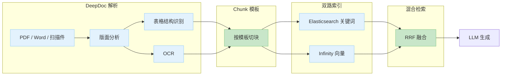

# 2.9 RAG 工程实践认知 [实用]

> 来源：[RAG Survey](https://arxiv.org/abs/2312.10997) · [OpenAI Cookbook](https://cookbook.openai.com/) · [LlamaIndex](https://docs.llamaindex.ai/) · [RAGAS](https://docs.ragas.io/) · [unstructured](https://github.com/Unstructured-IO/unstructured) · [PyMuPDF](https://github.com/pymupdf/PyMuPDF) · [marker](https://github.com/VikParuchuri/marker) · [RAGFlow](https://github.com/infiniflow/ragflow) · 验证环境：待验证

## 概念：为什么需要

**业务痛点**：2.3 解决了「向量库选型」，2.5 解决了「怎么评估」，中间缺一环——多数企业 RAG 项目跑通 demo 容易，交付企业级检索质量难。原因在于：RAG 的效果上限在检索，而检索质量由「文档处理流水线」决定——**解析 → 切块 → 索引 → 检索 → 重排**，每一环都影响最终答案质量。demo 阶段用几篇干净的 Markdown 文档看不出问题；真实企业文档（PDF 扫描件、Word、Excel 表格、PPT）一进来，解析乱码、切块切断语义、检索召回差，问题全部暴露。

- **从哪来**：早期 RAG 是「文档 → 切块 → 向量化 → 检索」的朴素流水线（Naive RAG）；演进到 Advanced RAG 后，解析、切块、混合检索、重排、查询改写各环节都成为可独立优化的模块（RAG Survey 的 Naive / Advanced / Modular 三阶段划分）
- **是什么**：一套把「原始文档」变成「可检索、可回答」的工程流水线，含解析、切块、索引、检索、重排五个环节
- **往哪去**：流水线各环节模块化、可插拔；评估（2.5）驱动每一环的调优；Modular RAG 阶段各模块可自由组合

## 认知要点：RAG 是流水线，不是单点

先建立四个意识：

1. **文档格式杂**：PDF（含扫描件）/ Word / Excel 表格 / PPT / 网页，每种格式的解析难点不同——PDF 表格会丢结构，扫描件是图片，需要 OCR（光学字符识别，把图片里的文字识别成可检索文本）
2. **切块策略影响召回**：同一份文档，切块粒度不同，检索结果天差地别
3. **混合检索比纯向量稳**：关键词（BM25）与向量语义互补，融合后召回更稳
4. **重排是质量提升杠杆**：先粗召回再精排，投入小、见效快

**各环节影响什么**（排查时的定位地图）：

| 环节 | 影响什么 | 典型问题 |
|---|---|---|
| 解析 | 内容完整性 | 乱码、丢表格、扫描件没走 OCR |
| 切块 | 召回粒度与语义完整 | 切断语义、块太大上下文稀释、块太小信息不全 |
| 索引 | 检索速度与过滤能力 | 没建索引全表扫描、无元数据过滤 |
| 检索 | 召回质量 | 纯向量漏术语、top-k 太小 |
| 重排 | 精度 | top-k 太大噪声多、答案被无关片段带偏 |

不治理的坑（典型症状）：

- PDF 解析乱码 / 丢表格 → 检索到的内容残缺 → 答案错
- 切块切断语义 → 关键信息被切成两半 → 召回不到
- 检索召回差但不知道哪一环的问题 → 没有分层排查意识，只能瞎调 prompt

**排查心智**：出问题先分层定位——解析层（内容对不对）→ 切块层（语义完整吗）→ 检索层（召回全吗）→ 生成层（答案忠实吗，呼应 2.5 的 faithfulness 指标）。

## 常见误区（先排雷）

- **误区一：先选框架再想数据**——框架解决「怎么接」，不解决「文档怎么变成好 chunk」；数据流水线质量决定上限
- **误区二：向量库选型花两周，解析切块花两小时**——投入与影响倒挂（呼应 2.3 经验之谈：多数企业卡在解析与切块）
- **误区三：检索差就换 embedding 模型**——先查解析与切块，再考虑换模型（呼应「切块 > 换模型」）
- **误区四：上线后再补评估**——没有评估集，调优无依据、回归无感知（呼应 2.5「评估先行」）

## 官方文档怎么看 RAG 工程

三份官方文档给出同一结论：RAG 是「数据进 → 答案出」的完整工程，不是「向量检索 + 提示词」两件事。要点如下（链接可访问性以知识检索手册 §5 为准；机制事实以官方文档为准，社区博客只作经验补充）。

**1. OpenAI Cookbook——RAG 流水线实践指南**

> 来源：[OpenAI Cookbook](https://cookbook.openai.com/) · 验证环境：待验证

- 官方把 RAG 拆成两个阶段：**indexing（索引构建）** 与 **retrieval/generation（检索生成）**
- indexing 阶段的关键决策：切块策略（chunking）、元数据（metadata）设计、embedding 选择——三者共同决定「能召回什么」
- retrieval/generation 阶段的关键决策：查询改写（query transformation，把模糊问题改写成利于检索的形式）、检索、重排（reranking）——三者共同决定「召回后留下什么」
- 官方建议按内容类型选切块策略，而不是全局统一一个块大小

**2. LlamaIndex 官方文档——RAG 五步流程**

> 来源：[LlamaIndex 文档](https://docs.llamaindex.ai/) · 验证环境：待验证

- 官方把 RAG 定义为五步：**loading（加载）→ indexing（索引）→ storing（存储）→ querying（查询）→ evaluation（评估）**
- 注意 evaluation 是流程的一环，不是上线前的补丁——与 2.5「评估先行」互相印证
- 切块指南：块大小与重叠是权衡——块大则上下文完整但检索粒度粗，块小则精确但上下文可能不足；没有万能参数，按内容与查询类型调

**3. RAGAS 官方文档——四指标定义**

> 来源：[RAGAS 文档](https://docs.ragas.io/) · 验证环境：待验证

- 四指标（faithfulness / answer relevancy / context precision / context recall）分别度量生成侧与检索侧质量，定义以官方文档为准（2.5 已展开，此处不重复）
- 官方文档同时给出「指标低 → 查哪一层」的定位建议，与本章「分层排查心智」一致

## 文档解析实践

解析质量直接决定下游：解析丢掉的内容，检索永远找不回来。

格式处理要点：

- **PDF**：文本型 PDF 直接抽文本；表格用表格抽取（保留行列结构）；扫描件走 OCR
- **Word / PPT**：转文本或 Markdown 时注意保留标题层级——层级是天然的切块边界
- **表格**：转成 Markdown 表格或键值对，比纯文本拼接更利于检索

开源工具（认知即可，选型时再细看）：

- **unstructured**：通用文档解析库，支持 PDF / Word / PPT / 图片等，输出结构化元素
- **PyMuPDF**：PDF 解析库，轻量、快，适合文本型 PDF
- **marker**：PDF 转 Markdown，对表格 / 公式 / 版面还原较好
- **RAGFlow**：深度文档解析 + RAG 一体化平台（企业落地可评估，架构见「明星项目架构拆解」）

工具选型速查（认知即可）：

| 工具 | 强项 | 适合场景 |
|---|---|---|
| PyMuPDF | 轻量、快 | 文本型 PDF 批量抽取 |
| unstructured | 格式全、输出结构化元素 | 多格式混合（PDF / Word / PPT / 图片） |
| marker | 版面 / 表格 / 公式还原好 | PDF 转 Markdown 质量优先 |
| RAGFlow | 解析 + RAG 一体化 | 企业级落地，不想自己拼流水线 |

解析质量检查清单（入库前过一遍）：

- [ ] 抽样 5~10 页，肉眼确认无乱码、无丢段
- [ ] 表格是否保留了行列结构（而不是挤成一坨文本）
- [ ] 扫描件是否全部走了 OCR，识别错误率可接受
- [ ] 标题层级是否保留（后续切块要用）

> 验证环境：待验证

## 切块（chunking）实践

切块 = 把长文档切成检索单元（chunk，检索与喂给模型的基本单位）。检索以 chunk 为单位，chunk 质量直接决定召回质量。

三种常见策略：

- **固定大小切块**：按字符数切 + 重叠窗口（overlap，相邻块重叠一段文字，避免切断语义）。简单、可控，是常见起点
- **语义切块**：按段落 / 标题 / 语义完整度切，块边界更自然，但实现复杂
- **父子块（parent-child）**：小块用于检索、父块（更大上下文）用于喂给模型，兼顾召回精度与上下文完整

关键参数与经验起点：

| 参数 | 影响什么 | 经验起点 |
|---|---|---|
| 块大小 | 上下文完整 vs 检索粒度 | 300~800 token |
| 重叠 | 边界语义连续性 | 块大小的 10%~20% |
| 边界策略 | 语义自然度 | 标题 / 段落等自然边界优先 |

块大小要与 embedding 模型上下文匹配（不超过模型能处理的 token 上限）；具体参数以评估为准（呼应 2.5）。

策略选择决策（按场景对号入座）：

| 场景 | 推荐策略 | 理由 |
|---|---|---|
| 起步 / 文档量大 | 固定大小 + 重叠 | 简单可控，先跑通 |
| 文档结构清晰（标题 / 段落规整） | 语义切块（按标题 / 段落） | 边界自然，召回更准 |
| 块太小导致上下文不足 | 父子块 | 小块检索 + 大块喂模型 |
| 检索精度上不去 | 先调块大小 / 重叠，再换策略 | 参数调优成本低于换策略 |

社区经验（观点转述，不署名）：切块策略的影响常大于换 embedding 模型——先调切块，再考虑换模型（与 2.3 经验之谈一致）。

## 混合检索与重排

- **BM25**：经典关键词检索算法，精确匹配，适合术语 / 编号 / 专有名词
- **向量检索**：语义匹配，适合同义改写 / 口语化提问
- **融合**：两路召回结果合并，常用 RRF（Reciprocal Rank Fusion，倒数排名融合：按排名倒数加权合并多路结果，k 通常取 60）

RRF 融合公式（每篇文档的最终得分 = 各路排名倒数的累加）：

```
score(d) = Σ_r 1 / (k + rank_r(d))    # k 通常取 60，rank_r(d) 是文档 d 在第 r 路的排名
```

- **重排（rerank）**：两段式——先用便宜的方式粗召回（top 50~100），再用重排模型精排（top 5~10）喂给 LLM。呼应 2.3 演进视角「embedding 与 reranker 组合成为标配两段式」
- **多路召回**：不止关键词 + 向量两路，还可加元数据过滤、图检索（GraphRAG 系）等，按业务需要组合

什么时候需要上混合检索（判断清单）：

- [ ] 术语 / 编号 / 型号查不到，但口语化提问能查到 → 缺关键词路
- [ ] 同义改写 / 口语提问查不到，但术语能查到 → 缺语义路
- [ ] 两路都召回但排序不对 → 先调 RRF 权重 / 上重排，而不是加路
- [ ] 数据量小、查询模式单一 → 纯向量或纯关键词就够，不必混合

## 工程化要点

- **增量更新**：文档变更 → 重新解析 / 切块 → 更新索引（先删旧 chunk 再写新 chunk）；全量重建只适合小规模或首次上线

增量更新标准流程：

1. 检测变更：文件 mtime / 内容 hash 变化，或人工触发
2. 重新解析 + 切块（只处理变更文档）
3. 按文档 ID 删除旧 chunk（避免新旧并存）
4. 写入新 chunk + 更新元数据（文档 ID / 标题 / 更新时间）
5. 失效相关缓存（见下）

- **多租户隔离**：知识库按团队 / 部门隔离，检索时按租户过滤（呼应 2.3 实用技巧「给 chunk 打权限标签，先过滤再排序」）

两种实现方式（按规模选）：

| 方式 | 做法 | 适合 |
|---|---|---|
| 元数据过滤 | 所有 chunk 一个集合，检索时按租户标签过滤 | 租户多、单租户数据量小 |
| 独立集合 / 独立库 | 每租户一套索引 | 租户少、单租户数据量大、隔离要求高 |

- **缓存**：高频问题命中缓存，省 LLM 调用成本、降延迟；注意文档更新后缓存失效策略

缓存策略分级：高频固定问题用精确匹配缓存（简单可靠）；近似问题用语义缓存（前沿，待验证）；文档更新时按版本失效（见实用技巧「缓存键带上文档版本」）。

## 明星项目架构拆解

选两个样本对照看：一体化平台（RAGFlow）看「解析怎么工程化」，框架（LlamaIndex）看「流水线怎么模块化」；两段式检索是两者共用的通用数据流。

**1. RAGFlow——深度文档解析 + RAG 一体化**

RAGFlow 是「解析质量优先」路线的代表：把文档解析做成独立深度模块（DeepDoc），再走双路索引 + 融合检索。数据流如下：



> 来源：[RAGFlow](https://github.com/infiniflow/ragflow) · 验证环境：待验证（架构细节以官方文档为准）

值得研读的点：版面分析（layout analysis）与表格结构识别（table structure recognition）是「解析质量」的工程化实现——这正是本章「多数企业卡在解析」的解法样本；双路索引（关键词 + 向量）+ RRF 融合是「混合检索」的落地样本。

**2. 两段式检索——通用数据流**

不依赖具体框架的检索数据流（2.3 演进视角的落地形态）：


要点：粗召回阶段「宁多勿漏」（便宜、快），精排阶段「宁缺毋滥」（贵、准）——两段式把成本花在刀刃上。

**3. LlamaIndex——框架视角的流水线**

LlamaIndex 把五步流程（loading / indexing / storing / querying / evaluation）实现为可组合的组件：文档加载器（loader）→ 节点解析器（node parser，切块）→ 索引（index）→ 检索器（retriever）→ 后处理器（postprocessor，含重排）→ 响应合成（response synthesizer）。研读价值：每个环节都有独立接口，替换实现（如换切块策略、换检索器）不动其他环节——这正是「流水线模块化」的代码形态。

> 来源：[LlamaIndex 文档](https://docs.llamaindex.ai/) · 验证环境：待验证

## 和 AI 沟通的提问要点

问 RAG 方案时，向 AI / 供应商提供四类信息，拿到的方案质量完全不同：

1. **文档类型与规模**：多少份、什么格式（PDF 扫描件占比？）、多少页 / 多少 token
2. **更新频率**：文档多久变一次（决定增量更新还是全量重建）
3. **查询类型**：问答（需要生成答案）还是检索（只要片段）？问题偏术语还是偏口语？
4. **质量瓶颈现象**：召回差 / 答非所问 / 幻觉——不同现象指向不同环节（见「认知要点」排查心智）

反例：只问「怎么做 RAG」拿到的方案为什么差——没有文档格式信息，方案默认「干净文本」；没有更新频率，方案默认「全量重建」；没有瓶颈现象，方案无法定位环节。四类信息缺一，方案就有一层假设，落地时假设变成坑。

## 选型与技术路线建议

从流水线视角选型，而不是只选向量库：

- **解析**：文档格式杂 → 评估 unstructured / marker / RAGFlow；格式单一 → 轻量方案（PyMuPDF）
- **切块**：先固定大小 + 重叠起步，badcase 驱动再上语义切块 / 父子块
- **向量库**：沿用 2.3 决策表（pgvector 起步 / Qdrant / Milvus）
- **检索**：先纯向量跑通，再上 BM25 + RRF 混合
- **重排**：检索质量不达标时上 reranker，性价比高

技术路线：**先跑通再优化**——先简单切块 + 纯向量，跑通端到端；再按评估（2.5）数据决定是否上混合检索 + 重排。**评估先行**：没有评估集不允许上线（呼应 2.5 经验之谈）。

## 业界前沿（前沿，待验证）

> 以下为演进方向与新兴项目，标注「前沿，待验证」——了解趋势即可，选型前回官方文档核实

- **RAG 2.0**：检索与生成联合优化——把检索器与生成模型一起训练 / 微调，而不是各自独立调优（Contextual AI 提出，2024）
- **Agentic RAG**：检索从「单次查询」变成「agent 循环」——多步检索、边查边想、必要时调用工具（如查数据库）。适合复杂问题拆解与多文档交叉验证（LlamaIndex 文档 Agent / Agentic RAG 方向）
- **GraphRAG / LightRAG**：用知识图谱把实体与关系结构化，回答「跨文档关联」类问题（如「哪些部门提到了同一套流程」）。微软 GraphRAG 重、LightRAG 轻，二选一深入（知识检索手册 §5 已收录）
- **Late Chunking**：先对整篇文档做 embedding、再切块，让每个 chunk 的向量携带全文上下文——解决「切块后单块语义孤立」问题（Jina AI 提出，2024）
- **多模态 RAG**：图表 / 图片 / 表格进入检索范围——PDF 里的架构图、流程图也能被检索到，而不只是正文文字
- **上下文工程（Context Engineering）**：把「给模型什么上下文」当作系统工程问题（检索、压缩、排序、注入时机），RAG 是其核心实践之一（Anthropic 2025 年提出）
- **语义缓存**：按语义相似度命中缓存（而非精确字符串匹配），高频问题的缓存命中率更高，省成本降延迟

演进主线（一句话）：检索从「单次、单路、纯文本」走向「多步（agentic）、多路（混合 + 图）、多模态」——但主线学习仍以本章五环节流水线为骨架，前沿是骨架上的可选升级，不是替代。

## 动手：最小可跑流水线（待验证）

> 验证环境：待验证（需 Python 3.10+，`pip install pymupdf`）

```python
# 1. 解析：PyMuPDF 抽取 PDF 文本
import fitz
doc = fitz.open("手册.pdf")
text = "\n".join(page.get_text() for page in doc)

# 2. 切块：固定大小 + 重叠
CHUNK_SIZE, OVERLAP = 500, 50
chunks = [text[i:i + CHUNK_SIZE] for i in range(0, len(text), CHUNK_SIZE - OVERLAP)]

# 3. 入库 + 4. 检索：接 2.3 的向量库（pgvector / Qdrant），embedding 后写入
# 5. 重排：召回 top 50 后用 reranker 精排取 top 5 喂给 LLM
```

RRF 融合伪代码（混合检索时用）：

```python
def rrf_fuse(ranked_lists, k=60):
    scores = {}
    for ranked in ranked_lists:          # 每路召回结果（文档 -> 排名）
        for doc, rank in ranked.items():
            scores[doc] = scores.get(doc, 0) + 1 / (k + rank)
    return sorted(scores, key=scores.get, reverse=True)
```

解析质量抽查（入库前跑一遍，肉眼确认）：

```bash
# 抽取前 5 页文本，检查乱码 / 丢段 / 表格结构
python -c "import fitz; d=fitz.open('手册.pdf'); [print(f'--- p{i+1} ---\n'+d[i].get_text()[:500]) for i in range(5)]"
```

（完整示例见 examples/ 目录规划；各库 API 用法以官方文档为准）

## 实用技巧

- **分层排查**：解析层 → 切块层 → 检索层 → 生成层，先定位再动手（呼应 2.5 指标定位法）
- **保留文档元数据**：chunk 带上文档 ID / 标题 / 页码，答案可溯源
- **切块边界优先用自然边界**：标题 / 段落优先，其次才是字符数
- **检索 top-k 先大后小**：粗召回多给（50~100），精排后只留 5~10
- **文档更新走增量**：先删旧 chunk 再写新 chunk，避免脏数据
- **解析结果先抽样验收再入库**：全量入库后发现解析问题，返工成本高
- **缓存键带上文档版本**：文档更新后旧缓存自动失效，避免「答案还是旧的」
- **重排模型按领域选**：通用重排模型对专业术语排序可能不准，badcase 驱动再换领域模型

## 考察问题

- 为什么「切块 > 换模型」在社区是通行经验？（线索：检索单元是 chunk，embedding 模型只负责把 chunk 变成向量；chunk 本身语义残缺，再好的模型也召回不到）
- 纯向量检索召回差，先上混合检索还是先调切块？（线索：先确认是「语义没匹配上」还是「信息根本不在任何 chunk 里」）
- RRF 融合为什么用排名而不是分数？（线索：不同检索器的分数不可比，排名是相对序）
- 为什么「先整篇 embedding 再切块」（late chunking）能提升检索质量？（线索：chunk 向量携带了全文上下文，单块语义不再孤立）
- Agentic RAG 相比单次检索解决什么问题？（线索：复杂问题需要多步拆解、多文档交叉验证，单次检索只能「查一次答一次」）

## 经验之谈

权威观点（引述 + 出处，观点为原文要点转述）：

- **Jerry Liu（LlamaIndex 作者）**：RAG 是 loading → indexing → storing → querying → evaluation 的完整流程，评估是流程的一环而不是事后补丁——「Demystifying RAG」系列文章，出处 [LlamaIndex 文档](https://docs.llamaindex.ai/) · 验证环境：待验证
- **Eugene Yan**：LLM 应用的主流模式中 RAG 是检索增强的典型代表，工程上评估自动化与缓存是上线前就要考虑的——「Patterns for Building LLM-based Systems」，出处 [eugeneyan.com](https://eugeneyan.com/) · 验证环境：待验证
- **Chip Huyen**：《AI Engineering》强调数据质量决定系统质量——对应到 RAG，就是文档处理流水线（解析 / 切块）的质量，出处 [huyenchip.com](https://huyenchip.com/) · 验证环境：待验证

社区通行经验（观点转述，不署名）：

- 多数企业 RAG 卡在文档解析与切块，而非向量库选型——先治理数据流水线，再谈模型与框架（与 2.3 一致）
- 检索质量是 RAG 效果上限，评估（2.5）是唯一可靠的调优依据——没有评估集，一切调优都是感觉
- 先跑通再优化：demo 用最简单流水线，badcase 驱动逐环升级，避免一开始就上全套高级组件

## 架构师视角

- 解决什么问题：让 RAG 从「能跑通 demo」到「能交付企业级检索质量」
- 何时用：任何要上线的 RAG 项目；何时不用：一次性原型、数据量极小（关键词检索就够）可跳过
- 权衡：流水线每加一环（混合检索 / 重排 / 语义切块）都有维护成本，用评估数据决定加不加
- **平台提供了什么能力边界**：解析 / 切块 / 重排是业务侧可自建或选开源组件的环节；向量库与 embedding 服务可能是平台组件（2.3）
- **业务接入点在哪**：文档处理流水线（解析 → 切块 → 索引）是业务资产，通过 VectorStore 接口接向量库
- **需要和基础设施团队对齐什么**：向量库配额与索引策略、embedding / reranker 模型服务（GPU 资源）、文档存储与更新触发机制

## 核心收获表

| 能力维度 | 具体收获 |
|---|---|
| 认知 | 能说清 RAG 五环节流水线（解析 / 切块 / 索引 / 检索 / 重排）与分层排查心智 |
| 解析 | 知道 PDF / 扫描件 / 表格的解析难点与开源工具选型（unstructured / PyMuPDF / marker） |
| 切块 | 能按场景选切块策略（固定 / 语义 / 父子块），理解块大小与 embedding 上下文匹配 |
| 检索 | 理解 BM25 + 向量混合检索（RRF）与两段式重排 |
| 工程化 | 掌握增量更新、多租户隔离、缓存三个工程要点 |
| 沟通 | 能向 AI / 供应商提供四类信息（文档 / 更新 / 查询 / 瓶颈）换取有效方案 |
| 前沿 | 知道 Agentic RAG / GraphRAG / late chunking 等演进方向（前沿，待验证） |

## 推荐开源项目表

| 项目 | 链接 | 研读重点 |
|---|---|---|
| unstructured | https://github.com/Unstructured-IO/unstructured | 通用文档解析 |
| PyMuPDF | https://github.com/pymupdf/PyMuPDF | PDF 文本抽取 |
| marker | https://github.com/VikParuchuri/marker | PDF 转 Markdown（表格 / 版面） |
| RAGFlow | https://github.com/infiniflow/ragflow | 深度解析 + RAG 一体化（DeepDoc 架构） |
| LlamaIndex | https://docs.llamaindex.ai/ | 切块 / 索引 / 检索的框架实现 |
| RAGAS | https://docs.ragas.io/ | 四指标定义与跑分（呼应 2.5） |
| RAG Survey | https://arxiv.org/abs/2312.10997 | Naive / Advanced / Modular 演进理论 |

## 常见问题排查

| 现象 | 排查路径 |
|---|---|
| 检索到的内容乱码 / 残缺 | 查解析层：PDF 是否扫描件（需 OCR）、表格是否丢结构 |
| 关键信息召回不到 | 查切块层：块是否切断语义、块大小是否超 embedding 上下文 |
| 术语 / 编号查不到、口语能查到 | 上 BM25 关键词路 + RRF 融合 |
| 召回一堆但答案仍差 | 查重排与生成层：top-k 是否太大、faithfulness（2.5）是否低 |
| 文档更新后答案还是旧的 | 查增量更新：旧 chunk 是否删除、缓存是否失效 |
| 不知道哪一环出问题 | 按「分层排查心智」逐层抽样验证：解析内容 → 切块语义 → 召回结果 → 生成答案 |
