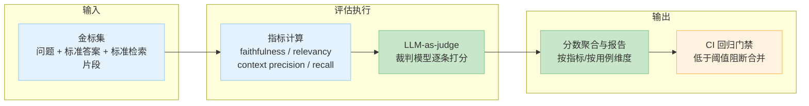
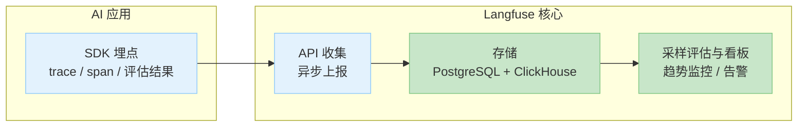
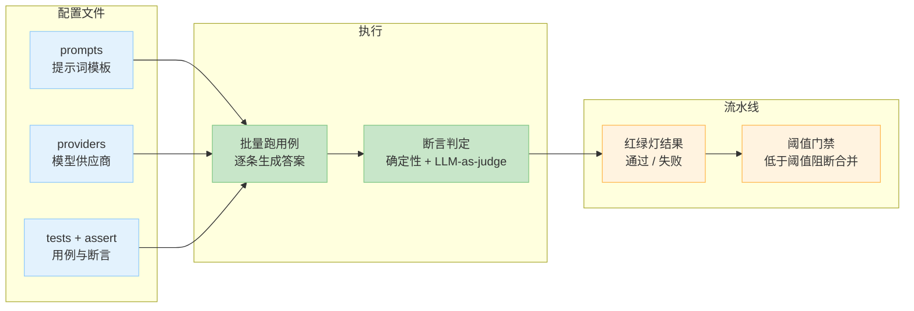

# 2.10 AI 应用拟合评估实践认知 [实用]

> 来源：[RAGAS 文档](https://docs.ragas.io/) · [promptfoo](https://www.promptfoo.dev/docs/)（路径待验证）· [Langfuse](https://langfuse.com/) · [K8s 官方文档](https://kubernetes.io/docs/concepts/workloads/controllers/deployment/) · 验证环境：待验证

## 概念：为什么需要

**业务痛点**：AI 应用上线前「效果」怎么验收——不能只看「能跑」。传统功能验收看「功能对不对」，AI 应用多一个维度「效果好不好」：答得对不对、有没有价值。AI 效果与业务指标脱节 = 上线后才发现没价值（[已必备]：客服机器人上线后解决率没提升，才发现评估只看了「答得流畅」）。

- **从哪来**：传统软件验收（功能测试）→ AI 应用新增「效果验收」（2.5 质量评估）→ 业务拟合评估（AI 效果 ↔ 业务价值映射）
- **是什么**：把 AI 效果映射到业务指标，上线前按清单验收，上线后持续监控能力退化
- **往哪去**：AI 应用 = 需要持续评估的产品，评估从「上线前检查」变成「日常运营」

**能力退化是渐进的**，三个典型来源：

| 退化来源 | 例子 | 为什么难察觉 |
|---|---|---|
| 模型更新 | 供应商换版本、自建模型重新训练 | 单次更新看「感觉差不多」，累积后体验劣化 |
| 数据漂移 | 线上问题分布变化（新业务、新话术） | 评估集是静态的，跟不上动态流量 |
| 提示词改动 | 为修一个 badcase 改 prompt | 修了 A 类问题，可能引入 B 类问题 |

单次看都不明显，等用户投诉才发现已经晚了——这就是本章要解决的：**把「效果」变成可验收、可监控、可回退的工程对象**。

**一个完整的故事线（贯穿本章的案例）**：

> 某电商客服机器人上线：开发团队用 RAGAS 跑分「四指标全绿」，顺利上线。三个月后业务方反馈「解决率没提升，投诉反而多了」。排查发现：① 评估集是上线时建的，没回填过线上 badcase；② 换过一次模型供应商，没跑回归；③ 线上没有采样评估，退化无人察觉。重做评估体系后定位到：换模型后 faithfulness 下降（模型开始瞎编），投诉率随之上升——**映射关系成立，但发现得太晚**。本章就是教你怎么不重演这个故事。

## 认知要点（先建立意识）

**AI 评估分三层**，本章补的是第二、三层：

| 层 | 度量什么 | 工具/方法 | 章节 |
|---|---|---|---|
| 模型质量 | 答得对不对 | RAGAS 四指标（faithfulness / answer relevancy / context precision / context recall） | 2.5 |
| 业务拟合 | 有没有价值 | AI 指标 ↔ 业务指标映射 + 灰度对比 | 本章 |
| 线上监控 | 上线后有没有退化 | 持续采样评估 + 趋势监控 | 本章 |

**三层的关系**：模型质量是地基（答得不对，业务价值无从谈起）；业务拟合是目标（答得对 ≠ 有价值，还要看是否服务了业务指标）；线上监控是保障（离线评估是快照，线上才是真相）。三层缺一不可，但**先建哪层取决于阶段**：原型期先建模型质量层，上线前补业务拟合层，上线后必须建线上监控层。

**金标集是资产**：金标集（golden set，人工标注的「问题 + 标准答案」评估集）随 badcase 回填，越滚越准（呼应 2.5）。它的价值随使用次数增长——每次线上 badcase 回填，评估集就多覆盖一类真实问题，评估结果就越接近线上真相。

**不治理的四个坑**：

1. **上线前不评估**：凭感觉上线，效果好坏全看运气——「感觉变好了」没有依据
2. **评估集不更新**：评估集停留在上线时，业务变了评估没变，分数失真——评估集是静态快照，不是活资产
3. **只看离线指标不看线上**：离线分数高 ≠ 线上体验好（评估集是静态的，线上流量是动态的）
4. **模型更新不回归**：换模型 / 改 prompt 不跑评估，能力退化无人察觉——回归门禁（CI 里评估不达标就阻断合并）就是防这个的

## 业务拟合方法论

四步走：

### 第 1 步：定义业务指标

先想清楚「这个 AI 功能为哪个业务指标服务」。常见业务指标：

| 业务场景 | 业务指标 | 一句话人话 |
|---|---|---|
| 客服机器人 | 解决率（一次解决率 / 最终解决率） | 用户的问题有没有被解决 |
| 知识检索 | 检索命中率 | 用户搜到想要的东西了吗 |
| 电商导购 | 转化率 | 推荐/问答有没有促成下单 |
| 通用助手 | 满意度（NPS/CSAT） | 用户用得爽不爽 |

> 业务指标的定义权在业务方，不在技术方——AI 团队要做的第一件事是**问业务方「这个功能为哪个指标服务」**，而不是自己拍脑袋。

### 第 2 步：AI 指标与业务指标映射

建立「AI 指标 → 业务指标」的假设关系：

| AI 指标（2.5） | 业务指标 | 映射假设 |
|---|---|---|
| faithfulness 低 | 投诉率上升 | 模型瞎编 → 用户不信任 → 投诉 |
| answer relevancy 低 | 一次解决率下降 | 答非所问 → 用户反复追问 |
| context recall 低 | 检索命中率下降 | 该找的没找回来 → 答不上来 |
| context precision 低 | 响应时长上升 | 有效信息排位靠后 → 用户要翻更多内容 |

> **映射是假设，不是事实**。上线前先小范围验证映射关系（比如先看 100 条线上样本里 faithfulness 低的是不是真的都投诉了），再全量依赖它。

### 第 3 步：灰度对比

新模型 vs 旧模型 A/B（A/B 测试：把流量随机分成两组，分别用新旧版本，对比结果）——同一时段、同一用户群随机分流，对比业务指标（呼应 1.11 灰度发布）。

灰度对比的三个控制变量：

1. **同一时段**：避开大促、节假日等流量异常期
2. **同一用户群随机分流**：按用户 ID 哈希分流，同一用户始终进同一组，避免人群偏差
3. **样本量足够**：先小流量跑 1~2 周，看业务指标差异是否显著，再决定全量

### 第 4 步：回归门禁

promptfoo 接 CI，改 prompt / 换模型必须跑评估，低于阈值阻断合并（呼应 2.5）。回归门禁（regression gate）是「评估进流水线」的落地形态：评估不是上线前的一次性检查，而是每次变更的必经关卡。

> 验证环境：待验证。promptfoo 的 CI 配置（GitHub Actions 集成、阈值设置）以官方文档为准。

**promptfoo 配置结构（示意，字段以官方文档为准）**：

```yaml
# promptfooconfig.yaml（示意，验证环境：待验证）
prompts:
  - "你是客服助手，基于以下资料回答：{{context}}\n问题：{{question}}"
providers:
  - id: openai:gpt-4o-mini        # 业务模型
tests:
  - vars:
      question: "退货政策是什么？"
      context: "{{context_1}}"
    assert:
      - type: contains              # 确定性断言：答案必须包含关键词
        value: "7 天"
      - type: llm-rubric           # LLM-as-judge 断言：按评分标准打分
        value: "答案忠实于给定资料，没有编造"
        threshold: 0.8
```

**灰度对比实操步骤**（呼应 1.11 灰度发布）：

1. 分流：按用户 ID 哈希，新模型组 10% 流量，旧模型组 90%
2. 埋点：两组都记录业务指标（解决率 / 满意度）与 AI 指标（RAGAS 分数）
3. 对比：跑 1~2 周，看业务指标差异是否显著（样本量不足时差异可能是噪声）
4. 决策：新模型显著更优 → 全量；持平 → 按成本选；更差 → 回滚

## 官方文档引述（机制要点）

### RAGAS：四指标与 LLM-as-judge 机制

- **要点**：RAGAS 的四指标分两组——生成侧（faithfulness 度量答案是否只来自检索内容、answer relevancy 度量答案是否切题）与检索侧（context precision 度量有效信息排位、context recall 度量应检回内容覆盖度）；指标计算依赖 LLM-as-judge（用大模型当裁判打分），裁判模型与业务模型同源时分数可能虚高，必要时换裁判模型交叉验证
- **链接**：https://docs.ragas.io/
- **验证环境**：待验证（指标定义与计算细节以官方文档为准）

### promptfoo：CI 级回归门禁

- **要点**：promptfoo 把「提示词 + 断言」组织成可版本化的测试用例，支持在 CI 流水线里跑评估并输出红绿灯结果——改 prompt 必须跑评估，低于阈值阻断合并；断言支持 LLM-as-judge 与确定性断言（如 JSON 结构、关键词）混用
- **链接**：https://www.promptfoo.dev/docs/ ⏳（路径待验证）
- **验证环境**：待验证

### K8s 官方文档：Deployment 滚动更新与回滚

- **要点**：K8s Deployment 的滚动更新（rolling update）机制支持「模型版本可回退」的平台侧落地——新版本发布后若评估指标劣化，可用 `kubectl rollout undo` 回滚到上一版本；配合 `revisionHistoryLimit` 保留历史版本（呼应 1.11 灰度发布与 Part 3 上云）
- **链接**：https://kubernetes.io/docs/concepts/workloads/controllers/deployment/
- **验证环境**：待验证（命令需在本地 kind/minikube 集群验证）

### OpenAI Cookbook：评估示例集

- **要点**：OpenAI 官方 Cookbook 收录 RAG / 评估 / 工具调用的官方示例集，其中评估示例演示了「金标集 + LLM-as-judge」的参考实现（含裁判模型提示词写法），可作为自建评估脚本的起点——但注意其示例面向 OpenAI 生态，自建时按业务调整
- **链接**：https://cookbook.openai.com/
- **验证环境**：待验证

## 明星项目架构：RAGAS 评估流水线与 Langfuse 数据流

> 架构以官方文档为准（待验证），以下为理解用简化图。

### RAGAS 评估流水线



**数据流解读**：金标集（人工标注的「问题 + 标准答案 + 标准检索片段」）是唯一输入；评估执行阶段对每条用例计算四指标，其中生成侧指标依赖裁判模型打分（LLM-as-judge）；输出阶段聚合分数生成报告，并接进 CI 作为回归门禁。**关键点：金标集质量决定评估质量**——输入是垃圾，输出就是垃圾（garbage in, garbage out）。

### Langfuse 数据流（线上监控）



**数据流解读**：应用侧 SDK 埋点（trace 追踪，记录一次请求的完整调用链；span 是 trace 里的单个环节）→ 异步上报到 Langfuse API → 存储层（PostgreSQL 存元数据、ClickHouse 存海量 trace）→ 看板层做采样评估与趋势监控。**业务接入点**：SDK 埋点只加两行代码，评估结果（RAGAS 分数）也可回传，实现「离线评估 + 线上监控」同一套指标口径。

### promptfoo 配置结构（CI 回归门禁）



**配置三要素**：prompts（提示词模板，变更即触发评估）、providers（模型供应商，换模型即触发评估）、tests + assert（用例与断言，断言支持确定性检查与 LLM-as-judge 混用）。**设计要点**：把「提示词」和「模型」都参数化，任何一方变更都能在 CI 里自动跑评估——这就是「改 prompt 必须跑评估」的落地机制。

## 上线前验收清单

> 验证环境：待验证

| # | 验收项 | 怎么做 | 通过标准（示例） |
|---|---|---|---|
| 1 | 金标集通过率达标 | RAGAS 跑分，对照评估基线 | 四指标不低于上一版（先「不劣化」再「达标」） |
| 2 | badcase 人工评审 | 抽 20~50 条人工逐条看 | 无「不可接受」级 badcase（如瞎编事实） |
| 3 | 性能达标 | 压测（压力测试，模拟高并发验证系统扛不扛得住） | 首 token 延迟 / 吞吐 / 并发上限达标（呼应 1.12） |
| 4 | 安全评审 | OWASP Top 10 for LLM Applications 清单逐条走查 | 高危项清零（呼应 2.7） |
| 5 | 回滚预案 | 记录模型版本、prompt 版本、评估基线 | 出问题可一键回退到上一版本 |

**每项展开**：

1. **金标集通过率达标**：阈值先宽松后收紧，起步阶段先「不劣化」再「达标」，避免被指标绑架（呼应 2.5）
2. **badcase 人工评审**：指标不能完全替代人——badcase 的「为什么错」只有人看得懂；评审结论要回填评估集
3. **性能达标**：压测要覆盖高峰流量（如客服机器人晚高峰），不能只测理想负载
4. **安全评审**：拿 OWASP 清单逐条走查，作为评审者的抓手（呼应 2.7）
5. **回滚预案**：模型版本可回退——记录当前模型版本、prompt 版本、评估基线，出问题一键回退（平台侧可用 K8s Deployment 回滚，见官方文档引述）

## 线上持续评估

### 采样评估

从线上流量中随机抽样，人工或 AI 标注（LLM-as-judge）。流程：

1. 定采样量：先每天 50 条，跑顺了再加大（避免标注成本失控）
2. 定采样策略：随机抽样，覆盖高峰低谷、覆盖各业务入口
3. 定标注方式：人工标注（准但贵）或 AI 标注（快但有偏差，必要时换裁判模型交叉验证）
4. 定评估频率：周粒度起步，指标稳定后可放宽

**采样评估实操（以 Langfuse 为例，验证环境：待验证）**：

1. 应用侧接入 SDK，开启 trace 记录（记录请求、响应、检索内容）
2. 在 Langfuse 里配置采样率（如 5% 流量进入评估池）
3. 对采样池跑 RAGAS 四指标（离线脚本或平台内置评估）
4. 周粒度看趋势，badcase 导出回填金标集

> 关键点：采样评估的产出不只是分数，还有 **badcase 流**——它是金标集回填的原料，也是「用 AI 分析 badcase 模式」的输入。

### 质量漂移检测

漂移（drift，线上数据分布随时间变化）检测 = 指标趋势监控：

- 周/日粒度看四指标趋势，超过阈值即告警
- 告警阈值先宽松后收紧：先「明显劣化才告警」，跑顺了再收紧
- 告警后走 badcase 分析流程，定位是模型问题、数据问题还是提示词问题

### badcase 回填评估集

线上发现的 badcase 持续回填金标集，评估集越滚越准（呼应 2.5）。回填时标注根因分类（检索不到 / 答非所问 / 瞎编 / 格式问题），为后续分析积累素材。

### 模型版本控制

记录每次模型 / 提示词变更与对应评估结果，能力退化时能定位「是哪次变更引入的」（呼应 2.8 评估与版本控制方向）：

| 版本 | 变更内容 | 评估基线 | 结果 |
|---|---|---|---|
| v1.0 | 上线基线 | 四指标全绿 | 通过 |
| v1.1 | 换模型供应商 | faithfulness 下降 5% | 回滚 |
| v1.2 | 改 prompt 修 badcase | 四指标持平 | 通过 |

## 用 AI 落实（本章特色）

方法论知道了，怎么让 AI 逐步执行——以下提问可直接用，但 **AI 输出必须人工复核**（AI 会编造，事实回官方验证）：

1. **让 AI 设计评估集**：「这是我线上收集的 30 条 badcase，请按根因归类（检索不到 / 答非所问 / 瞎编 / 格式问题），并每类生成 5 条变体，扩充我的评估集」
   - 检查点：变体是否覆盖真实业务场景、是否引入原 badcase 没有的新问题
2. **让 AI 跑评估并出报告**：「请用 RAGAS 对这份金标集跑分，输出四指标结果，并对比上一版评估基线，标出劣化的指标」
   - 检查点：报告是否区分「劣化」与「波动」（样本量小时波动是正常的）
3. **让 AI 分析 badcase 模式**：「请分析这 50 条 badcase，归类根因，并给出每类根因对应的修复方向（改检索 / 改 prompt / 改切块）」
   - 检查点：根因归类是否与人工判断一致，修复方向是否可执行
4. **让 AI 设计业务指标映射表**：「请根据我的业务（客服机器人），设计 AI 指标与业务指标的映射表，并说明每个映射的假设与验证方法」
   - 检查点：映射假设是否合理，验证方法是否可落地
5. **让 AI 生成验收清单**：「请基于这份验收清单模板，结合我的应用（RAG 客服），生成一份可勾选的上线前验收清单」
   - 检查点：是否覆盖金标集 / 人工评审 / 性能 / 安全 / 回滚五项

**一个完整的 AI 协作示例（badcase 分析）**：

> **你**：「这是我线上收集的 30 条 badcase（附 CSV），请按根因归类，每类给出修复方向。」
>
> **AI 输出**（示意）：
> - 检索不到（12 条）：问题涉及新上线的「运费险」政策，知识库未更新 → 修复：更新知识库 + 回填评估集
> - 答非所问（8 条）：用户问「怎么退」，模型答「退货政策」→ 修复：prompt 加意图识别
> - 瞎编（6 条）：模型编造了不存在的赔付金额 → 修复：prompt 约束「只答资料内内容」+ 加 faithfulness 断言
> - 格式问题（4 条）：答案过长无结构 → 修复：prompt 加输出格式约束
>
> **你复核**：抽查每类 2~3 条，确认归类正确；把「瞎编」类回填金标集（这是最高优先级 badcase）。

**AI 协作的边界**：AI 擅长「归类、生成变体、起草清单」这类结构化工作；「判定归类是否正确、决定修复优先级、验证修复效果」必须人来定——AI 是评估体系的执行者，不是决策者。

## 选型/技术路线建议

| 阶段 | 工具 | 用途 | 何时上 |
|---|---|---|---|
| 起步（离线评估） | RAGAS + promptfoo | 金标集跑分 + CI 回归门禁 | 原型期就要建 |
| 线上监控 | Langfuse（开源）/ LangSmith（商业） | 采样评估、trace 追踪、趋势监控 | 上线前必须建 |
| 业务指标平台对接 | 内部 BI / Grafana 看板 | AI 效果 ↔ 业务 KPI 放一起看 | 上线后持续运营期 |

**路线**：先离线评估跑通（RAGAS + promptfoo）→ 再线上采样（Langfuse）→ 最后对接业务指标看板。不要一上来就上全套，评估链路是逐步长出来的。

**选型决策要点**：

- 开源 vs 商业：Langfuse 开源可自托管（数据不出内网），LangSmith 商业（托管省事但数据出境需评估）——按数据合规要求选
- 评估框架：RAGAS 是四指标事实标准；DeepEval 是备选（断言更灵活，适合自定义指标）
- 业务指标平台：优先复用公司已有的 BI / 监控平台，不要自建——评估结果只是多一路数据源

## 业界前沿（演进方向）

> 以下为演进方向观察，标注「前沿，待验证」——不构成选型依据，仅作视野扩展。

- **评估自动化（agentic evals）**：用 AI 自动生成评估用例、自动执行多步任务评估——从「人工写评估集」走向「AI 生成 + 人工复核」（前沿，待验证）
  - 为什么值得关注：评估集建设是当前最大成本项，自动化直接降本；但生成用例的质量仍需人工把关
- **在线评估与离线评估融合**：线上流量实时评估（在线评估）与金标集离线评估互补——离线管回归，在线管真相（前沿，待验证）
  - 为什么值得关注：离线评估是快照，在线评估是连续信号；融合后「退化发现」从周级缩短到天级/小时级
- **LLM-as-judge 校准**：裁判模型偏差研究（同源虚高、位置偏差等），多裁判投票、裁判模型选择成为实践方向（前沿，待验证）
  - 为什么值得关注：裁判偏差会系统性扭曲评估结论，校准是「分数可信」的前提
- **评估与可观测融合**：评估结果与 trace 数据统一字段标准（如 OTel GenAI semconv，手册内部统一口径），实现「评估 + 可观测」一张图（前沿，待验证）
  - 为什么值得关注：评估与可观测打通后，badcase 可以直接关联到 trace 定位根因，排查效率大幅提升
- **多模态评估**：图片 / 音频输入场景的评估指标仍在演进，尚无四指标级别的成熟标准（前沿，待验证）
  - 为什么值得关注：多模态应用在增多，但评估标准滞后——先行的团队要自己定义指标，注意标注假设

## 权威观点

> 以下观点转述自知识检索手册 §10 已收录作者，出处固定可查；措辞为转述大意，非原文引用。

- **Hamel Husain**（evals 实战系列，[hamel.dev](https://hamel.dev/)）：AI 产品最先该建的不是功能是评估——评估要尽早建、持续维护，评估集是产品资产而不是上线前的临时检查
- **Eugene Yan**（LLM 应用与评估实践，[eugeneyan.com](https://eugeneyan.com/)）：评估要工程化——LLM-as-judge 有偏差，需要校准与交叉验证；评估结果要能指导改进，而不是只给一个分数
- **Chip Huyen**（《AI Engineering》O'Reilly 2025，[huyenchip.com](https://huyenchip.com/)）：评估是 AI 工程的核心挑战之一——AI 应用的价值取决于评估体系是否跟上模型与数据的变化

## 实用技巧

- 指标分开看：faithfulness 低 = 模型在瞎编（查 prompt 与检索内容）；context recall 低 = 该找的没找回来（查切块与 embedding）（呼应 2.5）
- 灰度对比要控制变量：同一时段、同一用户群随机分流，避免时段 / 人群偏差
- 评估报告要留档：每次变更的评估结果可追溯，这是「能力退化定位」的前提
- 采样评估先小后大：先每天 50 条，跑顺了再加大，避免标注成本失控
- 业务指标映射先做假设验证：小范围验证映射关系再全量依赖
- 告警阈值先宽松后收紧：先「明显劣化才告警」，跑顺了再收紧，避免告警疲劳
- badcase 回填时标注根因分类：检索不到 / 答非所问 / 瞎编 / 格式问题——分类是后续「用 AI 分析模式」的原料
- 评估脚本版本化：评估集、评估脚本、评估报告都进 Git，像代码一样评审——评估体系本身也要可回归

## 考察问题

- 为什么「离线指标全绿」不能证明线上有价值？（线索：评估集是静态的，线上流量是动态的；指标度量「答得对不对」，业务指标度量「有没有价值」）
- 灰度对比时新旧模型流量怎么分才公平？（线索：同一时段、同一用户群随机分流，避免时段 / 人群偏差）
- 能力退化怎么在用户感知之前发现？（线索：采样评估 + 趋势监控，而不是等投诉）
- 业务指标映射是假设，怎么验证它成立？（线索：小范围抽样看「AI 指标差」的样本是否真的对应「业务指标差」，先验证再全量依赖）
- 为什么「AI 生成的评估用例」不能直接进金标集？（线索：金标集是「标准答案」，标准答案不能由被考者出——AI 生成的是候选，人工复核后才算数）

## 经验之谈

- AI 产品最先该建的不是功能是评估——评估是产品的一部分，不是上线前的临时检查
- 评估不是一次性项目，是持续运营的资产：评估集、评估脚本、评估报告都要像代码一样维护
- 业务指标映射是假设，不是事实：上线前先小范围验证映射关系，别把假设当结论
- 评估链路是逐步长出来的：先离线评估跑通，再线上采样，最后对接业务指标——不要一上来就上全套

## 架构师视角

- 解决什么问题：AI 应用上线前怎么验收、上线后怎么持续评估能力退化
- 何时用：任何要上线的 AI 应用；何时不用：一次性原型可先不建评估
- 权衡：评估成本（人工标注 / 算力）与风险（上线后才发现没价值）——评估是「花小钱省大钱」
- **平台提供了什么能力边界**：评估工具链（RAGAS/promptfoo）可自建；线上监控（Langfuse）可自建或接入平台可观测；模型版本回退可复用 K8s Deployment 回滚机制
- **业务接入点在哪**：业务指标定义、金标集、验收清单是业务资产；评估结果进业务 KPI 看板
- **需要和基础设施团队对齐什么**：CI 跑评估的算力/额度、线上采样评估的链路（trace 数据）、评估结果是否进统一可观测平台

## 核心收获表

| 能力维度 | 具体收获 |
|---|---|
| 认知 | 能说清 AI 评估三层（模型质量 / 业务拟合 / 线上监控）及其关系 |
| 方法论 | 能设计业务指标映射表与灰度对比方案，并验证映射假设 |
| 验收 | 能按清单完成上线前验收（金标集 / 人工评审 / 性能 / 安全 / 回滚） |
| 运营 | 能建立线上采样评估、漂移检测与 badcase 回填机制 |
| 架构 | 能讲清 RAGAS 评估流水线与 Langfuse 数据流，理解评估链路选型路线 |
| AI 协作 | 能用 AI 生成评估集 / 报告 / 映射表，并知道人工复核 |

## 推荐开源项目表

| 项目 | 链接 | 研读重点 |
|---|---|---|
| RAGAS | https://docs.ragas.io/ | 离线评估四指标与 LLM-as-judge 机制 |
| promptfoo | https://www.promptfoo.dev/docs/ ⏳ | CI 回归门禁配置 |
| Langfuse | https://langfuse.com/ | 线上采样评估与 trace 数据流 |
| DeepEval | https://docs.confident-ai.com/ | 评估框架备选（自定义断言） |

## 常见问题排查

| 现象 | 排查路径 |
|---|---|
| 离线指标全绿但线上体验差 | 检查评估集是否过小/过偏、是否只看了离线没看线上采样 |
| 灰度对比看不出差异 | 检查分流是否随机、样本量是否足够、对比周期是否太短 |
| 线上能力退化没及时发现 | 检查是否建立了采样评估与趋势监控，badcase 是否回填评估集 |
| 换模型后效果变差 | 检查是否跑了回归门禁、模型版本是否可回退、评估基线是否留档 |
| 评估分数忽高忽低 | 检查样本量是否太小、裁判模型是否稳定（必要时换裁判模型交叉验证） |
| 业务指标映射不成立 | 检查映射假设是否经过小范围验证，先验证再全量依赖 |