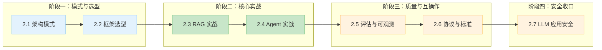

# Part 2 LLM 应用开发（章 README）

> 一句话说明：本章解决「怎么把 LLM 从『调 API』变成『能交付的 AI 应用』」——掌握 RAG / Agent 核心架构模式，学会评估质量、守住安全底线，为 Part 3 上云打基础。
> 💡 用 AI 学本章：考察问题抛给 AI 当讨论伙伴；动手报错让 AI 解释 + 给排查路径；让 AI 生成练习变体检验是否真懂。完整 AI 学习指南见根 README。

## 快速导航

| 文档 | 说明 |
|---|---|
| 📖 [03-rag-vector-db.md](03-rag-vector-db.md) | 2.3 前置：RAG 数据底座——Embedding 与向量库选型 |
| 📖 [05-rag-evaluation.md](05-rag-evaluation.md) | 2.5 增强：RAG 质量评估——RAGAS 四指标 + CI 回归 |
| 📖 [07-llm-security.md](07-llm-security.md) | 2.7 LLM 应用安全 |
| 📖 [08-enterprise-agent-platform.md](08-enterprise-agent-platform.md) | 2.8 进阶：企业智能体平台方向认知——九个方向地图与入门择业 |
| 📖 [09-rag-engineering.md](09-rag-engineering.md) | 2.9 工程实践：RAG 文档处理流水线——解析 / 切块 / 混合检索 / 重排 |
| 📖 [10-ai-fit-evaluation.md](10-ai-fit-evaluation.md) | 2.10 AI 应用拟合评估——业务指标映射 + 上线验收 + 线上监控 |
| 📋 2.1 / 2.2 / 2.4 / 2.6 | 规划中：架构模式 / 框架选型 / Agent 实战 / 协议与标准 |

## 核心特性

✅ 学完能做什么：

- 能讲清 RAG / Agent / 工作流模式的区别与适用场景
- 能完成 Embedding 与向量库选型（pgvector / Qdrant / Milvus 决策表）
- 能搭 RAG 应用，用 RAGAS 四指标评估质量并接进 CI 回归
- 能识别直接 vs 间接提示注入，按防御分层加固 Agent 工具
- 能独立设计一个 AI 功能的技术方案（选型 + 架构 + 部署）

## 前置知识

| 知识点 | 来源章节 | 在本章的应用 |
|---|---|---|
| Python 基础 | Part 0 | 写 RAG / Agent 示例代码 |
| HTTP / REST 与 API 调用 | Part 0 | 调 LLM API（OpenAI 兼容） |
| 容器与 K8s 基础 | Part 1 | 2.7 隔离执行；Part 3 上云铺垫 |

## 学习路线图

## 业务场景映射

| 业务痛点/场景 | 本章技术方案 | 标注 |
|---|---|---|
| 企业知识检索难、文档散落 | 2.3 RAG + 向量库选型 | [已必备] |
| 客服人力成本高、等客服排队 | 2.3 RAG 问答 + 2.5 质量评估 | [已必备] |
| 改 prompt 全凭感觉、上线质量回归 | 2.5 RAGAS + CI 回归 | [已必备] |
| Agent 越权操作造成业务事故 | 2.7 防御分层 + 安全评审 | [已必备] |