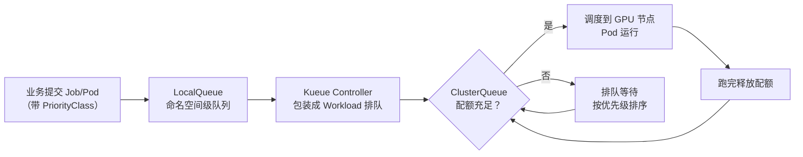

# 3.3 GPU 资源申请与调度认知 [实用]

> 来源：[Kubernetes 官方文档 · 调度 GPU](https://kubernetes.io/docs/tasks/manage-gpus/scheduling-gpus/) · [Kueue](https://kueue.sigs.k8s.io/) · [NVIDIA GPU Operator](https://docs.nvidia.com/datacenter/cloud-native/gpu-operator/latest/index.html) · 验证环境：待验证

## 概念：为什么需要

GPU 是 AI 上云后最稀缺、最贵的资源：一张训练卡动辄数万元，集群里「排队等卡」是常态而不是异常。业务团队的第一课不是选卡型，而是搞清楚三件事：**卡从哪来（怎么申请）、怎么排队（等多久、凭什么先轮到我）、怎么不浪费（用足配额）**。申请不到卡 = 项目延期；申请了不用 = 空转烧钱。这两头都是业务侧直接承担的后果，所以「申请与调度」不是平台的事，是每个 AI 业务团队都要懂的生存技能。

- **从哪来**：GPU 调度能力是 K8s 生态逐步长出来的——先是 Device Plugin 机制让 K8s 认识 GPU 资源，再有 GPU Operator 把驱动、插件、监控一键装好，最后 Kueue 这类排队调度器解决「卡不够分」的问题
- **是什么**：本章讲业务视角的 GPU 资源管理——怎么在 Pod 里声明 GPU、怎么进队列排队、怎么用足配额；不建设 GPU 平台（装机、驱动、调度器部署都是平台的事）
- **往哪去**：GPU 管理正在从「整卡申请」走向「细粒度共享 + 队列化调度」——DRA（Dynamic Resource Allocation，K8s 动态资源分配，1.35 GA 的新资源管理标准）和 Kueue 是两条主线，业务侧只需跟上「怎么申请」的姿势变化 [进阶]

**引导反思**：GPU 是「申请制」资源——申请、排队、用足，三个环节缺一个，项目就延期或烧钱。

**本章地图**：先建立认知（GPU 稀缺、调度/排队机制、业务侧义务）→ 学会申请（YAML 写法、整卡/共享、进队列）→ 理解排队（Kueue 两级队列、优先级、等卡准备）→ 用足配额（监控、回收、伸缩）→ 最后是沟通与选型（问 AI 的要点、问平台的顺序）。对应「申请 → 排队 → 用足」三环节，每节末尾都有「业务侧怎么做」的落点。

## 认知要点：先建立意识

1. **GPU 是稀缺资源，不是普通 CPU**：CPU 按核申请、随要随有；GPU 要排队、要配额、要考核利用率。用 CPU 的思维申请 GPU，第一周就会踩坑
2. **调度机制（怎么让 K8s 认识 GPU）**：Device Plugin（设备插件，K8s 的扩展机制，让 kubelet 把节点上的 GPU 上报成可调度资源）是核心——它把 `nvidia.com/gpu` 变成像 CPU/内存一样的资源单位；GPU Operator 则是 NVIDIA 官方的一键装机方案，把驱动、Device Plugin、监控打包管理（装机是平台的事，业务侧知道「有这个东西」即可）。业务侧怎么做：写对资源声明，报错时能判断「是平台没装还是我写错」
3. **排队机制（卡不够分怎么办）**：Kueue（K8s SIG 官方项目，作业排队与配额管理）用队列 + 配额的方式管理 GPU 分配——业务侧把作业提交进队列，等配额释放。业务侧怎么做：找平台要队列，作业进队，看状态
4. **业务侧义务**：申请（写对资源声明）、排队（进对队列、设对优先级）、用足（监控利用率、不用就释放）——三件事都是业务侧自己的事
5. **不治理的坑**：
   - 申请了不用：Pod 占着卡空转，烧钱还挡着别人（平台会按利用率回收配额）
   - 请求整卡但只用一半：模型小、请求稀疏，却占一整张卡——浪费是别人的两倍
   - 排队规则不懂：不知道优先级怎么设、不知道队列配额怎么算，作业永远排最后

**业务侧行动清单（把意识变成动作）**：

| 意识 | 对应动作 |
|---|---|
| GPU 是稀缺资源 | 申请前先估算（见「和 AI 沟通」），不拍脑袋要卡 |
| 调度机制 | 写对 YAML（只写 limits），报错先查机制 |
| 排队机制 | 找平台要 LocalQueue，作业提交进队列 |
| 业务侧义务 | 建利用率看板（3.4），跑完即释放 |
| 不治理的坑 | 每月对一次账：申请了几张卡、用了几张、利用率多少 |

## 官方文档引述：Device Plugin 与 GPU 调度的关键机制

以下机制来自 K8s 官方文档《Schedule GPUs》，是理解「为什么 GPU 申请长这样」的底层依据（[Kubernetes 官方文档](https://kubernetes.io/docs/tasks/manage-gpus/scheduling-gpus/) · 验证环境：待验证）：

> **机制 1：GPU 是不可压缩资源，不能超卖**
> 官方文档明确：容器（和 Pod）之间**不共享 GPU**，不存在 GPU 超卖（overcommitting）。一张卡要么整张给一个容器，要么不给——这是「整卡申请」成为默认姿势的根本原因，也是共享方案（MIG/时间片）必须靠额外机制实现的原因。

> **机制 2：GPU 只能写在 limits，且 requests 必须等于 limits**
> 官方文档规定 GPU 资源只能写在 `limits` 段：可以只写 limits（K8s 自动把 requests 视为等于 limits），也可以 requests 和 limits 都写但两者必须相等；**不能只写 requests 不写 limits**。这与 CPU/内存（可压缩资源，requests 可以小于 limits）完全不同——写错会直接调度失败。

> **机制 3：GPU 是节点级资源，按节点上报数量调度**
> Device Plugin 把每台节点上的 GPU 数量上报给 kubelet，调度器按「节点还剩几张卡」做调度决策。官方文档还建议 GPU 节点用标签 + 污点（taint，节点上的排斥标记，阻止不相关 Pod 调度上去）隔离，防止非 GPU 负载占住 GPU 节点——业务侧申请时若发现节点有污点，需要容忍（tolerations）才能调度上去，具体以平台配置为准。

> **机制 4：官方文档明确「集群级 GPU 共享需要额外方案」**
> 官方文档指出：多集群/多团队共享 GPU 的配额管理不在 Device Plugin 范围内，需要额外的调度层（如 Kueue）——这正是「排队机制」存在的官方依据。

**业务侧解读（四条机制 → 四个动作）**：

| 机制 | 业务侧动作 |
|---|---|
| 1. 不可超卖 | 小模型别占整卡——要么共享，要么接受浪费 |
| 2. 只写 limits | 写 YAML 时 GPU 只放 limits，requests 必须相等 |
| 3. 节点级资源 | 卡在节点上，节点有污点要容忍——问平台节点策略 |
| 4. 集群共享需额外方案 | 排队是常态，进队列前先问配额规则 |

四条都记住，申请 GPU 就不会写错。

## 申请 GPU 的姿势

**第 1 步：在 Pod 里声明 GPU**（GPU 资源只需写在 limits 里——Device Plugin 机制下 requests 会被忽略，K8s 按 limits 调度；验证环境：待验证）

```yaml
# gpu-pod.yaml —— 申请 1 张卡
apiVersion: v1
kind: Pod
metadata:
  name: gpu-pod
spec:
  containers:
    - name: cuda-container
      image: nvidia/cuda:12.0.0-base-ubuntu22.04
      resources:
        limits:
          nvidia.com/gpu: 1
```

**第 2 步：整卡 vs 共享（认知即可，具体策略问平台）**
- 整卡：`nvidia.com/gpu: 1` 独占一张卡，简单直接，但小模型用不满
- 共享：MIG（Multi-Instance GPU，NVIDIA 的硬件切分技术，一张物理卡切成多个相互隔离的实例）或时间片/显存切分（如 HAMi 项目）——一张卡多人用，利用率高，但隔离性和性能有取舍
- 业务侧判断：模型小、QPS 低 → 申请共享；模型大、要稳定性能 → 申请整卡

**共享的三种形态（认知即可，平台提供哪种问平台）**：

| 形态 | 机制 | 隔离性 | 适用 |
|---|---|---|---|
| MIG | 硬件切分，一张卡切成多个独立实例 | 强（硬件隔离） | 多租户、要稳定性能 |
| 时间片 | 软件轮转，多个 Pod 轮流用一张卡 | 弱（互相影响） | 开发调试、低 QPS |
| 显存切分（HAMi 等） | 软件按显存切分 | 中 | 显存小但算力够的场景 |

**第 3 步：进队列（Kueue 认知）**
- ClusterQueue（集群队列）：平台侧定义，声明整个集群的 GPU 配额池
- LocalQueue（本地队列）：命名空间级队列，业务团队把作业提交到这里
- 业务侧动作：向平台申请一个 LocalQueue → 作业提交到该队列 → 等 ClusterQueue 配额释放后自动调度

**第 4 步：看队列状态（验证环境：待验证）**

```bash
# 看自己团队的队列和排队情况（命令以平台实际为准）
kubectl get localqueue -n <你的命名空间>
kubectl get workload -n <你的命名空间>          # 排队中的作业
kubectl describe localqueue <队列名> -n <你的命名空间>   # 配额用量
```

## 明星项目架构：Kueue 两级队列

Kueue 是 K8s SIG 官方项目（CNCF 孵化中），用「两级队列」解决「卡不够分」：业务侧只接触 LocalQueue，配额池在 ClusterQueue，中间由 Kueue 控制器统一排队。数据流如下：



**组件构成**（知道谁在干活即可，部署是平台的事）：

| 组件 | 角色 |
|---|---|
| kueue-controller-manager | 核心控制器：监听 Workload、管理排队与准入 |
| Webhook | 校验/默认 LocalQueue、ClusterQueue 配置 |
| Workload CRD | 排队单元：包装 Job/Pod 等负载 |
| 集成层（integrations） | 支持 Job、JobSet、Pod、Deployment 等负载类型 |

**LocalQueue 长什么样**（平台建好后业务侧看到的对象，验证环境：待验证）：

```yaml
# localqueue.yaml —— 平台创建，业务侧只读
apiVersion: kueue.x-k8s.io/v1beta1
kind: LocalQueue
metadata:
  name: team-a-queue
  namespace: team-a
spec:
  clusterQueue: cluster-queue-gpu   # 指向平台定义的配额池
```

业务侧动作：作业提交到 `team-a` 命名空间并关联该队列（Kueue 通过标签/注解关联，具体以平台文档为准），剩下的排队、调度、释放都由 Kueue 完成。

三个核心概念（业务侧只需懂这三个）：

- **Workload**：Kueue 的排队单元——你提交的 Job/Pod 会被 Kueue 包装成 Workload 对象进入队列，`kubectl get workload` 看到的就是它
- **LocalQueue**：命名空间级队列，是业务侧的「提交入口」——你的作业先进这里，而不是直接找调度器
- **ClusterQueue**：集群级配额池，定义「全集群有多少卡、训练队多少、推理队多少」——配额用完了，后面的作业就在 LocalQueue 里排队

**抢占流程**（是否开启由平台配置）：高优先级 Workload 到达 → 检查 ClusterQueue 配额 → 配额不足时，Kueue 按配置抢占（preempt，把低优先级作业的配额让出来）低优先级 Workload → 被抢占的作业回到队列重新排队。业务侧要知道：**优先级不是自己说了算，是平台配置的规则**——提需求时问清楚规则，比盲目设高优先级有用。

## 排队与优先级

**为什么是队列而不是直接调度**：没有队列时，GPU 分配是「先到先得」——谁先提交谁先拿卡，无法按业务重要性分配，也无法全局看配额。队列的价值在于：全局配额视图（谁占了多少）、优先级排序（重要的先跑）、抢占（高优先级让低优先级让位）、公平性（多团队按配额分，不靠抢）。这就是 Kueue 存在的意义。

Kueue 的排队模型，业务侧要懂三个概念：

- **队列**：作业不是直接提交给调度器，而是提交进 LocalQueue，由 Kueue 统一排队
- **配额**：ClusterQueue 定义总配额（比如「全集群 32 张卡，训练队 20 张、推理队 12 张」），配额用完了就排队等
- **优先级与抢占**：队列可以配置优先级（PriorityClass，K8s 的优先级类，给 Pod/作业标优先级），高优先级作业可以抢占低优先级作业的配额（是否开启由平台配置）

**PriorityClass 长什么样**（验证环境：待验证）：

```yaml
# priority.yaml —— 声明一个高优先级类（是否生效由平台配置）
apiVersion: scheduling.k8s.io/v1
kind: PriorityClass
metadata:
  name: online-inference-high
value: 1000
globalDefault: false
description: "在线推理作业，优先于训练"
```

```yaml
# 在 Pod 里引用优先级类
spec:
  priorityClassName: online-inference-high
```

**配额怎么算（问平台时对照）**：

| 配额维度 | 说明 | 业务侧关注点 |
|---|---|---|
| 按卡数 | 队列最多同时用 N 张卡 | 我的作业要几张卡，会不会超配额 |
| 按时间 | 配额按使用时长计费/考核 | 跑得慢 = 占配额久，优化训练效率 |
| 按优先级 | 高优先级可抢占低优先级 | 我的作业是「可等」还是「不可等」 |
| 利用率考核 | 长期低利用率回收配额 | 用足配额，别被回收 |

业务侧怎么提需求：

1. 问平台：队列怎么申请、配额怎么算（按卡数？按时间？）、有没有优先级/抢占
2. 设优先级：训练任务 vs 在线推理——推理通常优先级更高（用户等着），训练可以排队
3. 等卡期间做什么（别干等）：
   - 预编译：把模型编译/优化提前做好（如 TensorRT 编译），卡一到直接跑
   - 预热数据：镜像、数据集提前拉到节点，避免卡到了还在下载
   - 先跑小规模验证：用 CPU 或小卡把代码逻辑跑通，卡到位直接上全量

**看排队状态**（验证环境：待验证）：

```bash
# 我的作业排到哪了
kubectl get workload -n <你的命名空间> -o wide
# 队列配额用了多少
kubectl describe localqueue <队列名> -n <你的命名空间>
# 集群配额池状态（通常只读，问平台要权限）
kubectl get clusterqueue
```

> 提示：Workload 状态字段（Pending / Admitted / Finished）是排队进度的直接信号——Admitted 表示已拿到配额开始调度，Pending 表示还在等。

## 用足配额（成本视角）

配额是「用进废退」的：申请了不用，平台会回收；用不满，下次申请更难。回收口径各平台不同（按利用率阈值、按闲置时长、按季度对账），业务侧要主动问清楚——知道口径才知道怎么达标。四个动作：

1. **监控利用率**：接 3.4 的 dcgm-exporter 指标，看自己的 GPU 利用率——利用率长期低于 30% 就是浪费（呼应 3.4）

```promql
# 自己团队的 GPU 平均利用率（需指标带 namespace 标签，见 3.4 实用技巧）
avg by (namespace) (DCGM_FI_DEV_GPU_UTIL)
```

2. **空闲回收**：训练跑完立刻删作业释放卡；开发调试用共享卡，别占整卡
3. **共享推理**：推理服务用批处理引擎（vLLM 等，见 3.6 引擎批处理）把多个请求合并处理，一张卡服务更多人
4. **按需伸缩**：不用就缩——推理服务按 QPS 伸缩（KEDA 等，见检索手册 §4），训练任务跑完即释放

**判断标准（经验值，非官方口径）**：利用率 < 30% 持续一周 → 该缩卡或换共享；利用率 > 80% 且排队 → 该加卡。具体考核口径问平台。

**空闲回收操作**（验证环境：待验证）：

```bash
# 训练跑完：删掉 Job 释放卡（Kueue 会同步释放配额）
kubectl delete job <训练任务名> -n <你的命名空间>
# 确认配额已释放
kubectl get workload -n <你的命名空间>
```

**伸缩的两种姿势**：

| 姿势 | 适用 | 说明 |
|---|---|---|
| 手动伸缩 | 训练任务 | 跑完即删，简单直接 |
| 自动伸缩 | 推理服务 | 按 QPS/利用率指标伸缩（KEDA 等），不用就缩到最小副本 |

## 和 AI 沟通的提问要点

让 AI 帮你估算 GPU 需求时，先给它这些信息（缺一个，估算就是拍脑袋）：

| 信息 | 为什么重要 |
|---|---|
| 模型大小与量化 | 决定显存需求：7B 模型 FP16 约 14GB 显存，INT8/INT4 量化后减半（粗略估算，具体以模型卡为准） |
| 推理还是训练 | 推理看显存 + 吞吐，训练看显存 + 算力 + 时长 |
| QPS 与并发 | 决定要几张卡：QPS 高 → 多卡 + 批处理 |
| 可用卡型 | 平台有什么卡（A100 / H100 / L40S 等），显存和算力差很多 |
| 预算约束 | 决定整卡还是共享、量化到什么程度 |

**完整示例**（估算方法，数值待验证）：

> 需求：「7B 模型做 RAG 问答，INT8 量化，预计 50 QPS，平台有 A100（80GB）和 L40S，预算有限」
> 估算过程：
> 1. 显存：7B × 1 字节（INT8）= 约 7GB 权重 + KV cache 与上下文开销 → 单卡 80GB 绰绰有余，**不需要多卡拼显存**
> 2. 吞吐：7B INT8 在 A100 上单卡吞吐约数百 token/s（具体数值待验证）——50 QPS 的问答场景（每请求输出几百 token）单卡可能吃紧
> 3. 结论：1 张 A100 起步，QPS 不够再加；预算有限则先上共享卡 + 批处理引擎（3.6），用利用率数据说话

**示例提问**：「我要部署一个 7B 模型做 RAG 问答，INT8 量化，预计 50 QPS，平台有 A100 和 L40S，预算有限——需要几张卡、用整卡还是共享？」

**常见估算错误（对照检查）**：

| 错误 | 后果 | 正确姿势 |
|---|---|---|
| 只报模型名不报量化 | 显存估算差一倍 | 先定量化（FP16 / INT8 / INT4） |
| 不报 QPS 只报「线上用」 | 无法算卡数 | 给峰值 QPS + 平均 QPS |
| 不报可用卡型 | 估算的卡平台没有 | 先问平台有什么卡 |
| 训练推理混着算 | 需求翻倍 | 分开算：训练按任务、推理按 QPS |
| 拿不准就多申请 | 配额被回收 | 先小后大，用数据说话 |

**让 AI 当估算陪练**：把上表当模板，让 AI 扮演「平台配额管理员」反问你的需求（模型、量化、QPS、卡型、预算），你来回答——答不上来的项就是你要找平台确认的项。这比直接要答案更能暴露信息缺口。

## 选型/技术路线建议

1. **先问平台方「怎么申请」**：流程（申请单？工单？）、配额（怎么算、怎么考核）、队列（有没有 Kueue、怎么进）——这是第一步，比选卡型重要
2. **按需申请**：推理用共享/批处理（QPS 低就别占整卡），训练按任务规模申请整卡
3. **用足配额**：监控（3.4）+ 伸缩（不用就缩）+ 回收（跑完即释放）
4. **跟进新标准**：DRA 是 GPU 管理演进方向（1.35 GA），平台升级后申请姿势可能变化——关注平台公告即可 [进阶]

**场景 → 申请姿势速查表**：

| 场景 | 申请姿势 | 理由 |
|---|---|---|
| 在线推理（QPS 高） | 整卡 + 批处理引擎（3.6） | 吞吐优先，批处理摊薄单请求成本 |
| 在线推理（QPS 低） | 共享卡（MIG/时间片） | 别占整卡，利用率优先 |
| 训练（大模型） | 整卡多卡 + 高优先级 | 任务有时限，排队成本高 |
| 训练（小模型/调试） | 共享卡或低优先级 | 可等，错峰提交 |
| 原型验证 | CPU/小卡先跑 | 卡到位直接上全量 |

## 业界前沿（前沿，待验证）

以下方向正在改变「怎么申请 GPU」的姿势，业务侧知道存在即可，具体以平台落地为准：

- **DRA（Dynamic Resource Allocation）**：K8s 1.35 GA 的新资源管理标准——从「资源名 + 数量」（`nvidia.com/gpu: 1`）走向「参数化资源请求」（可以声明「我要一张支持 MIG 的卡」这类带参数的请求），是 Device Plugin 的演进方向（[官方文档](https://kubernetes.io/docs/concepts/resource-management/dynamic-resource-allocation/)）[前沿，待验证]
- **Inference Extension（Gateway API 推理扩展）**：SIG Network 的模型路由标准——InferencePool / InferenceEndpoint 让网关按模型负载路由请求、过载保护，与 3.5 网关、3.6 推理服务衔接（[项目主页](https://gateway-api-inference-extension.sigs.k8s.io/)）[前沿，待验证]
- **InPlace Pod Resize**：Pod 原地调整资源、不用重启——对「先申请小卡、不够再扩」的姿势有影响；GPU 资源是否支持原地调整以平台版本为准（[K8s 发布博客](https://kubernetes.io/blog/)）[前沿，待验证]
- **spegel**：SIG 项目的 P2P 镜像分发——等卡期间预热镜像的加速手段，节点间互相拉镜像，避免卡到了还在等镜像下载（[项目主页](https://github.com/kubernetes-sigs/spegel)）[前沿，待验证]
- **趋势主线**：整卡独占 → 细粒度共享 + 队列化调度 + 按需伸缩；CNCF AI 工作组（[cnaiwg](https://tag-runtime.cncf.io/wgs/cnaiwg/)）的白皮书与会议材料是趋势判断的权威来源 [前沿，待验证]

**业务侧怎么跟**：以上方向都不需要业务侧动手——平台升级后「怎么申请」的姿势会变（比如 DRA 的申请写法、Inference Extension 的路由配置），业务侧只需：关注平台升级公告 → 对照本章「申请姿势」检查写法是否变化 → 变化了问平台要新文档。半年看一次 CNCF AI 工作组材料，保持趋势敏感即可。

## 实用技巧

- 排查 Pod 起不来先看事件：`kubectl describe pod <name>` 的 Events 会直接告诉你「没卡」还是「没配额」（验证环境：待验证）
- 申请前先确认节点有没有 GPU 标签/Device Plugin：`kubectl get nodes -l nvidia.com/gpu.present=true`（标签名以平台为准，验证环境：待验证）
- 训练任务用 Job 而不是裸 Pod：Job 失败可重试，Kueue 对 Job 的集成也最成熟
- 显存估算公式（粗略）：模型参数量 × 每参数字节数（FP16 为 2 字节）+ 推理上下文开销——具体数值以实测为准，别信拍脑袋的数字
- 申请前先问三个问题再动手：队列在哪、配额怎么算、优先级规则是什么——问清楚再写 YAML，省一周排队时间
- 训练脚本里加「跑完自动删 Job」的收尾逻辑（或 CI 里删），避免人忘了释放卡
- 多团队共享集群时，给作业打上团队标签（namespace 天然隔离），对账和排查都方便
- 显存 OOM 先看是不是上下文太长（RAG 场景常见），再考虑换卡——换卡是最贵的解法
- 申请前先看平台有没有现成的模板/示例 YAML——多数平台提供，直接改参数比从零写靠谱
- 把「申请 GPU 检查清单」贴到团队 wiki：队列名、配额数、优先级类、回收口径、看板地址——新人一天上手
- 申请多卡时先确认平台支持「单 Pod 多卡」（`nvidia.com/gpu: 4`）还是需要多副本——写法不同，问平台
- 训练任务加 checkpoint（断点续传）：被抢占/失败后从断点恢复，不浪费已跑的配额时间

## 考察问题

- 为什么 GPU 只能写在 limits 里，不能像 CPU 那样写 requests？（线索：Device Plugin 的调度机制；可压缩 vs 不可压缩资源）
- 整卡、MIG、时间片共享各适合什么场景？隔离性和利用率怎么权衡？（线索：性能稳定性 vs 成本；多租户）
- Kueue 的 ClusterQueue 和 LocalQueue 分别解决什么问题？业务侧该关心哪个？（线索：配额池 vs 提交入口）
- 等卡期间能做什么？为什么「干等」是最差策略？（线索：预编译、预热、小规模验证）
- 官方文档说「GPU 不能超卖」，那 MIG/时间片共享是怎么绕开这条限制的？（线索：硬件切分 vs 软件切分；隔离承诺）
- 你的团队申请了 4 张卡，利用率长期 20%——平台要回收 2 张，你怎么论证该留几张？（线索：利用率数据、QPS 峰值、伸缩方案）
- 平台说「配额按利用率考核」，你的推理服务夜间 QPS 低、白天高——怎么设计伸缩策略既满足考核又不影响体验？（线索：按时间伸缩、批处理、共享卡）
- Kueue 的 Workload 和 K8s 的 Job 是什么关系？为什么业务侧看到的是 Workload？（线索：包装/集成层；`kubectl get workload`）
- 平台提供 MIG 共享，但你的模型需要 40GB 显存、MIG 实例只有 20GB——怎么选？（线索：MIG 切分规格、整卡 vs 共享的边界）

## 经验之谈

- 观点（不署名）：「申请 GPU 的第一课不是选卡型，是搞清楚申请流程」——队列、配额、优先级规则不懂，作业永远排最后，选再好的卡也白搭
- 观点（不署名）：「GPU 配额是用进废退的」——申请了不用、用不满，平台回收配额后下次申请更难；用足配额是最好的续命方式
- 观点（不署名）：「等卡不是浪费时间，是准备时间」——预编译、预热数据、小规模验证，卡到位当天就能出结果
- 观点（不署名）：「先申请小卡跑起来，比申请大卡等一周强」——配额是动态的，先跑起来用数据说话，再申请扩卡
- 观点（不署名）：「利用率考核是双刃剑」——它逼你用足配额，但也可能逼人为了达标而空跑刷指标；正确姿势是拿真实业务负载说话，而不是刷数字
- 观点转述：Chip Huyen（ML 系统工程师，《AI Engineering》作者，见检索手册 §10）在《AI Inference Cost》中指出「训练成本被高估，推理成本被低估」——推理是长期持续的成本，训练是一次性的；对业务侧的含义是：申请 GPU 时别只算训练账，推理的「用足配额」才是长期省钱点（出处：[huyenchip.com/2023/01/24/ai-inference-cost.html](https://huyenchip.com/2023/01/24/ai-inference-cost.html)）
- 观点转述：Kwon et al.（vLLM 论文作者，见检索手册 §10）在 PagedAttention 论文中论证：KV cache 的显存碎片化是推理吞吐的主要瓶颈，借鉴操作系统虚拟内存分页思想管理 KV cache，吞吐相对基线提升 2~4 倍（论文报告数据）——这就是「共享推理 + 批处理」能一张卡服务更多人的机制基础（出处：[arXiv:2309.06180](https://arxiv.org/abs/2309.06180)）

## 架构师视角

- 解决什么问题：GPU 稀缺导致的申请难、排队乱、浪费多——业务侧不知道卡从哪来、怎么排队、怎么不浪费
- 何时用：有 GPU 负载的团队、共享 GPU 集群、训练与推理并存
- 何时不用：无 GPU 负载、纯 API 调用（走 3.5 网关）、单机原型阶段
- 权衡：整卡简单但浪费，共享省卡但隔离弱；优先级高排得快但可能被平台考核利用率；申请多卡保底 vs 按需伸缩省成本
- 固定三问：
  - 平台提供了什么能力边界？——Device Plugin / GPU Operator 是否已装、Kueue 队列是否开放、有哪些卡型、配额怎么申请、共享策略（MIG/时间片）是否可用
  - 业务接入点在哪？——Pod 声明 `nvidia.com/gpu`、作业提交到 LocalQueue、看队列状态与配额用量
  - 需要和基础设施团队对齐什么？——配额申请流程、优先级/抢占规则、利用率考核口径、共享策略与隔离承诺

## 核心收获表

| 能力维度 | 具体收获 |
|---|---|
| GPU 申请 | 能在 Pod 里正确声明 `nvidia.com/gpu`，知道整卡/共享的区别与适用场景 |
| 排队认知 | 知道 Kueue 的队列/配额/优先级机制，知道怎么向平台提需求、怎么设优先级 |
| 配额治理 | 知道怎么用足配额：监控利用率、空闲回收、共享推理、按需伸缩 |
| 机制理解 | 能说出 Device Plugin 四条关键机制（不可超卖 / 只写 limits / 节点级资源 / 集群共享需额外方案） |
| 沟通估算 | 能给 AI 提供模型/量化/QPS/卡型/预算五要素，估算不拍脑袋 |
| 前沿跟踪 | 知道 DRA、Inference Extension 等演进方向，能跟上平台升级后的申请姿势变化 |

## 推荐开源项目表

| 项目 | 链接 | 研读重点 |
|---|---|---|
| Kubernetes 官方 GPU 文档 | https://kubernetes.io/docs/tasks/manage-gpus/scheduling-gpus/ | Device Plugin 机制，2 小时可读完 |
| Kueue | https://kueue.sigs.k8s.io/ | 队列/配额/优先级模型，SIG 官方项目 |
| NVIDIA GPU Operator | https://docs.nvidia.com/datacenter/cloud-native/gpu-operator/latest/index.html | 驱动与插件一键装机（L2，装机是平台的事） |
| HAMi | https://github.com/Project-HAMi/HAMi | GPU 显存切分/共享 [进阶] |
| DRA 官方文档 | https://kubernetes.io/docs/concepts/resource-management/dynamic-resource-allocation/ | GPU 管理演进方向 [进阶] |
| Gateway API Inference Extension | https://gateway-api-inference-extension.sigs.k8s.io/ | 模型路由与过载保护 [前沿，待验证] |
| spegel | https://github.com/kubernetes-sigs/spegel | P2P 镜像分发，等卡预热加速 [前沿，待验证] |
| KEDA | https://keda.sh/ | 按 QPS/指标伸缩推理服务，不用就缩 |

## 常见问题排查

| 高频报错 / 现象 | 排查路径 |
|---|---|
| Pod 一直 Pending | `kubectl describe pod <name>` 看 Events：没卡（节点无 GPU 资源）还是没配额（队列满）→ 没卡找平台，没配额等队列或提优先级 |
| 报错 `nvidia.com/gpu` 资源不识别 | Device Plugin 未装或节点未上报 GPU——找平台（装机是平台的事） |
| 报错「requests 不能小于 limits」 | GPU 只能写 limits，或 requests 必须等于 limits——对照官方文档机制 2 改 YAML |
| 申请了卡但利用率长期很低 | 请求整卡但模型小/请求稀疏——换共享（MIG/时间片）或加批处理（3.6） |
| 作业排队排不上 | 优先级低或配额被占——问平台队列规则，训练任务错峰提交 |
| 显存不够 OOM | 模型 + 上下文超显存——量化、减小 batch、或申请更大显存卡型 |
| 作业被抢占（Preempted） | 优先级低于别人——问平台抢占规则，错峰提交或提优先级需求 |
| 队列显示配额充足但 Pod 仍 Pending | 节点上没有空闲 GPU（卡被别的 Pod 占着）或节点污点不匹配——`kubectl describe pod` 看调度事件 |
| 训练任务被抢占后进度丢失 | 训练要支持断点续传（checkpoint）——被抢占/失败后从断点恢复，别从头跑 |