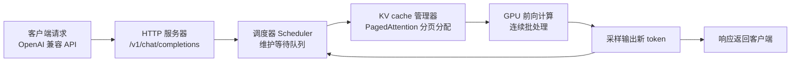
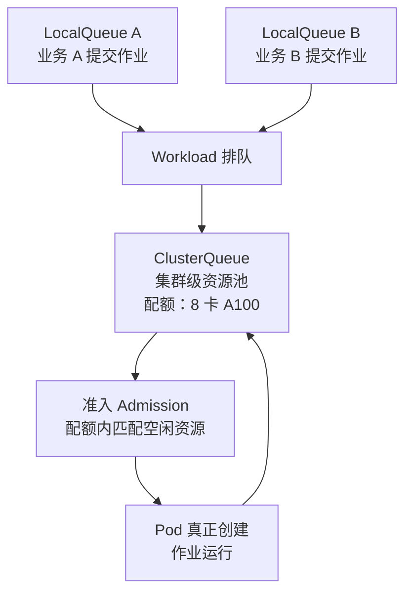

# 3.6 推理服务选型与部署实践认知 [实用]

> 来源：[vLLM](https://docs.vllm.ai/en/latest/) · [SGLang](https://docs.sglang.io/) · [KServe](https://kserve.github.io/website/) · [BentoML](https://docs.bentoml.com/) · [PagedAttention 论文](https://arxiv.org/abs/2309.06180) · 验证环境：待验证

## 概念：为什么需要

模型训练完只是「会了」，要变成业务能力必须「跑起来服务用户」——这一步由推理服务完成。推理引擎（inference engine：把训练好的模型跑起来、对外提供预测服务的软件）直接决定三件事：

- **吞吐**：单位时间能处理多少请求——决定同样一张 GPU 能服务多少用户（[已必备]）
- **延迟**：用户等多久才看到第一个字——决定产品体验（[已必备]）
- **成本**：同样的模型，引擎选错 = GPU 利用率低 + 延迟超标，账单却照付（[已必备]）

场景实例：同一个 7B 模型，用朴素实现（逐请求串行推理）和用 vLLM（连续批处理）跑，吞吐可以差一个数量级——选错引擎不是「慢一点」，是「同样的 GPU 钱只干了一成的活」。

- **从哪来**：推理服务早期是「模型 + Flask 起个 HTTP 服务」；模型变大后显存管理、批处理、并发成为瓶颈，催生了专用推理引擎（vLLM / SGLang）；再往上，K8s 上长出了推理平台（KServe）把部署、伸缩、多模型管理标准化
- **是什么**：本章讲业务团队怎么选引擎、怎么部署、怎么伸缩——不建设推理平台
- **往哪去**：推理服务会像数据库一样成为「平台能力」——业务侧申请、平台侧供给，中间隔着一层统一网关（3.5）

**先分清两个问题**：训练（train：学出模型权重，离线、可重试、以天计）和推理（inference：用权重服务用户，在线、不可重试、以毫秒计）是两个不同的工程问题——训练优化「算得快」，推理优化「响应快 + 成本低」；本章只讲推理。

**引导反思**：选推理引擎是「用 GPU 换体验和成本」的决策——先想清楚吞吐、延迟、成本三个目标，再选引擎，顺序不能反。

## 认知要点（先建立意识）

推理不是「起个服务」那么简单，五个认知先立起来：

- **引擎差异 = 吞吐 vs 延迟的取舍**：vLLM 用 PagedAttention（把 KV cache 分页管理、减少显存碎片的显存管理技术）和连续批处理（请求动态进出批次、不用等整批结束的批处理方式）把 GPU 吃满，追求高吞吐；SGLang 用 RadixAttention（复用公共前缀 KV cache 的缓存技术）优化结构化输出与多模态场景。没有「最好的引擎」，只有「匹配你场景的引擎」
- **OpenAI 兼容 API 是事实标准**：所有主流引擎都暴露 `/v1/chat/completions` 这类与 OpenAI 一致的接口——业务代码用 OpenAI SDK 改个 base_url 就能接，换引擎不换代码
- **部署形态有三档**：Deployment + Service 直部署（简单起步）→ KServe InferenceService（Serverless 伸缩）→ 网关统一入口（3.5）。形态决定运维成本和弹性能力
- **弹性伸缩是刚需**：业务 QPS 有波峰波谷（上班高峰、活动大促），推理服务必须能伸缩——但 GPU 副本伸缩比 CPU 服务难：每副本一张卡、冷启动慢
- **不治理的坑**：GPU 利用率低但账单高（副本常驻、请求稀疏）；并发一上来延迟飙升（KV cache 显存被打满，请求排队）；冷启动慢（模型加载要几十秒到几分钟，缩到零后第一个请求等不起）

**误区清单**（对照自查）：

- ①「模型能跑起来 = 部署完成」——没验证吞吐与延迟就上线，事故在峰值等着
- ②「副本越多越好」——GPU 副本空转是纯成本，先看利用率再谈扩容
- ③「缩到零最省钱」——冷启动的模型加载时间可能让第一个用户直接流失
- ④「引擎越新越好」——新引擎性能好但社区小、坑多，生产环境先看成熟度

**推理成本构成三块**（先看清钱花在哪，再谈优化）：

- 算力：GPU 卡时——由吞吐和利用率决定（3.4 的 GPU 账单）
- 显存：卡型与模型大小决定——量化、上下文长度影响它
- 网络与存储：模型加载、跨节点传输——冷启动慢的根源之一

## 推理引擎对比表

| 引擎 | 一句话定位 | 适用场景 | 难度 |
|---|---|---|---|
| vLLM | 高吞吐推理引擎，PagedAttention + 连续批处理，事实标准 | 单模型 / 多模型起步首选；聊天、批量生成 | 低（官方镜像 + OpenAI 兼容 API 直接起） |
| SGLang | 结构化输出 / 多模态见长的新秀，RadixAttention 前缀缓存 | JSON 输出、function calling、多模态输入 | 中（配置项多，社区小于 vLLM） |
| KServe | K8s 原生推理平台，InferenceService CRD 管部署 + Serverless 伸缩 | 多模型、要金丝雀发布、要按请求伸缩 | 中（要装 CRD / 依赖 Knative，装机是平台的事） |
| BentoML | Python 服务化框架，把模型 + 预处理 + 依赖打包成可部署单元 | 模型要带自定义预处理 / 后处理逻辑，团队是 Python 栈 | 低（本地打包、一键部署） |

选型口诀：**吞吐优先 vLLM，结构化输出 SGLang，多模型上 KServe，带业务逻辑用 BentoML**。

## 部署形态

三档递进，别跳级：

**第 1 档：Deployment + Service 直部署**（验证环境：待验证）——最简单，一个 vLLM 镜像 + GPU 资源申请就起来：

```yaml
# vllm-deployment.yaml —— 单副本 vLLM，申请 1 张 GPU
apiVersion: apps/v1
kind: Deployment
metadata:
  name: vllm-llama3-8b
spec:
  replicas: 1
  selector:
    matchLabels:
      app: vllm-llama3-8b
  template:
    metadata:
      labels:
        app: vllm-llama3-8b
    spec:
      containers:
        - name: vllm
          image: vllm/vllm-openai:latest
          args: ["--model", "meta-llama/Llama-3.1-8B-Instruct", "--max-model-len", "8192"]
          resources:
            limits:
              nvidia.com/gpu: "1"   # GPU 资源申请：Device Plugin 机制，见 3.3
          ports:
            - containerPort: 8000
```

配套一个 Service 暴露 8000 端口，业务代码 OpenAI SDK 指向 `http://vllm-llama3-8b:8000/v1` 即可。GPU 资源申请走 `nvidia.com/gpu`（Device Plugin 机制，K8s 调度 GPU 的标准方式）；若平台用 Kueue 做排队（作业排队 / 配额管理，3.3 大纲），申请 GPU 要走队列而不是直接建 Pod——先问平台。

**第 2 档：KServe InferenceService**（验证环境：待验证）——把「部署 + Service + 伸缩」收进一个 CRD：

```yaml
# inference-service.yaml —— KServe 声明式推理服务
apiVersion: serving.kserve.io/v1beta1
kind: InferenceService
metadata:
  name: llama3-8b
spec:
  predictor:
    model:
      modelFormat:
        name: vllm
      resources:
        limits:
          nvidia.com/gpu: "1"
```

KServe 自动生成 Deployment + Service，自带按请求伸缩（基于 Knative 的并发伸缩，可缩到零）和金丝雀发布（流量按比例切到新版本）。装不装 KServe 是平台的事，业务侧只提交 InferenceService。

**第 3 档：网关统一入口**——多模型并存后，把 3.5 的 LiteLLM / Envoy AI Gateway 架在推理服务前面：业务只认网关端点，模型路由、fallback、key 管控都在网关层。推理服务此时只是网关的一个 provider。

三档对照（验证环境：待验证）：

| 档位 | 形态 | 弹性 | 运维成本 | 适用阶段 |
|---|---|---|---|---|
| 1 | Deployment + Service | HPA / KEDA 手动配 | 低（标准 K8s 知识） | 单模型起步、验证业务 |
| 2 | KServe InferenceService | 按请求自动伸缩、可缩到零 | 中（CRD 由平台提供） | 多模型、QPS 波动大 |
| 3 | 网关统一入口 | 网关层路由 / fallback | 中（网关本身要运维） | 多模型并存、要 key 管控 |

## 动手：最小验证路径（验证环境：待验证）

从零到「业务能调」的五步，全部在 kind / 测试集群上验证（验证环境：待验证）：

**第 1 步：起 vLLM**——用上文第 1 档的 Deployment YAML，等 Pod Running（模型下载 + 加载要几分钟）：

```bash
kubectl apply -f vllm-deployment.yaml
kubectl get pods -w          # 等 Running 且 Ready
kubectl logs deploy/vllm-llama3-8b   # 看到服务启动日志
```

**第 2 步：验证 OpenAI 兼容端点**——先看模型列表，再发一个对话请求：

```bash
# 模型列表（验证环境：待验证）
curl http://<service-ip>:8000/v1/models

# 对话请求（验证环境：待验证）
curl http://<service-ip>:8000/v1/chat/completions \
  -H "Content-Type: application/json" \
  -d '{"model": "meta-llama/Llama-3.1-8B-Instruct", "messages": [{"role": "user", "content": "你好"}]}'
```

**第 3 步：看 GPU 利用率**——用 3.4 的 DCGM 指标确认卡真的在算：

```promql
# 该 Pod 所在节点的 GPU 利用率（验证环境：待验证）
DCGM_FI_DEV_GPU_UTIL
```

**第 4 步：并发压测**——用并发工具（hey / wrk / 自写脚本，工具与参数待验证）打请求，观察 TTFT / TPOT 与显存占用，找到延迟拐点——并发从 1 加到 N，延迟开始陡增的点就是该配置的并发上限。

**第 5 步：验证伸缩**——手动扩副本看是否正常调度（每副本一张卡），再决定上 HPA / KEDA / KServe：

```bash
kubectl scale deploy/vllm-llama3-8b --replicas=2   # 需要集群有 2 张空闲卡
```

**第 6 步：接网关统一入口**——把 3.5 的 LiteLLM 配置指向 vLLM 端点，业务代码改指向网关（验证环境：待验证）：

```yaml
# config.yaml 片段：vLLM 作为 provider
model_list:
  - model_name: llama3-8b
    litellm_params:
      model: openai/meta-llama/Llama-3.1-8B-Instruct
      api_base: http://vllm-llama3-8b:8000
```

业务代码 base_url 指向网关、模型名不变——验证「换后端不换代码」。

## 弹性伸缩实践

QPS 波动是常态（上班高峰、活动大促、夜间低谷），伸缩策略三选一：

- **HPA 按指标伸缩**（K8s 内置水平自动伸缩，按 CPU / 内存 / 自定义指标调副本数）：最通用，但 GPU 推理场景 CPU 指标不敏感——GPU 利用率不体现在 CPU 上，请求排队也不体现在 CPU 上，容易「指标没动、延迟已爆」
- **KEDA 按自定义指标伸缩**（事件驱动扩缩容组件，按队列长度 / 请求数等自定义指标伸缩）：按「排队请求数」这类业务指标伸缩，比 CPU 指标贴合推理场景；推理不要只 HPA CPU（检索手册 §4 明确提示）
- **KServe 按请求伸缩**：InferenceService 自带按并发请求数伸缩（Knative 驱动），请求多了加副本、闲了减副本、可缩到零——最省心，但缩到零有冷启动代价

三种策略对照（验证环境：待验证）：

| 策略 | 指标来源 | 伸缩粒度 | 冷启动 | 适用场景 |
|---|---|---|---|---|
| HPA | CPU / 内存 / 自定义指标 | 分钟级 | 无（不缩到零） | CPU 服务；GPU 场景需配自定义指标 |
| KEDA | 队列长度 / 请求数等事件指标 | 秒级 | 无（不缩到零） | 推理按请求数伸缩；批处理队列 |
| KServe | 并发请求数（Knative） | 秒级 | 有（可缩到零） | 多模型、QPS 波动大、SLO 容忍冷启动 |

**伸缩策略设计四步**：

1. 定 SLO：TTFT / TPOT 容忍上限——先有数字才能谈伸缩
2. 找指标：请求数 / 队列长度——不是 CPU
3. 定上下限：最小常驻副本（保冷启动）与最大副本（对齐 GPU 配额）
4. 验证：压测 + 3.4 利用率看板对照，调阈值

**GPU 利用率与副本数的权衡**：GPU 贵，别空转——副本数宁少勿多，用伸缩兜底；但缩到零要算冷启动账（模型加载几十秒到几分钟，第一个请求等不起），业务 SLO 不允许就保一个常驻副本。与 3.4 呼应：用 GPU 利用率指标验证伸缩策略是否真的把卡用满了。

## 官方文档引述：关键机制

三个机制是本章部署与伸缩的地基，直接引述官方文档要点（验证环境：待验证）：

**1. K8s GPU 调度机制（Device Plugin）**

> 来源：[Kubernetes 官方文档：调度 GPU](https://kubernetes.io/docs/tasks/manage-gpus/scheduling-gpus/) · 验证环境：待验证

- 机制要点：GPU 不是 K8s 内置资源，由 Device Plugin（设备插件：节点上把硬件资源上报给 kubelet 的组件）以扩展资源（extended resource：K8s 里 CPU / 内存之外的资源类型）形式上报 `nvidia.com/gpu`；调度器按节点剩余可分配量调度；Pod 用 `resources.limits` 申请
- 两个硬约束：扩展资源只能整数申请（不能申请 0.5 张卡）；requests 必须等于 limits（不能超卖）
- 业务含义：申请 GPU 就是「要一张卡」，调度器保证节点有空闲卡才调度；卡型差异（A100 / L40S）靠节点标签区分——问平台要标签规范，别自己猜

**2. HPA 伸缩机制**

> 来源：[Kubernetes 官方文档：Horizontal Pod Autoscaling](https://kubernetes.io/docs/tasks/run-application/horizontal-pod-autoscale/) · 验证环境：待验证

- 机制要点：HPA 周期性读取 Metrics API 的指标值，按公式 `desiredReplicas = ceil(currentReplicas × currentMetricValue / targetMetricValue)` 计算期望副本数；支持 CPU / 内存 / 自定义指标；有冷却窗口（cooldown：指标变化后等待一段时间再伸缩，防止抖动）
- 业务含义：CPU 指标对 GPU 推理不敏感（GPU 利用率不体现在 CPU 上），要用自定义指标（请求数 / 队列长度）——KEDA 就是封装这套机制的组件

**3. Kueue 两级队列**

> 来源：[Kueue 官方文档](https://kueue.sigs.k8s.io/) · 验证环境：待验证

- 机制要点：Kueue 用 ClusterQueue（集群级资源池：定义配额与资源 flavor）和 LocalQueue（命名空间级入口：业务提交作业的地方）两级队列管理作业排队；作业被包装成 Workload，准入（admission：Kueue 批准作业开始执行的时刻）后才真正创建 Pod；支持优先级与抢占
- 业务含义：平台开了 Kueue 后，申请 GPU 不是直接 `kubectl apply` Deployment，而是提交到 LocalQueue 排队——先问平台队列名与配额（3.3 大纲）

## 明星项目架构：vLLM 与 Kueue

**vLLM：PagedAttention + 连续批处理的数据流**（验证环境：待验证）



- 请求进来 → tokenize → 调度器把可执行的序列（有显存页可用的）组成批次 → GPU 前向计算 → 输出 token；完成的序列出批次、新请求进批次——**连续批处理**（不用等整批结束，GPU 每步都在算有用的 token）
- **PagedAttention**：KV cache 按固定大小的「页」分配，像操作系统虚拟内存分页——显存碎片大幅减少；论文数据：KV cache 显存碎片化浪费 60-80% 显存（出处：[arXiv 2309.06180](https://arxiv.org/abs/2309.06180)）
- 业务含义：vLLM 吞吐高的原因不是「代码快」，是「显存管理好 + 批处理不停顿」——这也是为什么并发场景 KV cache 显存是第一个瓶颈

**为什么连续批处理重要**：朴素实现是「一批请求一起算，最慢的算完才放下一批」——GPU 在等最慢的请求时是空闲的；连续批处理让每个计算步都塞满可执行的序列，GPU 空闲时间趋近于零。批处理大小、KV cache 页数、并发上限三者共同决定吞吐——这也是「并发一上来延迟飙升」的机制解释：页不够了，新请求只能排队。

**Kueue：两级队列的作业流转**（验证环境：待验证）



- 业务提交作业到自己的 LocalQueue → Kueue 包装成 Workload 排队 → 在 ClusterQueue 配额内匹配空闲资源 → 准入后 Pod 才创建 → 作业结束资源释放回池
- 两级的意义：配额在集群级（ClusterQueue）统一管，入口在命名空间级（LocalQueue）分业务管——业务只看得见自己的队列，配额打架由平台在集群级裁决
- 业务含义：Kueue 是「GPU 排队」的标准答案（SIG 官方项目，检索手册 §4 学习性价比最高）——平台开了它，你的 Deployment 可能不会立即创建，先排队

**引述小结**：三个机制串起来就是推理部署的完整链路——Device Plugin 决定「卡怎么给」（资源层）、Kueue 决定「卡怎么排队」（调度层）、HPA / KEDA 决定「副本怎么变」（伸缩层）；业务团队在每一层都只做「申请 / 配置」，实现都在平台。

## 和 AI 沟通的提问要点

向 AI / 平台 / 供应商问推理方案时，一次说清五件事，对方才能给可执行的答案：

1. **模型大小与量化**：模型名 + 参数量 + 精度（FP16 / INT8 / INT4）。量化（把模型权重从高精度压到低精度以省显存的技术）直接决定显存需求：7B 模型 FP16 权重约 14GB（每参数 2 字节），量化后减半再减半
2. **QPS 预期与峰值**：日常 QPS + 峰值 QPS + 峰值持续时间——决定副本数和伸缩策略
3. **延迟要求（SLO）**：首 token 延迟（TTFT，用户看到第一个字的时间）和每 token 速度（TPOT，每秒输出多少字）的容忍上限——决定引擎和批处理配置
4. **GPU 卡型与数量**：卡型（显存大小决定能装多大模型）和可用卡数（决定并发上限）——先问平台有什么卡，再选模型
5. **并发模式**：聊天（交互式，延迟敏感）还是批处理（离线生成，吞吐优先）——同一模型两种模式配置完全不同

**可直接复制的提问模板**（问 AI / 平台时套用，数字按业务实际填）：

```
我们计划自建推理服务，请给方案：
- 模型：Qwen2.5-7B-Instruct，FP16（可接受 INT8 量化）
- QPS：日常 50，峰值 200（持续 1 小时）
- 延迟：TTFT < 2s，TPOT 不低于 30 token/s（数字待验证）
- GPU：平台提供 A100 40G，可用 4 张
- 并发模式：聊天为主，少量批处理
请给出：引擎选型、副本数、显存估算、伸缩策略、风险点。
```

## 选型 / 技术路线建议

- **单模型起步：vLLM 直部署**——一个 Deployment + Service 跑通，OpenAI 兼容 API 接业务，最快见效果
- **多模型 / 要 Serverless：上 KServe**——InferenceService 管部署和伸缩，多模型各自独立伸缩
- **统一入口：接 3.5 网关**——模型路由、key 管控、fallback 收口到网关，业务代码只认一个端点
- **先看 GPU 预算再选引擎**：预算紧 → 吞吐优先 vLLM（同样的卡服务更多人）；要结构化输出（JSON / function calling 多）→ SGLang；带自定义业务逻辑 → BentoML

场景 → 推荐组合对照（验证环境：待验证）：

| 业务场景 | 推荐组合 | 理由 |
|---|---|---|
| 单模型、验证期 | vLLM + Deployment | 最快跑通，标准 K8s 知识即可 |
| 多模型、QPS 波动大 | KServe InferenceService | 按请求伸缩、金丝雀发布 |
| 多模型 + 要 key 管控 | KServe + 3.5 网关 | 路由与管控收口到网关 |
| 模型带自定义预处理 | BentoML | Python 服务化，业务逻辑内聚 |
| 结构化输出为主 | SGLang | JSON / function calling 优化 |

## 业界前沿（前沿，待验证）

推理服务正在从「自建引擎」走向「平台能力 + 标准接口」，四个方向值得盯（均标注「前沿，待验证」，以官方文档当日内容为准）：

- **Inference Extension（Gateway API 模型路由标准）**：https://gateway-api-inference-extension.sigs.k8s.io/ —— 在网关层按模型路由流量的标准扩展：InferencePool 声明后端模型池，网关按模型名 / 负载路由；EPP（EndpointPicker：路由决策实现）是平台的事。与 3.5 网关衔接的演进方向 [前沿，待验证]
- **In-Place Pod Resize（K8s 1.35 GA）**：Pod 资源原地调整不重启——推理服务调资源不用滚动重启；GPU 扩展资源是否支持原地调整待验证 [前沿，待验证]
- **DRA（Dynamic Resource Allocation，K8s 1.35 GA）**：GPU 管理演进方向，比 Device Plugin 更灵活的分配模型（结构化参数、共享、配额感知）——平台侧演进，业务侧观察 [前沿，待验证]
- **llm-d（CNCF 沙箱）**：P/D 分离（prefill 与 decode 分阶段部署在不同实例）与前缀缓存路由——用它理解「平台可能怎么做」[前沿，待验证]
- **KAITO**：声明式「跑某个模型」——填模型 ID 与 GPU 规格，对应申请单而不是装 GPU [前沿，待验证]
- **disaggregated inference（NVIDIA Dynamo）**：prefill / decode 分离部署、各自独立伸缩——推理架构演进方向 [前沿，待验证]

趋势判断：路由标准（Inference Extension）、资源标准（DRA）、接入标准（OpenAI 兼容 API + 网关）正在成型——业务团队盯标准接口，不盯实现；选型时优先选「接口标准、实现可换」的组件。

**对业务团队的行动建议**：前沿方向不用追实现，追接口——Inference Extension 的 InferencePool、DRA 的资源语义、网关的 OpenAI 兼容端点，都是「平台提供、业务消费」的接口；每季度用检索手册 §8 的 KubeWeekly 扫一遍动态即可。

## 实用技巧

- 显存估算先于部署：权重（每参数 2 字节 × 参数量）+ KV cache（随并发和上下文长度增长）+ 激活——估算公式待验证，以引擎文档为准
- 显存不够先量化：AWQ / GPTQ / FP8 是主流量化方案（具体支持以引擎文档为准），量化后显存减半，吞吐可能反而提升
- 冷启动治理：模型加载慢 → 用 readiness 探针（就绪探针，Pod 真正能接流量才进 Service 端点）挡住流量；SLO 敏感就保常驻副本
- 多副本注意 GPU 配额：每副本一张卡，副本数 × 卡数 = 总 GPU 占用——伸缩上限要和平台配额对齐
- 与 3.4 联动：GPU 利用率指标是伸缩策略的体检报告——利用率长期 < 30% 说明副本多了，长期 100% 说明要加副本
- 与 3.5 联动：推理服务接网关后，模型切换只改网关配置，业务代码零改动
- 对外模型名用 `--served-model-name` 固定：业务代码写死的模型名不要随镜像版本漂移
- 压测先于上线：用简单并发脚本打一打，看 TTFT / TPOT 与显存占用，再定并发上限（压测工具与具体数字待验证）
- 引擎版本钉住：推理引擎升级频繁，镜像 tag 用具体版本不用 latest，升级走灰度
- 日志与指标分开看：引擎日志看启动与报错，运行状态看指标——vLLM 的 /metrics 端点暴露吞吐与排队指标（端点与字段名待验证）
- 多模型共卡先问平台：一张卡跑多个小模型（显存切分 / 共享）是平台能力（HAMi 等），业务侧别自己折腾

## 考察问题

- 为什么「并发一上来延迟飙升」是推理服务的典型事故？（线索：KV cache 显存是共享瓶颈；批处理大小；请求排队；max-model-len 与并发的乘积关系）
- HPA 按 CPU 伸缩对 GPU 推理为什么不好使？（线索：GPU 利用率不体现在 CPU 指标；请求排队不产生 CPU 负载；要按请求数 / 队列长度伸缩）
- 缩到零的代价是什么？什么业务不能缩到零？（线索：模型加载时间；冷启动；SLO 与首请求延迟）
- 同一个模型，聊天场景和批处理场景的引擎配置差在哪？（线索：延迟 vs 吞吐；批处理大小；并发上限）
- 为什么「先看 GPU 预算再选引擎」而不是「先选引擎再看预算」？（线索：卡型决定显存上限，显存决定模型与并发上限——引擎是显存约束下的优化）
- KServe 的 InferenceService 和 Deployment 的本质区别是什么？（线索：CRD 把部署 + Service + 伸缩 + 发布收进一个声明；控制器替你生成底层资源）
- 为什么推理服务要「先压测再定并发上限」而不是拍脑袋定？（线索：延迟拐点由显存页数 / 批处理大小决定，只有实测才知道拐点在哪）

## 经验之谈

- 观点（不署名）：「先跑通一个模型，再谈平台」——单模型直部署起步，跑通业务闭环后再上 KServe / 网关，别一上来搭平台（社区通行经验，具体引用待补）
- 观点（不署名）：「GPU 空转比延迟高更贵」——副本宁少勿多，用伸缩兜底；利用率长期低于 30% 的副本是纯成本（社区通行经验，具体引用待补）

## 权威观点

- **Kwon et al.（PagedAttention 论文作者，检索手册 §10 收录）**：论文指出 KV cache 显存碎片化导致 60-80% 显存被浪费，PagedAttention 用分页管理解决——「显存是推理吞吐的第一瓶颈，管理好显存就是管理好吞吐」（出处：[arXiv 2309.06180](https://arxiv.org/abs/2309.06180)，论文摘要与正文）
- 观点（不署名）：推理优化的第一课是「让 GPU 每步都算有用的 token」——批处理、显存管理、前缀缓存都是围绕这一点（社区通行经验，具体引用待补）
- 观点（不署名）：自建推理的隐性成本是「运维注意力」——引擎升级、显存调优、伸缩策略都是持续投入，预算里要算这笔账（社区通行经验，具体引用待补）

## 架构师视角

- 解决什么问题：模型怎么跑起来、怎么选引擎、怎么伸缩——把「推理」从工程问题变成可决策的选型问题
- 何时用：任何要自建推理服务的团队；多模型并存、QPS 波动、成本敏感时尤其要早想
- 何时不用：调用厂商 API 就够（3.5 网关直连）——自建推理是「有 GPU 预算 + 有自建理由」之后的事
- 权衡：自建（可控、成本可优化）vs 厂商 API（省心、按量付费）；引擎性能 vs 生态成熟度；弹性 vs 冷启动
- 固定三问：
  - 平台提供了什么能力边界？——平台是否已提供推理平台（KServe / KAITO 等）或 GPU 队列（Kueue），还是需要业务侧自建
  - 业务接入点在哪？——OpenAI 兼容端点 URL + 模型名；业务代码只改 base_url
  - 需要和基础设施团队对齐什么？——GPU 配额与队列、卡型、镜像仓库、冷启动容忍度、伸缩上限

## 核心收获表

| 能力维度 | 具体收获 |
|---|---|
| 引擎选型 | 能按吞吐 / 延迟 / 结构化输出需求选 vLLM / SGLang / BentoML |
| 部署形态 | 能从 Deployment 直部署演进到 KServe InferenceService，知道每档的代价 |
| 弹性伸缩 | 能按 QPS 波动设计伸缩策略（HPA / KEDA / KServe），避免 GPU 空转 |
| 需求沟通 | 能向平台 / 供应商一次说清模型、QPS、延迟、卡型、并发模式五件事 |
| 前沿跟踪 | 知道 Inference Extension / DRA / llm-d 在解决什么问题，能向平台提「我们要 InferencePool / Kueue 队列」 |
| 成本联动 | 与 3.4 GPU 利用率、3.5 网关 token 成本合并成完整 AI 成本视图 |

## 推荐开源项目表

| 项目 | 链接 | 研读重点 |
|---|---|---|
| vLLM | https://docs.vllm.ai/en/latest/ | PagedAttention、连续批处理、OpenAI 兼容 API |
| SGLang | https://docs.sglang.io/ | 结构化输出、RadixAttention 前缀缓存 [进阶] |
| KServe | https://kserve.github.io/website/ | InferenceService、Serverless 伸缩、金丝雀 |
| BentoML | https://docs.bentoml.com/ | 模型打包、Python 服务化 |
| KEDA | https://keda.sh/docs/ | 按自定义指标扩缩容 [进阶] |
| PagedAttention 论文 | https://arxiv.org/abs/2309.06180 | 推理引擎核心论文：为什么 vLLM 快 |
| KAITO | https://kaito-project.github.io/kaito/docs/ | 声明式「跑某个模型」[前沿，待验证] |
| llm-d | https://github.com/llm-d/llm-d | P/D 分离、前缀缓存路由 [前沿，待验证] |

## 常见问题排查

| 高频报错 / 现象 | 排查路径 |
|---|---|
| 显存不足（OOM） | 模型太大或并发太高 → 换量化、调小 max-model-len、降并发上限；先算显存账再起服务 |
| 并发一上来延迟飙升 | KV cache 显存被打满 → 看 GPU 显存占用与请求排队；调批处理大小 / 并发上限；加副本 |
| 冷启动慢，第一个请求超时 | 模型加载中 → readiness 探针挡住流量；SLO 敏感保常驻副本；预热脚本 |
| GPU 利用率低但账单高 | 请求稀疏 / 副本过多 → 缩副本、上 KServe 按请求伸缩、与 3.4 看板对照 |
| 请求 404 / 模型名报错 | OpenAI 兼容端点路径（/v1/chat/completions）与模型名注册——vLLM 用 --served-model-name 指定对外模型名 |
| 申请 GPU 被拒 / 排队 | 平台用 Kueue 排队 → 走队列申请，问平台配额与优先级（3.3 大纲） |
| 副本扩不上去 | GPU 配额不够 / 节点无空闲卡 → 查平台配额与节点 GPU 余量；Kueue 排队则看队列状态 |
| 模型加载失败 | 镜像内无模型 / 网络拉取失败 → 确认模型路径与镜像内容；离线环境用预下载模型目录 |
| 网关转发后延迟变高 | 网关一跳 + 推理排队叠加 → 先看推理侧指标（排队 / 显存），再看网关配置（重试 / fallback 路径） |