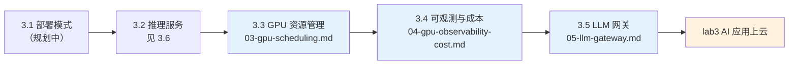

# Part 3 AI 应用上云

> 视角：业务团队如何使用 AI 基础设施（申请 GPU、部署推理、接入服务），不建设 GPU 平台。

## 一句话说明
把 LLM 应用可靠、可控、可算账地跑在 K8s 上：部署推理服务、申请 GPU、看清成本、管住 key。

> 💡 用 AI 学本章：考察问题抛给 AI 当讨论伙伴；动手报错让 AI 解释 + 给排查路径；让 AI 生成练习变体检验是否真懂。完整 AI 学习指南见根 README。

## 快速导航表
| 文档 | 说明 |
|---|---|
| [03-gpu-scheduling.md](03-gpu-scheduling.md) | 📖 详解 · **3.3 实用**：GPU 资源申请与调度认知 |
| [04-gpu-observability-cost.md](04-gpu-observability-cost.md) | 📖 详解 · **3.4 增强**：GPU 指标接入与成本分摊 |
| [05-llm-gateway.md](05-llm-gateway.md) | 📖 详解 · 3.5 LLM 网关与成本治理 |
| [06-inference-serving.md](06-inference-serving.md) | 📖 详解 · 3.6 推理服务选型与部署实践认知（对应大纲 3.2） |
| 3.1 部署模式 | 规划中（待写） |

## 核心特性块
- ✅ 把 GPU 指标接进 Prometheus，按 namespace / Pod 维度看利用率
- ✅ 用 showback 思路产出月度「AI 账单」（GPU 利用率 × 卡单价）
- ✅ 用 LLM 网关统一 key 管控、预算限流、provider fallback
- ✅ 按 OTel GenAI 语义约定打点，token 成本按团队 / feature 分摊
- ✅ 知道哪些事找平台（装机 / 指标保留），哪些事自己做（看板 / 分摊）

## 前置知识表
| 知识点 | 来源章节 | 在本章的应用 |
|---|---|---|
| Prometheus 指标与 Grafana 看板 | Part 1.8 可观测性基础 | GPU 指标接入与看板 |
| Deployment / DaemonSet / Service | Part 1.2 核心概念 | 部署 dcgm-exporter 与网关 |
| LLM 应用架构模式（RAG / Agent） | Part 2.1 | 理解 token 成本从哪来 |
| OpenAI 兼容 API | Part 2.2 / 3.6 | 网关统一端点，业务代码零改动 |

## 学习路线图

## 业务场景映射表
| 业务痛点/场景 | 本章技术方案 | 标注 |
|---|---|---|
| GPU 利用率低但账单高 | 3.4 GPU 指标接入 + showback 分摊 | [已必备] |
| token 成本失控，月底账单吓人 | 3.5 网关预算限流 + 按团队 / feature 分摊 | [已必备] |
| 被单一模型厂商绑定（涨价 / 断供被动） | 3.5 provider fallback，换模型只改配置 | [已必备] |
| 多模型并存，统一管控成为刚需 | 3.5 虚拟 key 池 + 统一端点 | [潜在] |