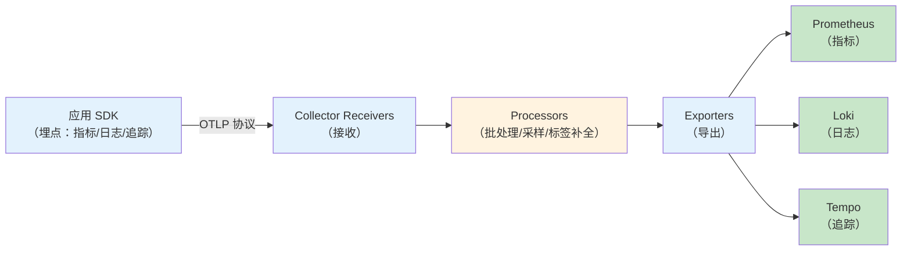
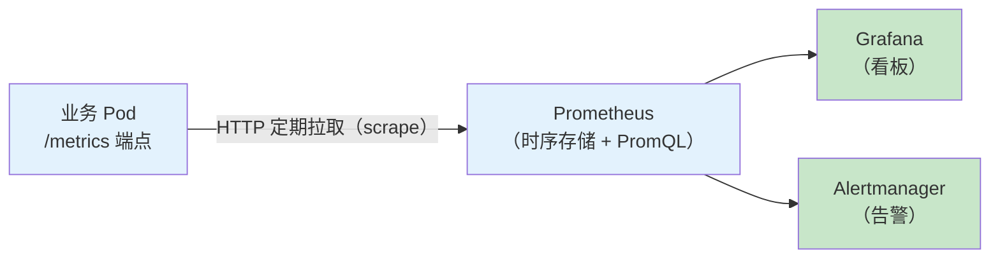

# 4.2 增强：可观测性接入实践认知 [进阶]

> 来源：[OpenTelemetry](https://opentelemetry.io/) · [Prometheus](https://prometheus.io/) · [Grafana](https://grafana.com/) · [Google SRE Book](https://sre.google/books/) · 验证环境：待验证

## 概念：为什么需要

**业务痛点**：没有可观测性 = 事故排查靠猜 [已必备]。场景实例：线上报障「下单变慢」，没有指标、没有追踪，只能靠日志翻找 + 人肉猜测，一次排查几小时起步；更常见的是「监控一切正常」但用户投诉不断——因为监控的是平台视角（CPU/内存），不是业务视角（下单成功率、支付延迟）。

- **从哪来**：早期靠「登录服务器看日志」；有了 K8s 后 Pod 随时重建，人肉排查失效，催生「三支柱」体系（指标 / 日志 / 追踪）；OpenTelemetry（OTel，CNCF 毕业项目，把埋点、采集、传输做成统一标准的开源项目）把三支柱统一成一套标准
- **是什么**：可观测性（observability，通过外部输出推断系统内部状态的能力）不是一套工具，而是一种分工——**平台方提供可观测能力（采集、存储、看板、告警），业务方负责「接入」（埋点）和「读」（解读指标、定位问题）**。本手册定位「使用者」，只讲业务侧怎么接、怎么读
- **往哪去**：从「三支柱各自为政」走向「统一标准 + 关联分析」（指标异常 → 日志看细节 → 追踪看链路），AI 应用再叠加 GenAI 语义约定（见下文），最终与 SLO 体系打通（呼应 6.2）

**引导反思**：可观测性不是「装个监控平台」就有的——平台是管道，埋点是业务的责任；不埋点的接入等于没接。

## 认知要点：三支柱与 RED/USE

**三支柱**（先建立意识，再谈接入）：

| 支柱 | 回答什么问题 | 载体 | 典型工具 |
|---|---|---|---|
| 指标（metrics，数值型度量） | 系统「怎么了」——总量、趋势、异常 | Prometheus 数值 + 标签 | Prometheus / Grafana |
| 日志（logs，事件记录） | 具体「发生了什么」——细节、上下文 | 结构化文本（推荐 JSON） | Loki / ELK |
| 追踪（traces，一次请求跨服务的调用链） | 「为什么」——请求经过了哪些服务、慢在哪一段 | OTel span（追踪中的一段，记录一次调用） | Tempo / Jaeger |

**RED / USE 方法论**（业界通行的指标设计方法，不是工具，是「埋什么」的清单）：

- **RED**（服务视角，业务排障用）：Rate 请求率（QPS）、Errors 错误率、Duration 耗时（延迟）——业务服务的黄金三件套
- **USE**（资源视角，容量规划用）：Utilization 利用率、Saturation 饱和度（排队/等待程度）、Errors 错误——看 CPU/内存/连接池等资源

**RED 三件套具体埋什么**（示例，验证环境：待验证）：

| RED 元素 | 埋什么 | 示例指标 |
|---|---|---|
| Rate 请求率 | 请求总数（Counter） | `http_requests_total` |
| Errors 错误率 | 按状态码分类的请求数 | `http_requests_total{status="5xx"}` |
| Duration 耗时 | 延迟直方图 | `http_request_duration_seconds`（P50 / P95 / P99） |

**三支柱各自的局限**（为什么必须组合）：

- 指标看不到细节：知道「错误率升高」，不知道「哪个订单、什么参数」
- 日志没有结构：知道「发生了什么」，难以回答「总量多少、趋势如何」
- 追踪有成本：全量采样存储扛不住，只能采样——细节与成本的权衡

**不治理的坑**（先知道坑在哪，接入时才不会踩）：

1. **只接平台不埋点**：平台采集的是资源指标（CPU/内存），业务指标（下单成功率、支付延迟）必须业务代码埋——不埋点，看板再漂亮也看不到业务
2. **日志非结构化**：纯文本日志没法按字段过滤、没法聚合统计、没法自动关联——「没法查」不是工具问题，是格式问题
3. **没有 SLO 联动**：指标都埋了、看板都有了，但没有目标——「指标好看」和「系统可靠」是两回事，指标要服务于 SLO（呼应 6.2）

## 官方文档引述：关键机制

接入前先读三处官方文档，把机制搞对，避免「照着博客抄、抄错不自知」：

**1. Prometheus 指标类型**（[官方文档：Metric types](https://prometheus.io/docs/concepts/metric_types/) · 验证环境：待验证）

- **counter**（计数器）：只增不减的累计值——请求总数、错误总数；命名约定以 `_total` 结尾
- **gauge**（仪表）：可增可减的当前值——当前连接数、队列长度、内存占用
- **histogram**（直方图）：分桶计数，记录值的分布——延迟、响应体大小；自动派生 `_bucket` / `_sum` / `_count` 三个序列，可算分位数（P99）
- 要点：类型选错，查询语义就错——用 gauge 数请求数，重启清零后趋势就断了；counter 的语义是「从进程启动以来的累计值」，查询时用 `rate()` 看速率

**2. OTel 追踪模型**（[官方文档：Traces](https://opentelemetry.io/docs/concepts/signals/traces/) · 验证环境：待验证）

- **span**（追踪中的一段）：一次命名操作，带开始/结束时间、属性（attribute）、状态——「支付调用」「LLM 调用」各是一个 span
- **trace**：span 组成的有向无环图（DAG），描述一次请求的完整路径
- **context propagation**（上下文传播）：跨服务通过 W3C traceparent 头传递追踪上下文，把各服务的 span 串成一条 trace
- 要点：不传播 context，链路就断——「只有入口 span、看不到下游」的根因几乎都是没透传 traceparent 头

**3. OTel Collector pipeline**（[官方文档：Collector](https://opentelemetry.io/docs/collector/) · 验证环境：待验证）

- 数据流固定三段：**receivers**（接收）→ **processors**（处理）→ **exporters**（导出）
- 要点：采样、标签补全、批处理都在 Collector 做，业务 SDK 保持轻量——业务侧只负责「产生数据」，加工是平台的事（呼应「使用者」定位）

## 接入姿势：指标 / 日志 / 追踪

**第 1 步：指标——Prometheus 客户端埋点 + ServiceMonitor 抓取**（ServiceMonitor：Prometheus Operator 里声明「采集哪些指标」的 CRD，3.4 已演示同一模式）

业务代码埋 RED 三件套（Python 示例，验证环境：待验证）：

```python
from prometheus_client import Counter, Histogram, start_http_server

# RED 三件套：请求率（Counter）、错误率（Counter 带 status 标签）、耗时（Histogram 直方图）
REQUESTS = Counter("http_requests_total", "HTTP 请求总数", ["method", "status"])
LATENCY = Histogram(
    "http_request_duration_seconds", "HTTP 请求耗时（秒）",
    buckets=[0.05, 0.1, 0.25, 0.5, 1, 2.5, 5],  # 直方图分桶：覆盖预期延迟范围
)

start_http_server(8000)  # 暴露 /metrics 端点，供 Prometheus 抓取
```

声明采集目标（验证环境：待验证）：

```yaml
apiVersion: monitoring.coreos.com/v1
kind: ServiceMonitor
metadata:
  name: order-service
  namespace: order
spec:
  selector:
    matchLabels:
      app: order-service
  endpoints:
    - port: metrics
```

注意：`port: metrics` 是**端口名**，不是端口号——Service 的 ports 里必须有一个叫 `metrics` 的端口（指向 Pod 的 8000），否则 ServiceMonitor 匹配不到（验证环境：待验证）：

```yaml
apiVersion: v1
kind: Service
metadata:
  name: order-service
  labels:
    app: order-service
spec:
  selector:
    app: order-service
  ports:
    - name: metrics      # 与 ServiceMonitor 的 port 对应
      port: 8000
      targetPort: 8000
```

**第 2 步：日志——结构化输出（JSON）+ 采集（平台侧）**。业务只做一件事：日志写成 JSON 并带上 trace_id（追踪 ID，用于和追踪关联）；采集、存储、检索是平台的事。

```json
{"ts":"2026-08-28T10:00:00+08:00","level":"error","logger":"order-service","msg":"支付超时","order_id":"20260828001","trace_id":"4bf92f3577b34da6a3ce929d0e0e4736"}
```

Python 侧用 JSON formatter 输出（示例，验证环境：待验证）：

```python
import json, logging

class JsonFormatter(logging.Formatter):
    def format(self, record):
        return json.dumps({
            "ts": self.formatTime(record, "%Y-%m-%dT%H:%M:%S%z"),
            "level": record.levelname.lower(),
            "logger": record.name,
            "msg": record.getMessage(),
            **getattr(record, "extra_fields", {}),  # 业务字段：order_id、trace_id 等
        }, ensure_ascii=False)

handler = logging.StreamHandler()  # 输出到 stdout，由平台采集
handler.setFormatter(JsonFormatter())
logging.getLogger().addHandler(handler)
```

要点：日志写 **stdout**（标准输出）而不是文件——K8s 里容器日志由平台从 stdout 采集，写文件反而采不到（12-Factor 的日志约定，检索手册 §2）。

**第 3 步：追踪——OTel SDK 埋点 + 采样策略**。给关键链路（下单、支付、LLM 调用）加 span，跨服务调用要透传 W3C traceparent 头（W3C 标准的追踪上下文传递头），否则链路会断。

```python
from opentelemetry import trace

tracer = trace.get_tracer("order-service")
with tracer.start_as_current_span("llm_completion") as span:
    span.set_attribute("gen_ai.request.model", "qwen-plus")
    # ... 调用模型 ...
    span.set_attribute("gen_ai.usage.input_tokens", 128)
    span.set_attribute("gen_ai.usage.output_tokens", 64)
```

SDK 初始化（Python 示例，验证环境：待验证）——把 span 批量发给 Collector：

```python
from opentelemetry import trace
from opentelemetry.sdk.trace import TracerProvider
from opentelemetry.sdk.trace.export import BatchSpanProcessor
from opentelemetry.exporter.otlp.proto.grpc.trace_exporter import OTLPSpanExporter

provider = TracerProvider()
provider.add_span_processor(BatchSpanProcessor(OTLPSpanExporter(endpoint="http://otel-collector:4317")))
trace.set_tracer_provider(provider)
```

**采样策略**（sampling，只记录部分请求以控制存储成本）：高流量服务先按比例采样（如 10%）起步；错误链路要全采——头部采样（SDK 端按比例决定记不记）做不到「错误必采」，要靠尾部采样（Collector 端按规则决定留不留，如错误 span 全留）。采样策略与平台对齐，别自己拍板。

尾部采样在 Collector 侧配置（示例，验证环境：待验证）：

```yaml
processors:
  tail_sampling:
    decision_wait: 10s          # 等待窗口：攒够一段再决定
    policies:
      - name: errors-always-sample
        type: status_code
        status_code:
          status_codes: [ERROR]   # 错误 span 全留
      - name: random-10pct
        type: probabilistic
        probabilistic:
          sampling_percentage: 10  # 其余按 10% 采样
```

## 明星项目架构：OTel Collector 与 Prometheus 的数据流

接入前先看懂两个核心机制的内部数据流，埋点才不会埋错位置。

**OTel Collector pipeline**（验证环境：待验证）——业务 SDK 产生的数据，经 Collector 加工后分发到各后端：



读图要点：业务侧只碰最左的 SDK（埋点），中间三段全是平台的事；「三支柱进一个管道、按类型分流到三个后端」就是 LGTM 栈（Loki 日志 / Grafana 看板 / Tempo 追踪 / Mimir 指标）的形态。

**Prometheus 拉取模型**（验证环境：待验证）——Prometheus 是「拉」不是「推」：



读图要点：ServiceMonitor 声明「拉谁」，Prometheus 按声明定期抓取——业务侧要保证 `/metrics` 端点可访问、指标名与标签符合平台规范；「拉」的语义是采集不依赖业务主动上报，业务挂了 Prometheus 立刻知道（target down）。

## AI 应用可观测的特殊性

AI 应用在传统三支柱之上多了一层：**模型调用**。行业标准是 OTel 的 GenAI 语义约定（semantic conventions，字段命名规范）——`gen_ai.*` 字段（如 `gen_ai.request.model` 模型名、`gen_ai.operation.name` 操作名、`gen_ai.usage.input_tokens` / `gen_ai.usage.output_tokens` 输入/输出 token 数）。注意：该规范状态多为 Development（开发中），引用时写 status，字段名以规范当前版本为准（来源：[semantic-conventions-genai](https://github.com/open-telemetry/semantic-conventions-genai)）。

三个业务价值点：

- **token 计量**：`gen_ai.usage.*` 是成本核算的原料——与 3.5 网关层的 token 打点合并，才是完整的「AI 账单」（呼应 3.4 成本分摊）
- **模型调用链**：LLM 调用作为 span 嵌入业务链路，能回答「慢在模型还是慢在业务」；跨模型对比（换模型后延迟/成本变化）也靠统一字段
- **质量指标**：忠实度、相关性等质量指标不在 OTel 里，靠评估体系（Part 2.5 RAG 评估的 RAGAS 四指标）——可观测管「跑得怎么样」，评估管「答得对不对」

**统一口径**：SPEC §7 质量标准要求 AI 可观测内容统一以 OTel GenAI semconv 为字段标准（Part 3.4 / 4.2 / lab3 同一埋点口径）——业务侧埋点、网关打点、成本账单用同一套字段，才能合并分析。

## 从指标到 SLO

链条：**RED 指标 → SLI 定义 → SLO 目标 → 错误预算告警**（SLI：服务水平指标，好事件数 ÷ 总事件数；SLO：服务水平目标，给 SLI 定的目标值；错误预算：1 − SLO，如 99.9% = 每月允许 43.2 分钟不可用——模板见 6.2）。

1. **RED 指标是 SLI 的原料**：埋了 `http_requests_total` 和延迟直方图，才能算「成功率」「P99 延迟」这类 SLI
2. **定 SLO**：用 6.2 模板，从 1 个用户可感知的 SLI 起步（如下单成功率 99.9%）
3. **错误预算告警**：不是「指标超阈值才告警」，而是「错误预算消耗太快就告警」——燃烧速率（burn rate，错误预算消耗速度）告警是 SRE Workbook 的标准做法（来源：[Google SRE Workbook](https://sre.google/workbook/)）

**SLI 定义示例**（「好事件」怎么定，验证环境：待验证）：

| SLI | 好事件定义 | 公式 |
|---|---|---|
| 成功率 | 2xx/3xx 响应 | 成功响应数 ÷ 总请求数 |
| 延迟 | 响应 ≤ 阈值（如 P95 ≤ 1s） | 达标请求数 ÷ 总请求数 |
| 可用性 | 请求被正常处理 | 非 5xx 响应 ÷ 总请求数 |

要点：SLI 的「好事件」定义要写进团队约定——「多慢算坏」「哪些状态码算成功」不定义清楚，SLO 就是各说各话（呼应 6.2 排查表第一条）。

延迟 SLI 示例（PromQL，验证环境：待验证）：

```promql
# P99 延迟：直方图分位数
histogram_quantile(0.99, sum(rate(http_request_duration_seconds_bucket[5m])) by (le))
```

**错误预算换算示例**（验证环境：待验证）：

| SLO | 每月允许不可用时间 | 含义 |
|---|---|---|
| 99.9% | 43.2 分钟 | 起步常用值（6.2 模板） |
| 99.95% | 21.6 分钟 | 核心链路 |
| 99.99% | 4.3 分钟 | 高要求，先别定这个 |

**燃烧速率告警**（burn rate，错误预算消耗速度；SRE Workbook 第 5 章的多窗口告警做法，验证环境：待验证）：用「短窗口高阈值 + 长窗口低阈值」组合——短窗口抓突发、长窗口抓慢性消耗。示例：1 小时窗口燃烧速率 ≥ 14.4 触发紧急告警（99.9% SLO 下错误预算为 0.1%，燃烧速率 14.4 ≈ 错误率持续 1.44% 一小时），6 小时窗口 ≥ 6 触发普通告警。具体阈值以 [SRE Workbook](https://sre.google/workbook/) 原文与平台告警规范为准。

**发布期间盯指标**（呼应 1.11 发布策略的灰度）：灰度发布时对比新旧版本实例的错误率与延迟，异常立即回滚——指标是发布门禁的眼睛，不是事后复盘的材料。

## 业界前沿：可观测性演进方向

> 本节为趋势观察，标注「前沿，待验证」——方向真实存在，具体成熟度以官方文档当日状态为准。

- **GenAI 语义约定走向稳定**：OTel GenAI semconv 状态多为 Development，随 LLM 应用普及逐步收敛——统一 `gen_ai.*` 字段是「跨厂商模型对比、token 成本核算」的前提（前沿，待验证）
- **OpenInference**：Arize 提出的 LLM 追踪开放标准，Langfuse 等平台采用，与 OTel GenAI semconv 并存演进——选型时先问平台支持哪套（前沿，待验证；定位建议核验）
- **eBPF 无侵入可观测**：Cilium Hubble / Tetragon 用 eBPF（内核级可编程观测技术）在系统层采集网络与安全事件，业务零埋点——但注意边界：无侵入解决的是「平台视角」（网络/安全），业务指标（下单成功率）仍要业务埋点（前沿，待验证）
- **持续剖析（continuous profiling）**：Pyroscope / Grafana Phlare 等把 CPU/内存剖析变成常驻采集，回答「慢在哪一行代码」——与追踪互补，追踪看链路、剖析看代码（前沿，待验证）
- **Agent 互操作与跨 Agent 追踪**：A2A 协议（Agent 互操作标准）兴起后，跨 Agent 调用链追踪成为新课题——单 Agent 内用 OTel 埋点，跨 Agent 的追踪标准仍在演进（前沿，待验证）

对业务团队的含义：前沿方向是「平台要不要提供」的问题，业务侧只需保持「埋点口径跟标准走」（gen_ai.* 字段、W3C traceparent），标准演进时平台升级、业务代码基本不动。

## 和 AI 沟通的提问要点

问可观测方案时，给 AI 提供四件事（缺了它就只能给泛泛而谈的答案）：

1. **技术栈**：语言 / 框架（决定 SDK 选型，如 Python FastAPI / Go）
2. **已有平台**：Prometheus？OTel Collector？日志平台？（决定接入姿势——平台已装的别重复建设）
3. **关键业务指标**：用户可感知的指标是什么（决定埋什么，如下单成功率、支付 P95 延迟）
4. **SLO 目标**：敢公布的数字（决定告警阈值与错误预算）

示例提问：「我的服务是 Python FastAPI 订单服务，平台已有 Prometheus + Grafana，关键业务指标是下单成功率与 P95 延迟，SLO 目标 99.9%。请给我一份埋点清单和 ServiceMonitor 配置。」

**反例对照**（为什么四件事缺一不可）：

| 提问 | 问题 | 改进 |
|---|---|---|
| 「怎么给我的服务加监控？」 | 没给技术栈/平台，只能给通用答案 | 补上语言、已有平台 |
| 「帮我埋点」 | 没给业务指标，埋出来的是技术指标 | 说清「用户可感知的指标」 |
| 「告警怎么配？」 | 没给 SLO，阈值只能拍脑袋 | 先定目标再谈告警 |

## 选型 / 技术路线建议

四步走，别跳步：

1. **先接平台**：问平台方要接入文档（指标端点规范、日志采集范围、看板模板）——平台已提供的能力先复用
2. **埋业务指标**：RED 三件套起步（QPS / 错误率 / 延迟直方图），一个服务先埋这三个
3. **加追踪**：关键链路（下单、支付、LLM 调用）加 span，日志带 trace_id
4. **定 SLO**：用 6.2 模板把 RED 指标变成 SLI / SLO，接错误预算告警

## 实用技巧

- **指标命名与标签纪律**：Counter 以 `_total` 结尾、延迟单位用秒（`_seconds`）；标签（label，指标的维度）基数要小——`order_id` 这种高基数值当标签会把指标撑爆，只能当日志字段
- **直方图 bucket 覆盖预期范围**：从 50ms 到 5s 起步，别用默认值拍脑袋
- **日志与追踪关联**：日志里带 trace_id，出问题时「日志看细节 → 追踪看链路」一条线走完
- **埋点代码要轻**：埋点失败不能影响业务（SDK 默认异步、失败静默），别在埋点里写重逻辑
- **先看平台已有的**：平台有看板模板、日志规范就先复用，别重复建设——这是「使用者」和「建设者」的分界线
- **告警要可执行**：告警消息里写清「看哪个看板、先查什么」——收到告警能直接动手，而不是再猜一轮
- **看板先看错误率再看延迟**：错误率是「有没有问题」，延迟是「问题多严重」——排查顺序别反
- **指标保留周期问平台**：原始指标保留多久、降采样后保留多久，决定你能回看多长的历史——对齐项，别自己假设

## 考察问题

- 为什么「只接平台不埋点」等于没接？（线索：平台采集的是资源/平台视角，业务指标必须业务代码埋）
- RED 和 USE 分别回答什么问题？什么时候用哪个？（线索：服务视角 vs 资源视角；业务排障用 RED，容量规划用 USE）
- 日志为什么要结构化？非结构化日志为什么「没法查」？（线索：采集解析、字段过滤、与指标/追踪关联）
- 采样率怎么定？为什么「错误链路要全采」而头部采样做不到？（线索：存储成本 vs 覆盖度；尾部采样规则）
- `gen_ai.*` 统一口径的价值是什么？（线索：跨厂商模型对比、token 成本核算、与 3.5 网关打点合并）
- 燃烧速率告警为什么用「短窗口 + 长窗口」两个窗口？（线索：短窗口抓突发、长窗口抓慢性消耗；单窗口会漏掉另一种形态）
- 为什么「日志写文件」在 K8s 里采不到？（线索：容器日志从 stdout 采集；写文件要额外 sidecar 或挂载）

## 经验之谈

- 观点（不署名）：「可观测性不是装完平台就有的，是业务代码一行行埋出来的」——平台提供管道，埋点是业务的责任；接入平台只是开始，埋点才是接入
- 观点（不署名）：「先埋 RED 三件套，再谈 SLO」——指标是 SLI 的原料，没有埋点，一切可靠性目标都是空谈（呼应 6.2「监控只有服务于 SLO 才有意义」）
- 观点（不署名）：「日志不带 trace_id，排查时就是大海捞针」——三支柱要关联起来才有价值，各自为政等于三套孤岛

## 权威观点

- **Charity Majors**（Honeycomb 联合创始人，可观测性领域代表人物，检索手册 §10）：可观测性 = 「能回答事先不知道的问题的能力」（观点转述，出处：charity.wtf 个人博客；3.4 已引同一观点）——落到本章：只埋「已知要看的指标」，就回答不了未知问题，所以埋点要埋业务指标（下单成功率、支付延迟），不是只埋 CPU/内存
- **Cindy Sridharan**（分布式排障领域作者，检索手册 §10）：《Distributed Systems Observability》（O'Reilly，2018）系统化「三支柱」框架——指标、日志、追踪各回答不同问题，组合使用才能定位分布式故障（观点转述，出处：O'Reilly 出版书籍）——落到本章：三支柱不是三选一，是「指标发现异常 → 日志看细节 → 追踪定位链路」的组合拳

## 架构师视角

- 解决什么问题：事故排查靠猜、业务指标不可见、可靠性没有量化目标
- 何时用：有用户可感知的服务、有发布节奏、需要与平台协作排障
- 何时不用：一次性脚本、内部工具、原型阶段——先跑起来再说，别为玩具系统建体系
- 权衡：埋点有代码侵入与存储成本；采样省成本但丢细节；指标粒度越细成本越高——先粗后细，别一上来全量全采
- 固定三问：
  - 平台提供了什么能力边界？——Prometheus / OTel Collector / 日志平台是否已部署、指标保留周期、告警通道、看板模板
  - 业务接入点在哪？——SDK 埋点、ServiceMonitor、日志格式约定、Grafana 看板
  - 需要和基础设施团队对齐什么？——指标命名与标签规范、采样策略、日志采集范围、SLO 指标口径与告警通道

## 核心收获表

| 能力维度 | 具体收获 |
|---|---|
| 三支柱认知 | 能说清指标/日志/追踪各自回答什么问题，知道何时用哪个 |
| 埋点能力 | 能给业务服务埋 RED 三件套指标、输出结构化日志、给关键链路加 OTel 追踪 |
| 平台协作 | 知道哪些事找平台（采集/存储/告警通道），哪些事自己做（埋点/看板/解读） |
| SLO 联动 | 能把 RED 指标定义成 SLI，用 6.2 模板定 SLO 与错误预算告警 |

## 推荐开源项目表

| 项目 | 链接 | 研读重点 |
|---|---|---|
| OpenTelemetry | https://opentelemetry.io/ | 三支柱统一标准：SDK 埋点、OTLP 协议、Collector 部署 |
| Prometheus | https://prometheus.io/ | 指标采集与 PromQL 查询 |
| Grafana LGTM | https://grafana.com/ | Loki（日志）/ Tempo（追踪）/ Mimir（指标）一体化看板 |
| OTel GenAI 语义约定 | https://github.com/open-telemetry/semantic-conventions-genai | `gen_ai.*` 字段标准（状态 Development，引用写 status） |
| OpenInference | https://github.com/arize-ai/openinference | LLM 追踪开放标准（定位待验证）[进阶] |
| Langfuse | https://langfuse.com/ | LLM 应用可观测与评估 [进阶] |

## 常见问题排查

| 问题 | 排查路径 |
|---|---|
| Grafana 查不到业务指标 | 埋点端点是否可访问（`curl localhost:8000/metrics`）→ ServiceMonitor 的 selector 是否匹配 → Prometheus target 是否 up |
| 指标有但全为 0 | 埋点是否真的被调用（代码路径没走到）→ 标签是否与查询条件一致 → 直方图/计数器是否在请求处理函数里注册 |
| 日志平台查不到日志 | 是否 stdout 输出 → 是否结构化格式（平台解析约定）→ namespace 是否在采集范围 |
| 追踪断链（只有入口 span） | 是否透传 W3C traceparent 头 → 采样率是否过低 → 跨服务调用是否带 context |
| 追踪时有时无 | 采样率是否过低（10% 采样下 90% 请求没有追踪是正常的）→ 错误链路是否被尾部采样全采 |
| P99 延迟不准 | 直方图 bucket 是否覆盖实际延迟范围——bucket 太粗分位数失真，调 bucket 后重新观察 |
| 指标有但告警不响 | 告警规则是否引用正确指标名 → 与平台对齐告警通道 → 检查 6.2 错误预算口径 |