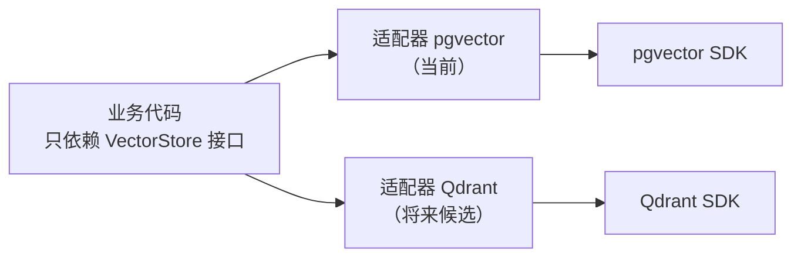
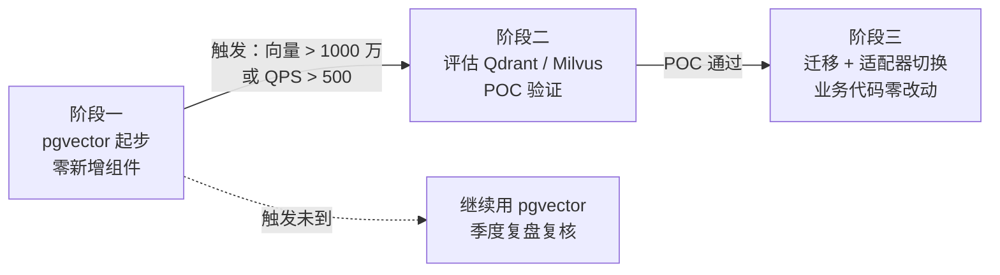
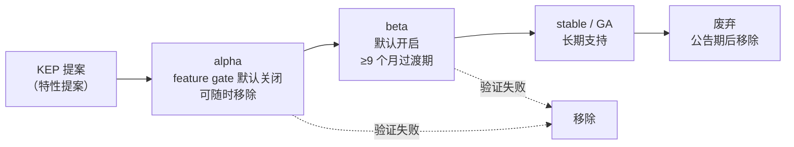
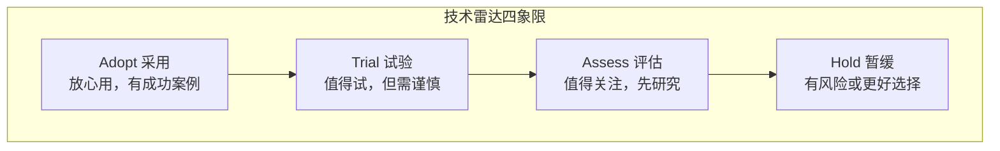

# 4.7 增强：技术选型与架构演进方法论 [进阶]

> 来源：[Martin Fowler](https://martinfowler.com/) · [ThoughtWorks 技术雷达](https://www.thoughtworks.com/radar) · [adr.github.io](https://adr.github.io/) · 验证环境：待验证

## 概念：为什么需要

**业务痛点**：一次错误选型可能等于两年重构 [已必备]——组件换不掉、性能撑不住、运维扛不动，重构期间业务寸步难行。更常见的是「跟风选型」：哪个火选哪个，半年后才发现运维成本远超预期。选型不是「哪个火选哪个」——是约束下的权衡决策。

- **从哪来**：拍脑袋选型（看热度、看熟人推荐）→ 功能对比表选型（只看功能不看运维）→ 框架化选型（约束 + 权重 + 验证 + 记录）
- **是什么**：一套把「选什么」从直觉变成流程的方法：明确约束 → 列候选 → 多维度评估 → POC 验证 → 记录决策
- **往哪去**：选型与演进结合——决策记录（ADR）进仓库，组件可替换（防腐层），技术路线分阶段演进，定期复盘

**引导反思**：选型能力是架构师的核心能力之一——「会选」比「会用」更值钱；选型质量决定未来两年的重构成本。

## 认知要点（先建立意识）

选型的本质是「在约束下做权衡」——没有最优解，只有约束下的最适解。约束通常来自五类：

| 约束类型 | 典型问题 |
|---|---|
| 团队能力 | 团队熟悉什么技术栈？能维护多复杂的系统？ |
| 运维成本 | 谁运维？7×24 还是工作日？出问题谁能扛？ |
| 业务规模 | 当前规模多大？增长预期多少？ |
| 合规 | 数据出境、审计、安全等级要求？ |
| 时间窗口 | 多久必须上线？POC 时间预算？ |

常见误区（对照自查）：

- **只看功能对比，不看运维成本**——功能表上赢的组件，运维上可能输光
- **被厂商/社区热度带节奏**——star 多 ≠ 适合你；热度是参考不是决策依据
- **不考虑演进路径**——只问「现在够不够」，不问「将来怎么换」
- **选型不记录理由**——半年后失忆，重构时不敢动（呼应 6.1 ADR）

**约束自查表**（选型前逐项过一遍，缺项先补）：

| 约束 | 自查问题 | 没想清楚的后果 |
|---|---|---|
| 团队能力 | 谁维护？能维护多久？ | 组件上线后没人会运维 |
| 运维成本 | 升级 / 排障 / 备份谁做？ | 运维成本远超预期 |
| 业务规模 | 当前与 1 年后规模？ | 为不存在的规模买单 |
| 合规 | 数据 / 审计 / 安全要求？ | 上线前被合规卡住 |
| 时间窗口 | 多久必须上线？ | 选型拖垮交付 |

## 选型框架：五步法

1. **明确问题与约束**：先写清楚「要解决什么问题」，再列约束（团队 / 运维 / 规模 / 合规 / 时间）
2. **候选方案清单**：至少 3 个，且必须包含「不选」选项（什么都不做 / 用平台已有能力）——「不选」是合法选项
3. **多维度评估**：功能 / 运维 / 生态 / 成本 / 团队 五维打分，按企业实际情况加权（权重化）
4. **小规模验证（POC）**：用真实业务场景的最小用例验证关键假设（性能、运维、兼容性）
5. **决策 + ADR 记录**：写一页纸 ADR（模板见 6.1），含备选方案与复核触发条件

评估维度权重化示例（示意，权重按企业实际调整）：

| 维度 | 权重 | 说明 |
|---|---|---|
| 功能 | 30% | 覆盖核心需求即可，不必追求全功能 |
| 运维 | 25% | 部署 / 升级 / 排障成本，常被低估 |
| 生态 | 15% | 社区活跃度、文档、人才储备 |
| 成本 | 15% | 许可证 / 资源 / 人力 |
| 团队 | 15% | 学习成本、熟悉度 |

**五步法走查示例**（以「团队要上 RAG 向量库」为例，数据呼应 2.3 与 6.1 的 ADR-001）：

| 步骤 | 示例动作 | 产出物 |
|---|---|---|
| 1. 明确问题与约束 | 问题：RAG 需要向量检索；约束：数据量 < 500 万条、团队已运维 PostgreSQL、无专职向量库运维、3 个月内上线 | 一页问题与约束清单 |
| 2. 候选方案清单 | pgvector / Qdrant / Milvus / 不选（关键词检索是否够用，先验证） | 候选清单（含不选） |
| 3. 多维度评估 | 按权重打分：pgvector 运维分最高（零新增组件），Milvus 功能分最高但运维分最低 | 权重化评分表 |
| 4. 小规模验证（POC） | 真实文档集跑检索质量 + 演练升级/备份，验证「运维假设」而不只是功能 | POC 报告（含失败项） |
| 5. 决策 + ADR 记录 | 决策：pgvector；ADR-001 记录备选方案与复核触发条件（向量 > 1000 万 或 QPS > 500） | ADR-001（模板见 6.1） |

走查要点：第 2 步的「不选」不是走过场——如果 POC 发现关键词检索已满足 80% 需求，正确决策就是「不选」，省下整个向量库的运维成本。

**五步法常见坑**（对照自查）：

| 步骤 | 常见坑 | 对策 |
|---|---|---|
| 1. 明确问题 | 问题没写清就开选 | 先写一页问题与约束清单，评审确认后再动手 |
| 2. 候选清单 | 只列热门方案，漏了「不选」 | 强制包含「不选」与平台已有能力 |
| 3. 评估 | 权重后定，为结论凑分 | 权重先定，打分过程中权重不可改 |
| 4. POC | 只验功能不验运维 | POC 用例必须含升级 / 备份 / 排障演练 |
| 5. 决策 | 不写 ADR，理由靠记忆 | 决策当天写 ADR，随 PR 评审（呼应 6.1） |

## 权衡分析

常见权衡对——没有免费午餐，选型就是选「愿意承受哪个代价」：

| 权衡对 | 典型场景 | 决策倾向 |
|---|---|---|
| 功能 vs 复杂度 | 全功能框架 vs 轻量方案 | 复杂度是长期负债，功能够用即可 |
| 性能 vs 成本 | 高性能组件 vs 便宜方案 | 先量化性能需求，再定成本预算 |
| 生态成熟 vs 新特性 | 稳定老牌 vs 热门新秀 | 业务系统优先生态成熟，新特性可 POC 观察 |
| 自建 vs 采购 | 自己造 vs 用平台 / 商业产品 | 优先用平台能力（定位红线），自建是最后选项 |

**「够用就好」原则**：避免过度设计——为不存在的规模买单是最常见的浪费。先满足当前 + 可预期的近期需求，把「将来怎么办」交给演进路径（见下节）。

**实战权衡场景**（三个常见选型，演示「权衡对」怎么落地）：

**场景一：消息队列选型**（权衡：生态成熟 vs 运维成本 vs 成本）

| 候选 | 优势 | 代价 |
|---|---|---|
| Kafka | 生态最成熟、吞吐高、人才多 | 重运维：需要专职团队调优与排障 |
| RabbitMQ | 轻量、功能够用、运维简单 | 吞吐上限低，超大流量场景撑不住 |
| 云厂商托管队列 | 零运维、按量付费 | 成本随规模线性增长、绑定厂商 |

决策倾向：业务量小 → RabbitMQ 或托管；吞吐要求高且有运维团队 → Kafka；都不确定 → 先托管起步，用防腐层留迁移余地。

**场景二：向量库选型**（呼应 2.3 选型决策表，权衡：运维成本 vs 规模能力）

| 候选 | 何时选 | 代价 |
|---|---|---|
| pgvector | 千万级以下、已有 PG | 规模上限低，超量需迁移 |
| Qdrant | 需要独立部署、过滤检索强 | 新增一个组件要运维 |
| Milvus | 十亿级、有专职运维 | 运维最重，小团队扛不动 |

决策倾向：先 pgvector 起步（零新增组件），复核触发条件（规模/QPS）触发后再评估迁移——这就是「先简单后复杂」的演进路径。

**场景三：AI 推理服务选型**（权衡：自建 vs 采购，呼应定位红线）

| 候选 | 优势 | 代价 |
|---|---|---|
| 平台推理服务 | 零运维、弹性、与平台对齐 | 定制化受限、按量付费 |
| 自建 vLLM 集群 | 完全可控、成本可优化 | 运维重：GPU 调度、扩缩容、故障自愈全自己扛 |

决策倾向：优先用平台能力（定位红线：学习者不建设基础设施）——先申请平台推理服务，出现平台满足不了的需求（如特殊量化、专属调度）再评估自建，且自建决策必须写 ADR。

## 演进式架构

选型不是一锤子买卖——架构要能演进。演进式架构（Evolutionary Architecture）：把「可演进」当作架构的一等需求来设计，而不是事后补救。三个抓手：

1. **防腐层（接口隔离）**：业务代码不直连组件 SDK，通过自己的接口访问——换组件只改适配层（呼应 2.3 向量库防腐层：用 VectorStore 接口接向量库，业务代码不直连向量库 SDK）
2. **可替换性**：选型时评估「换掉它要改多少代码」——把替换成本写进 ADR 的「后果」
3. **演进路径**：先简单后复杂——先 pgvector 起步，量级上来再迁移专用向量库（呼应 2.3）；先单体后拆分

**技术路线图**：把「现在用什么 → 什么条件下换什么 → 换的触发条件」画成分阶段路线图，与 ADR 的复核触发条件一一对应——路线图是演进路径的可见化，复核条件是它的触发器。

**防腐层实现要点**（以向量库为例，呼应 2.3 的 VectorStore 接口）：

- 业务代码只依赖自己定义的接口（如 `VectorStore`：存、查、删三个方法），不直连组件 SDK
- 组件 SDK 调用全部收进适配器（adapter，把组件能力翻译成自己接口的胶水代码），换组件只改适配器
- 接口按「业务需要什么」设计，不按「组件有什么」设计——接口是业务的，不是组件的



**替换成本评估清单**（选型时逐项打分，写进 ADR 的「后果」）：

| 评估项 | 问题 | 低替换成本特征 |
|---|---|---|
| 接口层 | 业务代码直连 SDK 还是走自己的接口？ | 走自己的接口 |
| 配置层 | 配置是集中管理还是散落各处？ | 集中管理（ConfigMap / 配置中心） |
| 数据层 | 数据能否导出、格式是否标准？ | 标准格式、有导出工具 |
| 运维层 | 换组件后监控/告警/备份要重做多少？ | 与平台能力对齐，改动小 |

**技术路线图示例**（RAG 向量库分阶段演进，呼应 2.3）：



要点：路线图的价值不在「画得准」，而在「触发条件可量化」——触发条件到了就重新走五步法，而不是硬扛或盲换。

## 官方文档引述：行业标准锚点

选型方法论不是凭空发明——以下三处官方文档是「演进式架构」「生态评估」「评估维度」的行业标准锚点，遇到争议时回原文核对。

**1. Kubernetes API 版本演进**

> 来源：[Kubernetes 官方文档 · API Versioning](https://kubernetes.io/docs/reference/using-api/) · 验证环境：待验证

机制要点：

- K8s 所有 API 对象带 `apiVersion` 字段，版本演进分三档：**alpha**（默认关闭、可能随时移除）、**beta**（默认开启、至少 9 个月过渡期后转正或废弃）、**stable**（长期支持）
- 新特性由 **feature gate**（特性开关）控制，逐版本灰度开启，出问题可回退
- 废弃有公告流程（deprecation policy），不搞「突然删除」

与选型的关联：这是「演进式架构」的官方范本——新能力先进来（alpha）、验证后转正（beta/stable）、废弃有流程。选型时看候选组件的「版本策略」是否同样可演进：有没有灰度开关、废弃有没有公告期、升级是平滑的还是破坏性的。

**2. CNCF 项目成熟度模型**

> 来源：[CNCF 项目目录](https://www.cncf.io/projects/) · 验证环境：待验证

机制要点：

- CNCF 项目分三档：**Sandbox**（早期实验）、**Incubating**（孵化中，采用者增长）、**Graduated**（毕业，成熟稳定）
- 毕业标准包括：采用者数量、治理结构、安全审计、版本发布纪律等

与选型的关联：选型时查 CNCF 状态是生态评估的官方依据（呼应检索手册 §0.4）——Graduated 优先于 Incubating，Incubating 优先于 Sandbox；但状态只代表成熟度，不代表适合你的场景。

**3. AWS Well-Architected Framework**

> 来源：[AWS Well-Architected](https://docs.aws.amazon.com/wellarchitected/) · 验证环境：待验证

机制要点：

- 六大支柱：卓越运营、安全性、可靠性、性能效率、成本优化、可持续性
- 每支柱一组设计原则与检查问题，用于评审架构与选型

与选型的关联：五步法里的「多维度评估」可以直接借用支柱提问做检查单——不必绑定 AWS 服务名，问题本身通用（呼应检索手册 §7）。

## 明星项目架构：可演进机制的范本

**1. Kubernetes 特性演进机制（演进式架构的行业范本）**

K8s 把「新特性如何进入系统、如何转正、如何废弃」做成了完整流程——这是「演进式架构」最值得抄的作业：



组件说明：

- **KEP**（Kubernetes Enhancement Proposal，特性提案）：新特性先写提案，说清问题、方案、风险，评审通过才进入开发——与选型五步法「先写清楚问题再动手」同款流程
- **feature gate**（特性开关）：新特性默认关闭，逐版本灰度开启，出问题可回退——「可回退」是演进式架构的关键
- **apiVersion**（API 版本字段）：v1alpha1 / v1beta1 / v1 三档，调用方按版本升级，不搞破坏性变更

选型启示：评估候选组件时，对照这套机制问三个问题——它有没有「灰度开关」？废弃有没有公告期？版本升级是破坏性的还是平滑的？

**2. ThoughtWorks 技术雷达（选型热度判断工具）**

技术雷达（Technology Radar）是 ThoughtWorks 每半年发布的技术观察报告，用四象限给技术打标签：



用法：给候选方案逐个打标签——Hold 的不引入；Assess 的进观察池；Trial 的进 POC；Adopt 的才进生产。标签随每期雷达更新，防止「热度带节奏」（呼应认知要点误区）。

## 业界前沿：选型视野里的新动向

> 以下均为真实存在的项目/特性，但处于快速演进期，标注「前沿，待验证」——选型时按技术雷达分类法打 Assess/Trial 标签，进 POC 观察池，不直接进生产。

| 项目/特性 | 一句话 | 与选型的关联 | 标注 |
|---|---|---|---|
| Kubernetes Inference Extensions（K8s 1.32 起 alpha） | 把推理服务（如 vLLM）接入 K8s 调度与扩缩容的扩展点 | AI 推理负载与平台调度对齐的前沿方向，选型 AI 组件时关注 | 前沿，待验证 |
| A2A（Agent2Agent 协议） | Agent 间互操作的开放协议 | 多 Agent 协作的互操作标准方向，选型 Agent 框架时关注 | 前沿，待验证 |
| InPlace Pod Resize（K8s 1.27 起 beta） | Pod 资源原地调整，无需重启 | 资源效率方向，影响「性能 vs 成本」权衡 | 前沿，待验证 |
| spegel（CNCF Sandbox） | 基于 BitTorrent 的 OCI 镜像点对点分发 | 大规模集群镜像分发成本方向 | 前沿，待验证 |

选型启示：前沿方向的价值不在「现在就用」，而在「知道它存在」——半年后需求出现时，你至少知道该往哪个方向评估（呼应 L4 趋势前瞻）。

**怎么跟踪前沿**（不追热点，按节奏跟踪）：

- **季度节奏**：每季度从 ACM Queue / Latent Space / InfoQ 各挑 1 篇做拆解（问题 → 约束 → 决策 → 教训），与季度技术路线复盘合并进行（呼应检索手册 §7 案例研读纪律）
- **信源分级**：官方发布博客（机制与事实）> 大牛博客（视角与踩坑）> 二手转述（仅当线索，不直接引用）
- **版本敏感内容**：以官方发布博客 + KEP 为准（呼应检索手册 §0 检索约定）
- **跟踪产出**：更新技术雷达标签 + 技术路线图，而不是攒「收藏夹」——收藏不产生决策，标签才产生决策

## 和 AI 沟通的提问要点

问选型时，给 AI 提供以下上下文（缺了这些，AI 只能给泛泛之谈）：

- **业务规模与增长预期**：数据量、QPS、用户数、增长曲线
- **团队技术栈与能力**：现有栈、团队规模、熟悉度
- **运维资源**：谁运维、值班模式、SRE 支持
- **合规约束**：数据合规、审计、安全要求
- **时间窗口**：上线期限、POC 预算

**让 AI 当评审**：把候选方案和评估结果给 AI，让它对照框架找遗漏维度（比如只比了功能没比运维、没考虑替换成本）——AI 是评审不是决策者，最终决策与理由记录在 ADR。

**选型提问模板**（可直接复制，把「{}」替换成你的情况）：

```text
我要做一次技术选型，请按五步法框架帮我评估。

1. 问题与约束：{要解决什么问题}；约束——团队能力：{技术栈/规模}；
   运维：{谁运维/值班模式}；业务规模：{数据量/QPS/增长预期}；
   合规：{要求}；时间窗口：{上线期限/POC 预算}
2. 我的候选方案：{候选 A / 候选 B / 不选}
3. 请先列出评估维度与建议权重，再逐项对比；
   重点回答：每个候选的运维成本、替换成本、演进路径
4. 最后给出你的倾向与理由，并指出我可能遗漏的维度
```

**AI 评审对照清单**（让 AI 逐项检查你的选型材料）：

- [ ] 约束是否列全（团队 / 运维 / 规模 / 合规 / 时间）？
- [ ] 候选是否 ≥ 3 个且包含「不选」？
- [ ] 评估是否覆盖运维成本与替换成本，而不只是功能？
- [ ] 权重是否先定后打分（防止先有结论再凑权重）？
- [ ] POC 是否验证了关键假设（含运维假设）？
- [ ] 决策是否写了 ADR，复核触发条件是否可量化？

用法：把材料丢给 AI 逐项打勾，缺哪项补哪项——AI 的价值是「查漏」，不是「替你拍板」。

## 选型/技术路线建议

| 团队规模 | 建议路线 |
|---|---|
| 小团队 | 「够用就好」+ 防腐层：选最熟悉的方案，用接口隔离留替换余地 |
| 中大型 | 权重化评估 + POC 验证：五步法走全，关键决策写 ADR |
| 所有团队 | 关键决策 ADR 记录 + 定期复盘（季度）：复核触发条件随季度案例研读一起过 |

**小团队操作清单**（人少、无专职运维，目标：不给自己挖坑）：

1. 选团队最熟悉的方案——学习成本是最贵的隐性成本
2. 用平台已有能力优先（定位红线），新增组件前先问「平台有没有」
3. 业务代码加一层薄接口（防腐层），哪怕只是包一层函数
4. 关键决策写一页纸 ADR（模板见 6.1），半小时的事别省
5. 季度复盘 30 分钟：过一遍复核触发条件，没触发就继续用

**中大型操作清单**（有平台团队、多业务线，目标：决策可评审、可复用）：

1. 五步法走全，评估维度权重化，权重由业务方 + 平台方共同定
2. POC 纳入正式流程：目标、用例、通过标准、时间盒（如 2 周）
3. 选型报告 + ADR 进方案文档，随 PR 评审（呼应 6.1）
4. 选型结论沉淀为平台能力或推荐清单，避免每个团队各选一遍
5. 季度技术路线复盘：对照技术雷达更新，Hold 的组件重新评估

## 实用技巧

- 候选清单至少 3 个，且必须包含「不选」——没有对比的选型是信仰不是决策
- 权重先定再打分，避免「先有结论再凑权重」
- POC 用真实业务场景的最小用例，验证的是「关键假设」不是「全部功能」
- 把替换成本（换组件要改多少代码）写进 ADR 的「后果」
- 用技术雷达分类法（Adopt / Trial / Hold，来自 ThoughtWorks 技术雷达）给候选方案打标签——Hold 的组件不引入
- 用 AWS Well-Architected 的支柱提问（运营 / 安全 / 可靠 / 性能 / 成本）做评估检查单，不必绑定 AWS 服务名
- POC 失败也是结果——把失败原因写进 ADR 的「备选方案」栏，避免半年后重踩同一个坑
- 给候选方案设「退出条件」：什么情况下必须换（写进 ADR 复核触发条件），比「我们相信它能行」可靠
- 选型结论先写、论证后写——一页纸先给「选什么 + 为什么不选 B」，评审者 5 分钟进入状态
- 拿不准的组件先查机制再决策（呼应 KTHW 经验）：搞清它怎么工作，再谈要不要用

## 考察问题

- 为什么「不选」是合法选项？（线索：约束下的权衡——什么都不做可能才是最优解；平台已有能力优先）
- 功能对比表赢了，为什么还可能选错？（线索：运维成本、替换成本、团队能力不在表里）
- 防腐层什么时候是过度设计？（线索：组件稳定、替换概率低、接口抽象本身有成本——想想 2.3 的 VectorStore 接口）
- 复核触发条件触发后，正确的动作是什么？（线索：不是直接换，而是重新走一遍「问题 → 候选 → 评估 → POC」）
- 技术雷达的 Hold 象限对选型意味着什么？（线索：Hold 不是「不好」，是「现在别引入」——想想为什么大厂也在 Hold 某些热门技术）
- 为什么「先简单后复杂」的演进路径比「一步到位」更稳？（线索：复杂度是负债，提前付利息不划算；触发条件没到，复杂方案的优势用不上）
- 前沿项目（如 Inference Extensions）什么时候值得进 POC？（线索：技术雷达分类法——Assess 进观察池，需求出现且触发条件满足才 Trial）

## 经验之谈

- 观点（不署名）：多数选型失败不在「选错组件」，而在「没想清楚约束」——约束想清楚了，候选清单自己会缩小（通行工程共识，具体引用待补）
- 观点（不署名）：「够用就好」不是将就，是把复杂度预算留给真正重要的地方；为不存在的规模买单，两年后一定后悔
- 观点（不署名）：选型报告里最值钱的部分是「为什么不选 B」——它记录了你的思考边界，也是半年后复盘时的对照物

**权威观点（有出处，观点转述）**：

- Martin Fowler《Who Needs an Architect?》（2003，[martinfowler.com](https://martinfowler.com/)）：架构师更像城市规划师——划定框架与边界，让团队在框架内自主设计，而不是替团队做所有设计；架构关乎「重要的事」，选型正是「重要的事」之一
- Bilgin Ibryam《Principles of Container-based Application Design》（2017，[Red Hat 博客](https://www.redhat.com/en/blog/principles-container-based-application-design)）：容器化应用设计七原则（单一关注点、自包含、镜像可移植、进程可丢弃、运行时约束、动态配置、可观测）——选型时用原则逐条评估候选组件，比功能对比更接近本质
- Kelsey Hightower（[KTHW README](https://github.com/kelseyhightower/kubernetes-the-hard-way)）：Kubernetes the Hard Way 是为学习优化的——走长路确保理解每一步；引申到选型：理解机制后再决策，避免黑盒选型

## 架构师视角

- 解决什么问题：把选型从「跟风 / 拍脑袋」变成「约束下的权衡决策」，让技术路线可演进、可复盘
- 何时用：任何引入新组件 / 新技术的决策；季度技术路线复盘
- 何时不用：日常实现细节、一次性决定——方法论是给「影响半年后」的决策用的
- 权衡：流程本身有成本（评估、POC、ADR），用「决策影响面」控制流程深度——影响面小的决策走轻量版
- 固定三问：
  - **平台提供了什么能力边界？**——先查平台已有能力（向量库、网关、消息队列），「不选」选项优先填平台能力；自建是最后选项（定位红线）
  - **业务接入点在哪？**——选型落地为 API / 接口时，用防腐层隔离，接入点即替换点
  - **需要和基础设施团队对齐什么？**——新组件引入、资源配额、运维责任归属，选型评审时同步给平台方

## 核心收获表

| 能力维度 | 具体收获 |
|---|---|
| 选型框架 | 能走完五步法：约束 → 候选（含不选）→ 权重化评估 → POC → ADR |
| 权衡分析 | 能识别常见权衡对，用「够用就好」控制复杂度 |
| 演进式架构 | 能用防腐层 + 替换成本 + 演进路径设计可替换架构 |
| AI 协作 | 能给 AI 提供完整选型上下文，让 AI 当评审找遗漏维度 |
| 决策记录 | 关键决策写 ADR，复核触发条件可量化（呼应 6.1） |

## 推荐开源项目表

| 项目 | 链接 | 研读重点 |
|---|---|---|
| ThoughtWorks 技术雷达 | https://www.thoughtworks.com/radar | Adopt / Trial / Hold 分类法，选型热度判断 |
| adr.github.io | https://adr.github.io/ | ADR 轻量实践：模板与案例 |
| system-design-primer | https://github.com/donnemartin/system-design-primer | 系统设计通识，权衡素材库 [进阶] |
| AWS Well-Architected | https://aws.amazon.com/architecture/well-architected/ | 支柱提问检查单（运营 / 安全 / 可靠 / 性能 / 成本） |

## 常见问题排查

| 现象 | 排查路径 |
|---|---|
| 选型报告写成了「功能对比表」 | 检查是否回答了「为什么不选 B」、是否包含运维 / 替换成本维度 |
| 团队各执一词吵不出结果 | 先对齐约束与权重——分歧常在权重不在事实 |
| POC 验证了但上线还是翻车 | 检查 POC 是否覆盖真实业务场景与规模，是否验证了运维假设 |
| 半年后说不清当初为什么选 | 补 ADR：从「背景 → 备选 → 决策」倒推记录，复核触发条件量化 |
| 前沿项目想直接上生产 | 按技术雷达分类法打标签：Assess/Trial 先进 POC 观察池，触发条件满足再转正 |
| 团队想用新技术但没人会运维 | 约束没对齐：把「运维成本」维度权重拉高重评，或先申请平台托管能力 |
| 选型流程太重，小决策也走五步法 | 用「决策影响面」控制深度：影响面小的决策走轻量版（候选 2 个 + 一页纸结论） |