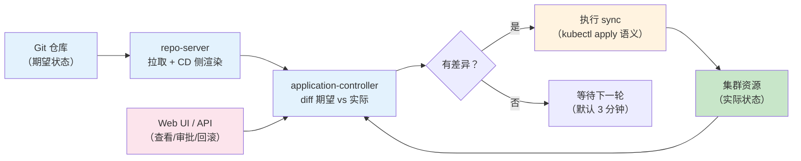
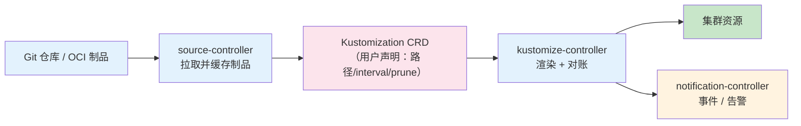
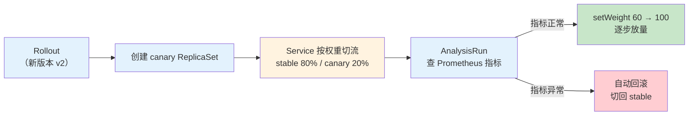
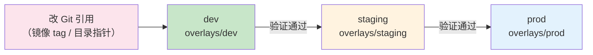
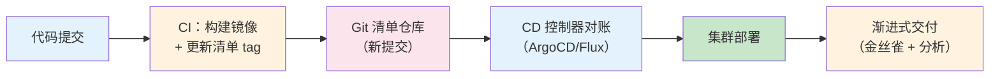

# 4.8 GitOps 交付实践认知 [进阶]

> 来源：[ArgoCD](https://argoproj.github.io/cd/) · [Flux](https://fluxcd.io/) · [Argo Rollouts](https://argoproj.github.io/rollouts/) · [Flagger](https://flagger.app/) · 验证环境：待验证

## 概念：为什么需要

**业务痛点**：[已必备] 发布靠人肉 kubectl、环境之间配置悄悄漂移（「测试好的，生产就炸」）、出问题说不清谁改了什么、回滚靠翻聊天记录——团队规模一大，这套就撑不住。GitOps 把「部署」从人肉操作变成「改 Git 仓库」，集群自己向 Git 收敛。

- **从哪来**：人肉 kubectl → CI 流水线 push 式部署（流水线直接连集群执行 kubectl）→ GitOps 拉取式对账（控制器盯着 Git，有变化自己同步）
- **是什么**：GitOps 是以 Git 仓库为唯一事实来源的声明式交付方式——Git 里声明「集群应该长什么样」，集群里的控制器（controller：一个持续运行、不断把实际状态修正到期望状态的程序）负责对账（reconcile：比较期望状态与实际状态，有差异就修正），把集群状态向 Git 收敛
- **往哪去**：从「同步部署」走向「渐进式交付」（金丝雀 + 自动分析，见下文）；多集群统一管理；Git 仓库成为审计与合规的载体——谁改了什么、什么时候改的，全在提交历史里

**引导反思**：GitOps 解决的不是「部署自动化」——CI 早就自动化了；它解决的是「部署的可信度」：环境漂移、变更可追溯、回滚可重复。

## 认知要点（先建立意识）

**GitOps 核心一句话**：Git 声明 → 控制器对账。所有认知都从这句话推出来：

| 认知 | 含义 | 常见误解 |
|---|---|---|
| Git 是唯一事实源 | 集群状态以 Git 为准，手改集群会被控制器改回去 | 「我 kubectl 改一下应急」——会被 selfHeal 拉回，应急要走 Git |
| 对账是拉取式 | 控制器主动从 Git 拉取，不是 CI 推给集群 | 以为 GitOps 是「CI 的升级版」 |
| 声明式最终状态 | 只描述「最终要什么」，不描述步骤 | 把发布步骤写进 GitOps 清单 |

**不治理的坑**（先建立意识，避免踩）：

1. **把 GitOps 当 CI 用**：CI 的职责是构建制品（镜像），CD 的职责是部署。在 GitOps 清单里塞构建步骤、镜像 tag 写死不更新——Git 仓库里的镜像版本和实际构建产物脱节
2. **多环境配置漂移**：dev/staging/prod 各维护一份清单，改了一处忘改另一处——环境差异要用 overlay/values 显式管理（见「多环境管理」），不是复制粘贴
3. **误合并直接上线**：GitOps 下「合并即部署」，没有分支保护（branch protection：禁止直接推 main、强制走 PR 的机制）和审批，手滑合并 = 直接上线
4. **回滚靠 revert 但数据库不兼容**：代码回滚容易，数据库 schema 回滚难——发布前要确认「这次变更能不能 revert」（呼应 1.11 发布策略）

## 官方文档关键机制

GitOps 不是新发明，而是把 K8s 已有的声明式机制串起来。以下四处官方机制是理解 GitOps 的钥匙（要点 + 链接，验证环境：待验证）：

**1. K8s 声明式管理：kubectl apply 的三方合并**

- 要点：`kubectl apply` 通过 `kubectl.kubernetes.io/last-applied-configuration` 注解记录「上次提交的配置」，做三方合并（上次提交 / 当前配置 / 集群实际状态），只改差异、不覆盖手改字段——这是 GitOps 控制器执行同步的底层语义，ArgoCD/Flux 的 apply 与 kubectl apply 行为一致
- 链接：https://kubernetes.io/docs/tasks/manage-kubernetes-objects/declarative-config/
- 验证环境：待验证（`kubectl apply` 后 `kubectl get <obj> -o yaml` 查看注解）

**2. ArgoCD 对账循环（reconcile loop）**

- 要点：application-controller 周期性（默认 3 分钟，可配置）比较「Git 里的期望状态」与「集群实际状态」；repo-server 负责拉取 Git 并在 CD 侧渲染（Helm/Kustomize）；有差异就 sync，automated 模式下 selfHeal（手改被拉回）+ prune（清单删除则集群删除）
- 链接：https://argoproj.github.io/cd/
- 验证环境：待验证

**3. Flux GitOps Toolkit 组件化**

- 要点：Flux 不是一个单体，而是一组可裁剪的控制器——source-controller 拉取并缓存制品（Git 仓库 / OCI 制品 / Helm 仓库），kustomize-controller 与 helm-controller 消费制品做对账，notification-controller 对外发事件（告警/Webhook）
- 链接：https://fluxcd.io/flux/components/
- 验证环境：待验证

**4. Argo Rollouts 金丝雀 + 自动分析**

- 要点：Rollout 资源替代 Deployment；canary steps 定义放量阶梯（setWeight/pause）；AnalysisTemplate 定义「查什么指标、什么条件算成功/失败」，AnalysisRun 执行分析，指标异常自动回滚
- 链接：https://argoproj.github.io/rollouts/features/canary/
- 验证环境：待验证

## ArgoCD vs Flux 对比

GitOps 双雄（均为 CNCF 项目），选型前先看差异：

| 维度 | ArgoCD | Flux |
|---|---|---|
| 一句话定位 | 带 UI 的 GitOps 控制台，多集群管理强 | 轻量组件化 GitOps 工具集，Kustomize 原生 |
| 核心形态 | 一个中心化服务（Application CRD + Web UI） | GitOps Toolkit 多个小组件（source-controller / kustomize-controller 等） |
| UI / 审批 | 强：Web UI 看同步状态、diff、回滚，支持 UI 操作 | 弱：无官方 UI，靠 CLI + 第三方界面 |
| 多集群 | 强：一个 ArgoCD 注册管理多个集群 | 支持，但更偏「每集群一套」 |
| 渐进式交付 | 配套 Argo Rollouts（同生态） | 配套 Flagger（独立项目，Flux/ArgoCD 都支持） |
| 学习成本 | 中：概念多（Application/Project/AppSet），UI 掩盖部分复杂度 | 低-中：CRD 直白（GitRepository + Kustomization/HelmRelease），无 UI 可看 |
| 适用场景 | 需要 UI 审批、多集群、团队可视化诉求强 | 已有 Kustomize 资产、追求轻量、CLI 习惯团队 |

**选型建议**（按团队情况对号入座）：

- 团队规模小 / 已有 Kustomize 资产 / 不想多养一个中心服务 → **Flux**（Kustomization CRD 直接吃 overlay，心智负担最小）
- 需要 UI 审批 / 多集群统一管理 / 平台团队要可视化 → **ArgoCD**（UI 是它的核心价值，别当纯 CLI 用）
- 核心服务要渐进式交付 → 无论选哪个，配套 Argo Rollouts 或 Flagger（见下文）

## 核心机制架构

选型之后，值得把两个核心机制的内部数据流看一遍——理解「谁在什么时候做什么」，排障和向平台提需求都靠它。

**ArgoCD 对账循环**（组件 + 数据流）：



要点：repo-server 与 application-controller 分离——渲染（重活）与对账（快活）不互相阻塞；UI 只是控制台的壳，对账循环不依赖 UI。

**Flux GitOps Toolkit 数据流**（组件化对账）：



要点：用户只声明 Kustomization（要什么），控制器自己拉制品、渲染、对账——「声明式」在 Flux 里贯彻到控制器本身。

**Argo Rollouts 金丝雀数据流**（渐进式交付）：



要点：新旧版本同时存在，流量权重由控制器调整；成败判断交给 AnalysisRun（指标），不靠人盯。

## 动手：最小 GitOps 演练

> 验证环境：待验证。以下命令发布前须在本地 kind 集群跑通（`kind create cluster` 起一个集群即可）。

**路线 A：Flux（轻量，推荐先试）**：

```bash
flux install   # 在 kind 集群安装 Flux 控制器（flux CLI 需先安装）

# 声明制品源：指向清单仓库
flux create source git demo-manifests \
  --url=https://github.com/example/demo-manifests \
  --branch=main

# 声明对账：把 overlays/prod 目录同步进集群
flux create kustomization demo-prod \
  --source=demo-manifests \
  --path=./overlays/prod \
  --prune=true --interval=5m

flux get kustomization demo-prod   # 看对账状态
```

**路线 B：ArgoCD（要 UI 时）**：

```bash
kubectl create namespace argocd
kubectl apply -n argocd -f https://raw.githubusercontent.com/argoproj/argo-cd/stable/manifests/install.yaml

# 取初始管理员密码（首次登录用）
kubectl -n argocd get secret argocd-initial-admin-secret \
  -o jsonpath="{.data.password}" | base64 -d

# 声明一个 Application（等价于上面 Flux 的 Kustomization）
argocd app create demo-prod \
  --repo https://github.com/example/demo-manifests.git \
  --path overlays/prod \
  --dest-server https://kubernetes.default.svc \
  --dest-namespace demo \
  --sync-policy automated
```

演练目标：改一次 Git 里的镜像 tag → 观察控制器自动同步 → 手改集群资源 → 观察 selfHeal 拉回。跑通这三步，GitOps 心智模型就立住了。

## 多环境管理

**环境即分支/目录**：多环境（dev/staging/prod）的清单组织有两种主流方式：

- **目录方式（推荐）**：一个仓库，`overlays/dev`、`overlays/staging`、`overlays/prod` 三个目录，用 Kustomize overlay 叠加环境差异（呼应 1.9 打包章节）——环境差异显式可见，diff 一目了然
- **分支方式**：每个环境一个分支（main=prod）——分支多了合并混乱，一般团队不推荐，除非平台约定如此

**环境差异**（用 overlay/values 显式管理，不复制粘贴）：配置（ConfigMap）、密钥（Secret——密钥不进明文 Git，用 SealedSecret / External Secrets / SOPS 等方案，具体选型问平台方）、副本数、镜像 tag（环境固定 tag vs 滚动 tag）。

**Promotion 流程**（逐级提升）：dev 验证 → 合并到 staging → 验证 → 提升到 prod。提升 = 改 Git 里的引用（如 overlay 的镜像 tag 或目录指针），不是重新部署——控制器自动同步。



注意：Promotion 的「审批」发生在 Git 侧（PR 审批 / 分支保护），不是集群侧——这是 GitOps 与旧式发布流程最大的心智差异。

示例（Flux 声明式清单，验证环境：待验证）：

```yaml
apiVersion: kustomize.toolkit.fluxcd.io/v1
kind: Kustomization
metadata:
  name: demo-prod
  namespace: flux-system
spec:
  interval: 5m            # 对账周期：每 5 分钟检查一次 Git
  path: ./overlays/prod   # 指向 prod overlay 目录
  prune: true             # 清单里删掉的对象，集群里也删
  sourceRef:
    kind: GitRepository
    name: demo-manifests
```

ArgoCD 对应物（Application CRD，验证环境：待验证）：

```yaml
apiVersion: argoproj.io/v1alpha1
kind: Application
metadata:
  name: demo-prod
  namespace: argocd
spec:
  project: default
  source:
    repoURL: https://github.com/example/demo-manifests.git
    targetRevision: main
    path: overlays/prod
  destination:
    server: https://kubernetes.default.svc
    namespace: demo
  syncPolicy:
    automated:
      prune: true
      selfHeal: true   # 手改集群会被拉回 Git 状态
```

> 验证环境：待验证。以上 YAML 发布前须在本地 kind 集群跑通。

## 渐进式交付

**是什么**：渐进式交付（progressive delivery）是发布策略的统称——金丝雀发布（canary release：先让新版本接收一小部分流量，验证没问题再逐步放量）+ 自动分析（根据指标判断成败，失败自动回滚）。呼应 1.11 发布策略：那里讲「有哪些发布策略」，这里讲「怎么在 GitOps 里落地」。

**两个工具**：

- **Argo Rollouts**：ArgoCD 同生态的 Rollout 控制器，用 `Rollout` 资源替代 Deployment，支持金丝雀/蓝绿 + AnalysisTemplate（分析模板：定义「看哪些指标、什么条件算失败」）
- **Flagger**：独立项目，配合 Flux/ArgoCD/服务网格等，自动做金丝雀/蓝绿/A-B 测试，指标分析内置

**核心价值**：发布成败由指标说了算，不是人盯日志——指标异常自动回滚，发布风险从「上线即事故」变成「可控实验」。

示例（Argo Rollouts 金丝雀，验证环境：待验证）：

```yaml
apiVersion: argoproj.io/v1alpha1
kind: Rollout
metadata:
  name: demo
spec:
  replicas: 5
  strategy:
    canary:
      steps:
        - setWeight: 20         # 先放 20% 流量
        - pause: {duration: 5m} # 观察 5 分钟（可配 AnalysisTemplate 自动分析）
        - setWeight: 60
        - pause: {duration: 5m}
        - setWeight: 100
  selector:
    matchLabels:
      app: demo
  template:
    metadata:
      labels:
        app: demo
    spec:
      containers:
        - name: demo
          image: example/demo:v2.0.0
```

> 验证环境：待验证。以上 YAML 发布前须在本地 kind 集群跑通。

## 与 CI 的分工

**一句话**：CI 构建镜像 + 更新 Git 清单 → CD 控制器部署。CI 的产物是「Git 里的一次提交」，不是「集群里的一次部署」。

| 环节 | 谁负责 | 产物 |
|---|---|---|
| 构建镜像 | CI（GitHub Actions / GitLab CI / Jenkins 等） | 镜像 + 清单更新提交 |
| 更新清单 | CI（提交新镜像 tag 到 Git 仓库） | Git 提交（触发 CD） |
| 部署 | CD 控制器（ArgoCD/Flux 对账） | 集群状态向 Git 收敛 |
| 验证/回滚 | CD 控制器 + 渐进式交付工具 | 自动分析、自动回滚 |

全链路数据流（CI 与 CD 的边界一目了然）：



注意：CI 的终点是「Git 提交」，CD 的起点是「Git 提交」——两者通过 Git 解耦，CI 挂了不影响已提交版本的部署，CD 挂了不影响构建。

**「渲染在 CD 侧」vs「客户端渲染」**（呼应 1.9 考察问题）：客户端渲染 = 本地/CI 里跑 `helm template` / `kubectl kustomize` 把最终 YAML 渲染出来再提交；CD 侧渲染 = 提交原始 chart/overlay，由 ArgoCD/Flux 在集群侧渲染。差异在于：渲染产物是否入库、chart 依赖解析发生在哪一侧、本地有没有「渲染产物漂移」。GitOps 下推荐 CD 侧渲染——Git 里存声明，不存渲染结果。

## 和 AI 沟通的提问要点

问 AI「我们该上 GitOps 吗 / 选 ArgoCD 还是 Flux」时，先给足上下文，AI 才能给有效建议：

1. **现有 CI 流水线**：用什么（GitHub Actions / Jenkins / 自研）？现在怎么部署（kubectl 脚本？平台控制台？）
2. **Kustomize/Helm 资产**：已有多少清单资产？用 overlay 还是 chart？——决定 Flux/ArgoCD 的适配成本
3. **多环境数量**：几个环境？差异多大？——决定要不要上多环境管理
4. **发布审批流程**：谁审批？走什么系统（工单/IM/平台）？——决定要不要 ArgoCD 的 UI 审批
5. **是否需要渐进式交付**：核心服务能不能接受「全量发布 + 回滚」？——决定要不要上 Rollouts/Flagger

> 示例提问模板（可直接复制给 AI）：
> 「我们团队用 GitHub Actions 构建镜像，现有 Kustomize overlay 管理 dev/staging/prod 三个环境，发布走工单审批，核心服务需要金丝雀发布。请对比 ArgoCD 和 Flux 在我们场景下的适配成本，并给出落地路线。」

## 选型/技术路线建议

- **已有 Kustomize + 轻量** → Flux：Kustomization CRD 直接吃 overlay，无 UI 依赖，组件可裁剪
- **需要 UI 审批 + 多集群** → ArgoCD：Application/Project 模型 + Web UI，多集群注册管理
- **核心服务上渐进式交付** → Argo Rollouts（ArgoCD 生态）或 Flagger（独立，配 Flux 常见）
- **路线图**：先单环境跑通 GitOps（一个仓库 + 一个环境）→ 再上多环境 overlay → 最后核心服务上渐进式交付——别一步到位

## 业界前沿：GitOps 演进方向

> 前沿，待验证。以下为 2026 年观察到的演进方向，写进方案前须回官方文档/发布博客核实。

- **多集群 GitOps 成为标配**：ArgoCD ApplicationSet（用生成器批量生成 Application，cluster 列表驱动多集群/多环境）；Flux 的多集群模式（每集群一套控制器 + 共享制品源）
- **渐进式交付与可观测融合**：发布决策由指标驱动（错误预算/SLO 联动），Rollouts/Flagger 持续演进；新项目 Kargo（面向 GitOps 的渐进式交付编排，把「提升到下一环境」也变成声明式，2024 年出现，CNCF 沙箱候选）
- **制品 OCI 化**：清单/chart 与镜像同库同权限（呼应 1.9「往哪去」），Flux 原生支持 OCI 制品源，ArgoCD 跟进
- **平台工程融合**：GitOps 成为内部开发者平台（IDP）黄金路径的默认交付通道（CNCF Platforms 白皮书视角，见检索手册 §2）
- **AI 辅助 GitOps**：AI 生成/审查清单、发布风险评估、故障诊断（如 K8sGPT 类工具）——方向明确，落地形态待验证

## 实用技巧

- `kubectl diff -k overlays/prod`：合并前先看差异（1.9 的保险延续到 GitOps）
- `argocd app sync demo-prod`：手动触发同步（对账周期外应急用）；`argocd app get demo-prod` 看状态
- `flux reconcile kustomization demo-prod`：Flux 手动触发对账
- `kubectl argo rollouts get rollout demo`：看金丝雀进度；`kubectl argo rollouts promote demo` 手动放量
- 分支保护 + PR 审批是 GitOps 的第一道安全网——「合并即部署」意味着合并权限 = 部署权限
- 密钥不进明文 Git：用 SealedSecret / External Secrets / SOPS 等方案（具体选型问平台方）

## 考察问题

- ArgoCD 的 selfHeal 和 prune 各解决什么问题？为什么生产环境要谨慎开 prune？（线索：手改集群 vs 误删资源）
- 「渲染在 CD 侧」和「客户端渲染」对多环境管理各有什么影响？（线索：1.9 考察问题；渲染产物是否入库）
- 金丝雀发布为什么需要「自动分析」而不是「人盯 5 分钟」？（线索：指标、告警、发布窗口）
- 数据库不兼容的发布，GitOps 的 revert 能救回来吗？（线索：1.11 发布策略；schema 迁移与代码回滚的时序）
- kubectl apply 的 last-applied-configuration 注解在 GitOps 里扮演什么角色？手改集群后 apply 会发生什么？（线索：三方合并；selfHeal 与注解的关系）
- ApplicationSet 解决什么问题？什么场景下「一个 Application 写死」不够用？（线索：多集群、多环境、生成器）

## 经验之谈

- GitOps 的价值不在「自动化部署」，而在「变更可审计、状态可收敛」——部署早就自动化了，缺的是可信度
- 「合并即部署」是把双刃剑：流程越顺，分支保护和审批越重要——Git 权限就是生产权限
- 渐进式交付是「发布风险」的最终解，但别一上来就全量上——先让核心服务跑通金丝雀，再推广
- 多环境管理里，环境差异用 overlay 显式表达，比「复制一份再改」可靠得多——复制粘贴是漂移的源头

**权威观点引述**（检索手册 §10 已收录人物，观点转述）：

- Bilgin Ibryam（《Kubernetes Patterns》作者）把「声明式部署」列为 K8s 核心模式之一：把期望状态交给平台，平台负责收敛——GitOps 正是这一模式在交付域的落地（出处：《Kubernetes Patterns》O'Reilly；博客 https://www.ofbizian.com/）
- 张磊（《深入剖析 Kubernetes》）强调 K8s 设计的精髓是声明式 API：用户声明「要什么」，系统持续对账「做到」——理解这一点，就理解了 GitOps 为什么是 K8s 的「原生」交付方式（出处：极客时间专栏 https://time.geekbang.org/column/intro/116）

（以上为观点转述，不署名；具体引用待补）

## 架构师视角

- **解决什么问题**：部署的可信度——环境漂移、变更追溯、回滚可重复；发布风险可控（渐进式交付）
- **何时用**：多环境 + 多服务 + 发布频繁的团队；需要审计与合规的场合
- **何时不用**：单环境玩具项目（GitOps 是负担）；平台已提供更简单的发布通道（先问平台方）
- **权衡**：GitOps 的「合并即部署」换来了可审计性，代价是流程约束（分支保护/审批）；渐进式交付换来了低风险发布，代价是复杂度（分析模板/指标）
- **固定三问**：
  - 平台提供了什么能力边界？平台是否已提供 GitOps 服务（ArgoCD/Flux 托管）？多集群、渐进式交付是否平台能力？
  - 业务接入点在哪？清单以什么形式提交（overlay/chart）？镜像 tag 更新走什么约定？
  - 需要和基础设施团队对齐什么？Git 仓库权限与分支保护、密钥管理方案（SealedSecret/External Secrets）、渐进式交付的指标来源（Prometheus 谁提供）

## 核心收获表

| 能力维度 | 具体收获 |
|---|---|
| 认知 | 能说清 GitOps 核心（Git 声明 → 控制器对账）与「不是 CI 升级版」 |
| 选型 | 能按团队情况给出 ArgoCD/Flux 选择及理由 |
| 多环境 | 能用 overlay 组织多环境清单，说清 Promotion 流程 |
| 渐进式交付 | 能说清金丝雀 + 自动分析的机制与工具（Rollouts/Flagger） |
| CI 分工 | 能说清 CI 构建/CD 部署的边界与「渲染在 CD 侧」的差异 |
| AI 协作 | 能向 AI 提供选型所需上下文（CI/资产/环境/审批/发布需求） |

## 推荐开源项目

| 项目 | 链接 | 研读重点 |
|---|---|---|
| ArgoCD | https://argoproj.github.io/cd/ | Application/Project 模型、多集群、UI 审批 |
| Flux | https://fluxcd.io/ | GitOps Toolkit 组件、Kustomization/HelmRelease |
| Argo Rollouts | https://argoproj.github.io/rollouts/ | Rollout 金丝雀/蓝绿、AnalysisTemplate |
| Flagger | https://flagger.app/ | 渐进式交付自动化、指标分析 |
| ApplicationSet | https://argoproj.github.io/applicationset/ | ArgoCD 多集群/多环境批量生成（前沿，待验证） |
| Kargo | https://kargo.akuity.io/ | GitOps 渐进式交付编排（前沿，待验证） |

## 常见问题排查

| 高频问题 | 排查路径 |
|---|---|
| 手改集群被改回去 | selfHeal 生效——应急变更走 Git 提交，别和控制器对抗 |
| 同步了但集群没变化 | 检查对账周期（interval）、Git 仓库路径/分支是否正确；`argocd app get` / `flux get kustomization` 看状态 |
| 误合并直接上线 | 立即 revert + 补分支保护 + PR 审批（Git 权限 = 生产权限） |
| 回滚后数据库不兼容 | 发布前确认变更可 revert；schema 迁移与代码回滚的时序问题（呼应 1.11） |
| 金丝雀流量没按预期放量 | 检查 Rollout 的 steps 配置、Service 的 selector 是否匹配、AnalysisTemplate 指标是否可查 |
