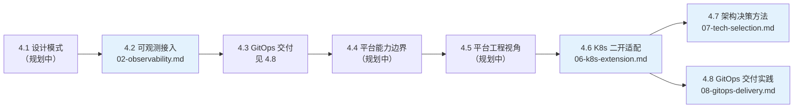

# Part 4 云原生架构进阶

> 视角：业务/中台 + 二开适配视角——不建设平台，驾驭平台、适配平台、与基础设施团队协作。

## 一句话说明
从「会用 K8s」进阶到「懂架构」：设计模式、可观测接入、GitOps 交付、平台能力边界、K8s 二开适配——把业务问题翻译成平台方案，把平台能力沉淀成可复用资产。

> 💡 用 AI 学本章：考察问题抛给 AI 当讨论伙伴；动手报错让 AI 解释 + 给排查路径；让 AI 生成练习变体检验是否真懂。完整 AI 学习指南见根 README。

## 快速导航表
| 文档 | 说明 |
|---|---|
| [02-observability.md](02-observability.md) | 📖 详解 · **4.2 可观测性接入**：业务应用接入 OTel / Prometheus / Grafana（埋点、指标、日志、追踪），从指标到 SLO |
| [06-k8s-extension.md](06-k8s-extension.md) | 📖 详解 · **4.6 增强**：K8s 二开适配速查（client-go / CRD / Operator 使用者路线） |
| [08-gitops-delivery.md](08-gitops-delivery.md) | 📖 详解 · **4.8 进阶**：GitOps 交付实践认知（ArgoCD/Flux 对比、多环境管理、渐进式交付、CI 分工） |
| [07-tech-selection.md](07-tech-selection.md) | 📖 详解 · **4.7 增强**：技术选型与架构演进方法论（选型框架 / 权衡分析 / 演进式架构） |
| 4.1 云原生设计模式 / 4.4 平台能力边界 / 4.5 平台工程使用者视角 | 规划中（待写）；4.3 GitOps 交付 → 见 4.8 |

## 核心特性块
- ✅ 用 client-go 三套姿势按场景选型：一次性 List/Get、Watch + Informer、Dynamic client
- ✅ 读懂 CRD：spec 是用户声明、status 是平台回写，用 kubectl explain 查字段
- ✅ 判断「该写 Operator 还是 CronJob」——Operator 的价值在状态驱动的自愈
- ✅ 规避二开工程坑：reconcile 不阻塞、controller 最小 RBAC、Lister 最终一致
- ✅ 掌握二开优先级：CRD + Controller 表达需求 > Webhook 拦截 > 改平台；知道哪些事找平台（Webhook 高可用 / RBAC / CRD 版本），哪些事自己做（适配器 / 对账逻辑）

## 前置知识表
| 知识点 | 来源章节 | 在本章的应用 |
|---|---|---|
| Pod / Deployment / Service / Namespace | Part 1.2 核心概念 | 理解 controller 管理的资源对象 |
| ConfigMap / Secret / ServiceAccount | Part 1.3 配置与安全 | controller 配置注入与最小 RBAC |
| Job / CronJob | Part 1.5 Pod 设计 | 与 Operator 对比，判断「该用哪个」 |
| kubectl api-resources / explain | Part 1 贯穿技巧 | API 发现三板斧 |
| 可观测性基础（探针 / 日志 / 指标） | Part 1.8 | 4.2 可观测接入 |

## 学习路线图

## 业务场景映射表
| 业务痛点/场景 | 本章技术方案 | 标注 |
|---|---|---|
| 平台能力重复建设（每个团队各造一套轮子） | 4.6 CRD + Controller 把适配逻辑沉淀成平台能力 | [已必备] |
| 系统耦合改不动（改一行牵一发动全身） | 4.1 设计模式（规划中）+ 4.6 适配层解耦 | [已必备] |
| 发布风险高（上线即事故） | 4.8 GitOps 声明式交付 + 渐进式发布 | [已必备] |
| 故障爆炸半径大（一个服务挂了拖垮全站） | 4.2 可观测接入 + 4.4 平台能力边界（规划中） | [已必备] |
| 降本增效成为硬指标（资源利用率、交付效率） | 4.5 平台工程黄金路径（规划中） | [已必备] |