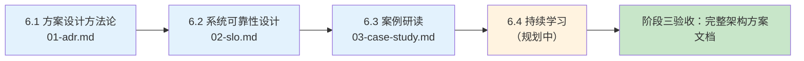

# Part 6 架构师修炼

> 视角：业务/中台视角的架构师修炼——方案设计方法论、系统可靠性设计、案例研读，不建设平台。

## 一句话说明
把「实现功能」升级为「设计系统」：用 ADR 记录决策「为什么」、用 SLO 把可靠性变成可执行纪律、用固定信源持续研读真实架构案例。

> 💡 用 AI 学本章：考察问题抛给 AI 当讨论伙伴；动手报错让 AI 解释 + 给排查路径；让 AI 生成练习变体检验是否真懂。完整 AI 学习指南见根 README。

## 快速导航表
| 文档 | 说明 |
|---|---|
| [01-adr.md](01-adr.md) | 📖 详解 · **6.1 增强**：ADR 架构决策记录模板 |
| [02-slo.md](02-slo.md) | 📖 详解 · **6.2 增强**：SLO 起步模板（SLI → SLO → 错误预算） |
| [03-case-study.md](03-case-study.md) | 📖 详解 · **6.3 增强**：案例研读固定信源 |
| 6.4 持续学习 | 规划中（待写） |

## 核心特性块
- ✅ 用 ADR 一页纸记录决策「为什么」，方案文档内嵌 3~5 篇 ADR
- ✅ 用 SLI → SLO → 错误预算三步定可靠性目标，预算烧完冻结发布
- ✅ 用「问题 → 约束 → 决策 → 教训」四步拆解真实架构案例
- ✅ 知道哪些事找平台（容灾演练 / 容量规划），哪些事自己做（决策记录 / SLO 定义）
- ✅ 能输出一份完整的架构设计方案文档（需求 → 选型 → 架构 → 风险）

## 前置知识表
| 知识点 | 来源章节 | 在本章的应用 |
|---|---|---|
| 可观测性基础（指标 / 探针） | Part 1.8 | 定义 SLI 时知道指标从哪来 |
| 可观测性接入（OTel / Prometheus） | Part 4.2 | SLI 指标口径与错误预算看板 |
| 架构决策方法（选型框架 / 权衡） | Part 4.7 | ADR 是选型决策的落纸形式 |
| 业务痛点与场景分析 | Part 0.1 / 各章业务场景 | 案例研读的「问题」从业务出发 |

## 学习路线图

## 业务场景映射表
| 业务痛点/场景 | 本章技术方案 | 标注 |
|---|---|---|
| 技术决策失误代价高（一次错误选型 = 两年重构） | 6.1 ADR 记录决策「为什么」，方案评审可追溯 | [已必备] |
| 系统不可靠导致事故与信任崩塌 | 6.2 SLO + 错误预算，预算烧完冻结发布 | [已必备] |
| 架构师断层（能设计系统的人稀缺） | 6.1~6.3 方法论 + 案例研读训练决策质量 | [已必备] |
| 业务不确定性加剧，架构要「边打边改」 | 6.1 ADR 复核触发条件，演进式决策 | [潜在] |